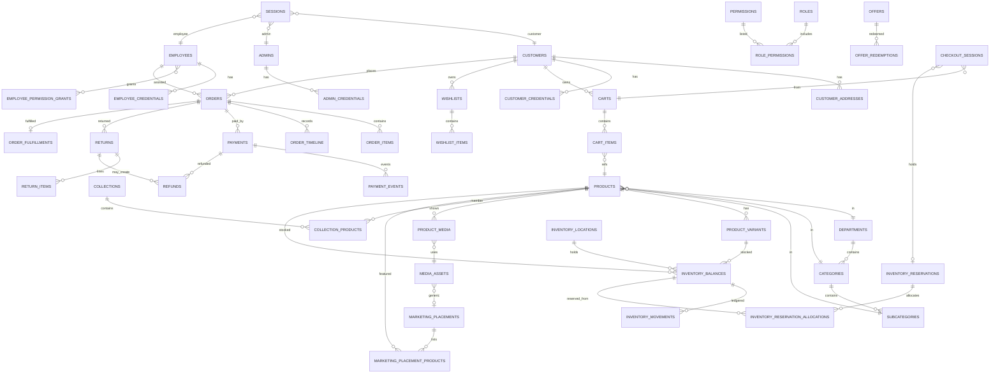

# PRATIKSHYA FASHON — Backend Architecture

## 1 Executive Summary

PRATIKSHYA FASHON is a complete operational UX --- customer storefront, Admin Portal, Employee Operations Portal --- with **no HTTP backend**. Persistence is `localStorage` plus authored seed modules. The frontend is already shaped as repositories and command layers. The backend must **replace those repositories**, not rewrite pages.

### 1.1 What the backend becomes

The **authoritative source of truth** for:

-   Product persistence and lifecycle
-   Inventory (balances, reservations, movements, transfers)
-   Orders, payments, refunds, returns
-   Customer / admin / employee identity
-   Permissions
-   Marketing placement persistence
-   Product publication
-   Media metadata and object-storage keys
-   Settings that affect money, stock, or access
-   Auditability

The frontend remains the **UX source of truth**. It must never again be authoritative for price, stock, publication, payment success, role, or media URLs.

## 2 Architecture Principles

### 2.1 Non-negotiable rules (carried from Phase 1)

1.  **ONE `products` table.** No `women_products` / `men_products` / `kids_products` / `bridal_products`.
2.  **Canonical product IDs** `PF-{DEPT}-{FAMILY}-{NNNN}` --- never inferred from filenames, folders, clocks, or indexes.
3.  **Lifecycle commands, not status PATCH.** `DRAFT → SUBMITTED → APPROVED → PUBLISHED`. **Approval does not publish.**
4.  **Storefront visibility:** `status = PUBLISHED` **and** parent category `ACTIVE`.
5.  **Marketing placements store product IDs only** --- never product snapshots.
6.  **Brand lock:** `src/assets/pratikshya_logo.webp` stays a frontend asset.
7.  **Sandbox QR is sandbox-only** and can never mark a live order paid.
8.  **Assisted orders are the same order entity** with `channel = ASSISTED`. *(Implemented in Phase 1.)*
9.  **One customer identity** --- Admin CRM, Employee directory, and storefront account share `customers`. *(Implemented in Phase 1.)*
10. **Shipping / COD / tax numbers live in settings**, not in checkout UI config. *(Implemented in Phase 1 via `commerceDefaults` + settings authority.)*

## 3 Current Frontend Architecture

> **CURRENT — IMPLEMENTED**

### 3.1 Current frontend architecture (post-Phase 1 stabilization)

Phase 1 frontend stabilization is **complete** and verified by the regression suite. The current frontend is:

-   **Stack:** React 19 + Vite 7 + Tailwind 4 + React Router 7, single-file production build (`vite-plugin-singlefile`), no HTTP backend.
-   **Canonical customer storage:** `pratikshya_customers_registry` (via `services/customer/customerRegistry.js`). The legacy `pratikshya_customers` admin list is **migration/legacy only** — merged once, then removed. Admin CRM, Employee directory, account area, and analytics all read the one registry.
-   **Canonical order storage:** `pratikshya_orders` (via `services/orders/orderService.js`). Assisted employee orders are the **same order entity** with `channel = "ASSISTED"` / `source = "employee_assisted"`; the legacy `pratikshya_employee_assisted_orders` key is **migration/legacy only**.
-   **Single-source commerce numbers:** `config/commerceDefaults.js` holds authored shipping/COD defaults; runtime authority is Admin Settings (`pratikshya_settings`) through `readShippingRules()` / `readPaymentRules()`. `checkoutConfig.js` is UI metadata only.
-   **Collection fixes:** `FREE_SHIPPING_THRESHOLD` is now defined (Explore no longer fails at runtime); New Arrivals resolves through `taxonomyRepository.isProductInCollection(product, "new-arrivals")` (Admin ↔ storefront wired); collection membership resolves through **one** `taxonomyRepository.isProductInCollection` function (manual IDs + `rule.flag` / `rule.occasion` / `rule.fabricIncludes`); `/collection/:slug` is a legacy redirect to the canonical `/collections/:slug`.
-   **Shared portal shell:** `PortalShell` + `PortalSidebar` + `usePortalSidebarCollapse` + `usePortalDrawer` + `RailTooltip` power both Admin and Employee portals. Desktop supports expanded / collapsed (72px rail with tooltips, active states preserved); mobile uses an off-canvas drawer with backdrop, Escape handling, focus management, body-scroll lock, and auto-close on navigation. Collapse preferences persist in `pratikshya_admin_sidebar_collapsed` and `pratikshya_employee_sidebar_collapsed` (UI chrome — not business settings).
-   **Admin Collection Detail is responsive:** shrinkable `minmax(0, …)` grid tracks, `min-w-0`, `table-fixed` product table, truncated product names, internal table scrolling only when necessary; main content expands when the sidebar collapses (`flex-1 min-w-0` in `PortalShell`).
-   **Dead code removed** (Phase 1 low-risk cleanup): `CorrectionDialog`, `AdminModulePlaceholder`, `AdminComingSoon`, `ADMIN_PLACEHOLDER_COPY`/`MODULE_STATUS`, `data/products/catalogue.js` shim, `loadAttendanceMap`, and the `demoOrders.js` stub body.

The backend described in the rest of this document **replaces these repositories** feature-by-feature; it does not rewrite pages.

## 4 Target Backend Architecture

> **PLANNED / TARGET — NOT IMPLEMENTED**

### 4.1 Python and future AI integration

Python is intentionally locked for the backend because PRATIKSHYA FASHON plans to add AI capabilities in future phases. This is an architectural readiness decision, **not** permission to implement AI now.

The commerce backend remains the single modular monolith and the future AI layer must consume the same authoritative catalogue, pricing, inventory, customer, and order services. AI must never create a parallel source of truth.

### 4.2 Target topology

    Frontend (React + Vite)
       ↓
    Existing service / repository abstraction
       ↓
    API adapter (thin HTTP)
       ↓
    REST API  /api/v1
       ↓
    Backend services (modular monolith)
       ↓
    PostgreSQL  ·  S3-compatible object storage  ·  Payment gateway

### 4.3 What this phase does **not** do

This phase does **not** create the `backend/` directory, write any FastAPI code, migrations, schemas, or storage/payment integrations, and does **not** modify frontend functionality. The layout below is the **planned** repository structure (the mandated conceptual baseline), with the more granular layer names from earlier revisions mapped onto it.

### 4.4 Planned backend repository layout (conceptual — do not create yet)

```text
backend/
├── app/
│   ├── main.py            # FastAPI application factory, lifespan, health
│   ├── core/              # environment config, constants, placement catalogue, permission keys
│   ├── api/               # FastAPI routers — HTTP only
│   │   └── v1/            # versioned REST surface (all routes live here)
│   ├── models/            # SQLAlchemy ORM models (tables)
│   ├── schemas/           # Pydantic v2 request/response schemas (validators folded in)
│   ├── repositories/      # SQLAlchemy data-access — no HTTP, no auth decisions
│   ├── services/          # business commands / transactions / lifecycle (controllers folded in)
│   ├── dependencies/      # DI: auth principal, RBAC, policies, pagination
│   ├── middleware/        # auth, RBAC, idempotency, rate-limit, request-id, CORS, CSRF
│   ├── workers/           # scheduled/background jobs (expiry sweepers, notifications)
│   └── ai/                # FUTURE AI service boundary (empty scaffold only — see §44.1)
├── alembic/               # Alembic migration revisions
├── seeds/                 # taxonomy, canonical products, admin, settings
├── tests/
│   ├── unit/
│   ├── integration/
│   ├── api/
│   └── concurrency/
├── requirements.txt
├── alembic.ini
├── .env.example
└── README.md
```

Earlier revision names map onto this structure as follows: `config` → `core`, `controllers` → `services` (route handlers parse + delegate only), `validators`/`policies` → `dependencies`/`schemas`, `events`/`tasks` → `workers`, `utils` → `core`. The rest of this document uses those logical layer names interchangeably; the directory above is the target.

### 4.5 Layer responsibilities

  -----------------------------------------------------------------------------------------------------------------------------
  Layer                   May                                                 Must not
  ----------------------- --------------------------------------------------- -------------------------------------------------
  **routes**              Bind method + path + schema + preHandlers           Contain business rules

  **controllers**         Map DTO ↔ service, choose status code               Talk to SQL, hash passwords, compute totals

  **services**            Commands, transactions, lifecycle, money            Read `request` / cookies; invent SQL

  **repositories**        SQL, locks, uniqueness                              Authorize; send emails; call payment APIs

  **validators**          Shape + domain predicates                           Persist

  **policies**            Answer "may this principal do X to Y?"              Mutate state

  **events**              Append audit after successful commit                Replace the command; fire-and-forget money

  **config**              Env + frozen catalogues (placements, permissions)   Runtime business numbers (those are `settings`)
  -----------------------------------------------------------------------------------------------------------------------------

**Avoid putting business logic in route handlers.** The frontend already learned this: `productWorkflowCommands` is the one command layer; `catalogRepository.updateStatus` is only an adapter. The backend copies that split.

### 4.6 Domain grouping inside `services/` / `repositories/` (logical, not microservices)

    identity/     catalog/     workflow/     media/
    marketing/    inventory/   commerce/     payments/
    workforce/    audit/       settings/     storage/

One Python application process. One PostgreSQL database. Cross-domain work (checkout) is a **service transaction** that calls multiple repositories inside `BEGIN … COMMIT`.

------------------------------------------------------------------------

## 5 Domain Architecture

IDENTITY          customers · admins · employees · sessions · credentials · RBAC
    CATALOGUE         departments · categories · subcategories · products · variants
    WORKFLOW          product commands + validators (columns on products, not a second table)
    MEDIA             media_assets (metadata) + object storage (bytes) + product_media
    MARKETING         marketing_placements + placement_products + generic media
    COLLECTIONS       collections + collection_products (+ optional rule JSON)
    INVENTORY         locations · balances · movements · reservations · transfers
    COMMERCE          carts · cart_items · wishlists · offers · redemptions
    CHECKOUT          checkout_sessions (server-priced, reserved)
    ORDERS            orders · order_items · order_timeline · fulfillments
    PAYMENTS          payments · payment_events · refunds
    RETURNS           returns · return_items
    CUSTOMERS         addresses · preferences (profile columns on customers)
    WORKFORCE         attendance · leave · performance          (V1 — portal already uses them)
    NOTIFICATIONS     notification_templates · notification_deliveries   (V1 — order status, staff events; see §27.1)
    SYSTEM            settings · audit_logs · idempotency_keys

### 5.1 Explicitly not domains in V1

-   AI shopping / business / mirror (keep mock providers)
-   Support-case / styling-appointment entities
-   Warehouse WMS beyond current inventory transfers
-   Recommendation engine
-   Search cluster

------------------------------------------------------------------------

### 5.2 Persistence vocabulary (compatibility --- keep)

Stored on `products`:

  ----------------------------------------------------------------------------------------------------
  Column                             Values
  ---------------------------------- -----------------------------------------------------------------
  `status`                           `DRAFT` \| `PENDING_REVIEW` \| `PUBLISHED` \| `ARCHIVED`

  `review_state`                     `NONE` \| `PENDING` \| `APPROVED` \| `REJECTED`

  `assigned_employee_id`             uuid null

  `workflow` JSONB                   `employeeReviewStartedAt`, `adminReviewStartedAt`, `approvedAt`
  ----------------------------------------------------------------------------------------------------

### 5.3 Canonical projection (read model --- keep)

    DRAFT → ASSIGNED → IN_EMPLOYEE_REVIEW → SUBMITTED → IN_ADMIN_REVIEW
          → APPROVED → PUBLISHED → ARCHIVED

`RETURNED` is **not** a stored stage. Rejection maps to editable DRAFT / IN_EMPLOYEE_REVIEW with `review_state = REJECTED` and a reason.

Precedence (from `productWorkflowState.js`): ARCHIVED \> PUBLISHED (grandfathered) \> review APPROVED \> pending status → SUBMITTED / IN_ADMIN_REVIEW \> REJECTED presentation \> assigned work \> DRAFT.

### 5.4 Publication path (the only legal one)

    DRAFT  --submit-->  SUBMITTED (status=PENDING_REVIEW, review=PENDING)
           --approve--> APPROVED  (review=APPROVED, status still PENDING_REVIEW)
           --publish--> PUBLISHED (status=PUBLISHED)

**Approval MUST NOT publish.** Storefront remains invisible until `publishProduct`.

### 5.5 Transition table (invalid transitions fail)

  --------------------------------------------------------------------------------------------------------------------------------------------------------------------------------
  Command                      Who                              From                                    To                 Extra
  ---------------------------- -------------------------------- --------------------------------------- ------------------ -------------------------------------------------------
  createProduct                Admin or `products.manage`       ---                                     DRAFT              allocate canonical ID

  saveProductDraft             Admin or **assigned** employee   DRAFT / ASSIGNED / IN_EMPLOYEE_REVIEW   same               employee whitelist

  assignProduct                Super Admin                      not ARCHIVED                            same + assignee    employee login-allowed

  submitProduct                Admin or assignee                submittable stages                      SUBMITTED          `validateProductForSubmit`

  beginAdminReview             Super Admin                      SUBMITTED                               IN_ADMIN_REVIEW    timestamp only

  returnProduct                Super Admin                      not PUBLISHED/ARCHIVED                  DRAFT + REJECTED   **reason required**

  approveProduct               Super Admin                      SUBMITTED / IN_ADMIN_REVIEW             APPROVED           `validateProductForApprove`; **no storefront**

  publishProduct               Super Admin                      **APPROVED only**                       PUBLISHED          **full revalidation**; ignore prior pass

  unpublishProduct             Super Admin                      PUBLISHED                               DRAFT              clear `approvedAt`

  archiveProduct               Super Admin                      not archived                            ARCHIVED           keep media ownership

  restoreProduct               Super Admin                      ARCHIVED                                DRAFT              review NONE

  bulkSubmit/Approve/Publish   same auth                        ---                                     ---                **loop individual commands**; independent success

  deleteProductPermanently     Super Admin                      unused never-published DRAFT            removed            confirm public id; unassign media

  changeProductId              Super Admin                      any non-published preferred             new public_id      family prefix immutable; transactional media transfer
  --------------------------------------------------------------------------------------------------------------------------------------------------------------------------------

**Forbidden:**

-   `PATCH /products/:id { status: "PUBLISHED" }`
-   DRAFT → APPROVED
-   DRAFT → PUBLISHED
-   SUBMITTED → PUBLISHED
-   APPROVED → DRAFT (except explicit unpublish/return/restore commands)
-   Bulk "set status"

Existing PUBLISHED rows stay PUBLISHED (grandfathering).

------------------------------------------------------------------------

Port `productPublishValidator.js` as the **one** orchestrator. Compose shared checks:

    validateProductIdentity()      // public_id format, present
    validateProductName()          // required, not placeholder
    validateProductSku()           // required, unique across products+variants
    validateProductPricing()       // computePricing: MRP>0, selling>0, selling≤MRP
    validateProductTaxonomy()      // department/category/subcategory exist and nest
    validateProductDescription()   // description or shortDescription
    validateProductMedia()         // primary image, not video, ACTIVE, not MARKETING, no conflicts
    validateProductGrouping()      // unresolved media groups
    validateProductReviewFlags()   // flags that data does not already prove
    validateProductLifecycle()     // APPROVED required only for publish

  ----------------------------------------------------------------------------------------------------------------------------------------------------
  Function                        Includes                                                                            Extra
  ------------------------------- ----------------------------------------------------------------------------------- --------------------------------
  `validateProductForSubmit()`    all data checks except lifecycle APPROVED                                           category inactive = warning

  `validateProductForApprove()`   same as submit                                                                      still no storefront

  `validateProductForPublish()`   **all of the above + lifecycle APPROVED + fresh re-read of media/taxonomy/price**   never reuse the approve result
  ----------------------------------------------------------------------------------------------------------------------------------------------------

Publish is a **command**, not a cached flag. Category inactive is a **warning** (product publishes but stays storefront-hidden) --- same as today.

Shared `computePricing` rules stay in one module (port `utils/pricing.js`) and run **only on the server** for persisted prices. Frontend may keep a preview copy.

------------------------------------------------------------------------

collections
    collection_products (collection_id, product_id, sort_order) unique pair

Types: `MANUAL` \| `RULE_BASED` (rule JSON: `{ flag: "isNew" }`, `{ fabricIncludes: "silk" }`, `{ occasion: "Wedding" }`).

Status stored: DRAFT \| ACTIVE \| PAUSED \| ARCHIVED. Display SCHEDULED / EXPIRED **derived** from `start_date` / `end_date` (same as offers).

**Direct URL** `GET /catalog/collections/:slug` resolves membership **on the server**. Invalid slugs → 404. Never invent products.

Membership = `collection_products` UNION rule-matching published products. Pages must not hardcode IDs.

Seed from `taxonomyRepository` collection seeds (`new-arrivals`, `featured`, `heritage-weaves`, `festive-edit`, `silk`, `wedding`, ...).

------------------------------------------------------------------------

Port `inventoryRepository` semantics. Frontend is already transaction-shaped.

### 5.6 Quantities (one formula)

    available = on_hand − reserved − damaged
    returned  = quarantine (does NOT increase available until inspection)
    sold      = cumulative sold (informational)

Negative available is refused. `settings.inventory.negativeStockAllowed` default **false**.

### 5.7 Locations

Seed:

-   `loc-main-store` STORE ACTIVE\
-   `loc-main-warehouse` WAREHOUSE ACTIVE

Reservation prefers STORE then WAREHOUSE (existing sort). Returns enter warehouse quarantine.

**Decision:** this is **simple multi-location**, not a WMS. Do not add bins as first-class entities; `placement` JSON (department/section/rack/shelf/bin) stays metadata on the balance row.

### 5.8 Movements (append-only)

OPENING_BALANCE, RECEIVE, ADJUST, TRANSFER_OUT, TRANSFER_IN, RESERVE, RELEASE, SALE, RETURN, DAMAGE, RESTOCK.

### 5.9 Reservations

-   Created at checkout start (`expires_in` from `settings.orders.paymentTimeoutMinutes`, default 15).
-   Allocations pinned to balance rows --- cancellation restocks **those** rows, not "today's" locations.
-   Status: ACTIVE → SOLD \| RELEASED \| RESTOCKED \| EXPIRED.
-   Expiry: lazy on read **and** periodic job. Browser clock is not authority.

### 5.10 Transfers

`DRAFT → REQUESTED → APPROVED → IN_TRANSIT → RECEIVED` (or CANCELLED). Stock leaves source only at IN_TRANSIT; arrives at RECEIVED. Pending outbound counts against requestable quantity.

### 5.11 Tracked vs untracked

If a product has no balance rows and `inventory_tracked = false`, cart validation uses legacy `product.stock` / `availability`. New published products should be tracked; `ensureOpeningStock` remains a command.

All mutations run in a **DB transaction** with `SELECT … FOR UPDATE` on the balance row.

------------------------------------------------------------------------

carts (id, customer_id null, guest_token null, currency INR, updated_at)
    cart_items (cart_id, product_id, variant_id, quantity, unit_price_snapshot)

  ----------------------------------------------------------------------------------------------------------------------------
  Topic                              Decision
  ---------------------------------- -----------------------------------------------------------------------------------------
  Anonymous                          Guest cookie `pf_guest` → server cart. localStorage is a cache only

  Authenticated                      `customer_id` unique active cart

  Merge on login                     Union by (product_id, variant_id); sum qty; **revalidate** availability and **reprice**

  Price                              Always recomputed from `computePricing` + variant override. Client price ignored

  Availability                       `validateCartItems` server-side

  Coupon                             Stored as `applied_offer_id`; revalidated on every GET

  Expiry                             Guest carts idle \> 30 days purged. Authenticated carts persist

  Unpublished product                Line kept but `unavailable: true`; blocked at checkout
  ----------------------------------------------------------------------------------------------------------------------------

Frontend `CartContext` becomes an adapter over `GET/PATCH /cart`.

------------------------------------------------------------------------

-   One wishlist per customer (authenticated). Guest wishlist stays localStorage until login, then merge unique product IDs.
-   `wishlist_items (wishlist_id, product_id)` unique.
-   Duplicate toggle is idempotent.
-   Unpublished / archived products: remain listed with `available: false`; do not 404 the wishlist. Direct add of unpublished IDs is rejected.

------------------------------------------------------------------------

Port `offerRepository`. **Do not** build a promotions engine beyond what exists.

  ---------------------------------------------------------------------------------------------------------------------
  Field                              Rule
  ---------------------------------- ----------------------------------------------------------------------------------
  type                               PERCENTAGE \| FIXED_AMOUNT

  code                               unique, `[A-Z0-9]+(-[A-Z0-9]+)*`, 2--24

  status stored                      DRAFT, ACTIVE, PAUSED, ARCHIVED

  display                            SCHEDULED / EXPIRED derived from dates

  eligibility                        ALL / SPECIFIC products, CATEGORY, COLLECTION + exclusions

  customers                          ALL / NEW / RETURNING / SPECIFIC

  limits                             `usage_limit`, `per_customer_limit`

  min / max                          `minimum_order_value`, `maximum_discount`

  stackable                          column exists; settings default `allowStacking: false` --- V1 **does not stack**
  ---------------------------------------------------------------------------------------------------------------------

**Marketing artwork ≠ offers.** HOME_HERO / PROMOTION media is not a discount.

Redemption: `offer_redemptions (offer_id, order_id)` **unique**. `recordRedemption` is idempotent per order. Increment under row lock.

Checkout **never** trusts client `couponDiscount`. Server runs `validateOffer` against current catalogue + settings.

Code locked after first redemption (existing rule).

------------------------------------------------------------------------

Server-controlled. Steps (UI): customer → delivery → review → payment. Confirmation is a separate page.

`checkout_sessions`:

-   Snapshot of cart item IDs + qty (not prices)
-   Address id or payload
-   Delivery method id
-   Payment method id
-   `reservation_id`
-   **Server totals:** subtotal, productDiscount, couponDiscount, shipping, codFee, tax, total
-   Status: OPEN \| RESERVED \| PLACED \| EXPIRED \| ABANDONED

### 5.12 Revalidation on every mutation and on pay

1.  Product exists\
2.  `status = PUBLISHED` and category ACTIVE\
3.  Price via `computePricing`\
4.  Inventory available / reservation still ACTIVE\
5.  Offer still redeemable\
6.  Shipping from **settings** (`readShippingRules`)\
7.  Tax from settings (currently often 0 / inclusive)\
8.  Address complete\
9.  Payment method allowed

**Never trust frontend totals.** Authoritative total is computed here.

COD: order created with `payment_status = PENDING`, reservation confirmed as SALE immediately (stock leaves), no gateway.

Non-COD: reservation → payment intent → webhook confirms → SALE.

Timeout: `settings.orders.paymentTimeoutMinutes` releases reservation and expires the session.

------------------------------------------------------------------------

**ONE order entity.**

    channel: ONLINE | ASSISTED
    source:  storefront | employee_assisted
    created_by_employee_id: null | uuid
    customer_id: required for ONLINE, optional for ASSISTED (walk-in)

Assisted orders **must not** live in a second table (Phase 1 already merged `pratikshya_employee_assisted_orders`).

### 5.13 Order payload

Customer snapshot, items (name, sku, public product_id, qty, unit price, line total), discounts, shipping, taxes, total, payment_status, fulfillment_status, display_status, timeline, channel, timestamps, invoice number, tracking.

`order_items` store **purchase-time** name/sku/price. `product_id` FK remains for inventory/analytics.

Invoice sequence: `orders_invoice_seq` (replaces `pratikshya_order_sequence`).

`forceTransition` **does not exist** on the production API.

`buildOrderRecord` today stamps PAYMENT_CONFIRMED in the browser. **That path is forbidden in production.** See §23.

------------------------------------------------------------------------

The current `ORDER_STATUS` mixes money and warehouse. Backend stores **three** fields; the UI journey is a **projection**.

  --------------------------------------------------------------------------------------------------------------------------------------------
  Field                              Values
  ---------------------------------- ---------------------------------------------------------------------------------------------------------
  `payment_status`                   PENDING, AUTHORIZED, PAID, FAILED, CANCELLED, REFUND_INITIATED, REFUND_PENDING, REFUNDED

  `fulfillment_status`               PENDING, ALLOCATED, PICKING, PACKED, READY_TO_DISPATCH, SHIPPED, OUT_FOR_DELIVERY, DELIVERED, CANCELLED

  `display_status`                   Compatible with existing `ORDER_STATUS` labels for the SPA
  --------------------------------------------------------------------------------------------------------------------------------------------

### 5.14 Projection (so the frontend journey does not rewrite)

  -------------------------------------------------------------------------------------------------------
  Condition                            display_status
  ------------------------------------ ------------------------------------------------------------------
  payment PENDING (non-COD)            PENDING_PAYMENT

  payment PAID, fulfillment PENDING    PAYMENT_CONFIRMED then ORDER_CONFIRMED

  fulfillment PROCESSING...DELIVERED   matching journey step

  cancelled                            CANCELLED

  active return                        RETURN_REQUESTED / RETURNED / REFUND_PENDING / REFUNDED as today
  -------------------------------------------------------------------------------------------------------

### 5.15 Payment transitions (who)

  From             To                   Who
  ---------------- -------------------- ---------------------------------------
  PENDING          PAID                 **webhook only** (or COD create)
  PENDING          FAILED / CANCELLED   webhook or expire job
  PAID             REFUND_PENDING       cancel/return commands
  REFUND_PENDING   REFUNDED             **refund webhook / provider confirm**

Clients cannot POST these.

### 5.16 Fulfillment transitions (who)

Port existing commands; each requires the matching permission:

  --------------------------------------------------------------------------------------------------------------------------------------------
  Command                                       From → To                        Permission
  --------------------------------------------- -------------------------------- -------------------------------------------------------------
  confirmOrder (auto after PAID)                → ORDER_CONFIRMED / PROCESSING   system

  allocateOrder                                 PROCESSING → ALLOCATED           `orders.fulfill`

  startPicking / markItemPicked                 ALLOCATED → PICKING              `orders.pick`

  markPacked (all items picked)                 PICKING → PACKED                 `orders.pack`

  markReadyToDispatch                           PACKED → READY_TO_DISPATCH       `orders.fulfill`

  dispatchOrder (carrier + tracking required)   → SHIPPED                        `orders.dispatch`

  markOutForDelivery                            SHIPPED → OUT_FOR_DELIVERY       `orders.dispatch`

  markDelivered                                 → DELIVERED                      `orders.fulfill`

  cancelOrder                                   cancellable set                  customer owner **or** `orders.cancel`; admin extra statuses
  --------------------------------------------------------------------------------------------------------------------------------------------

Customer cancel: `CANCELLABLE_STATUSES` through PICKING. Admin: through READY_TO_DISPATCH. Packed+ ships require reason.

Cancel of PAID order → restock via reservation allocations + refund pending.

------------------------------------------------------------------------

**Critical.** Frontend must never be authoritative for production success.

    Checkout
      → POST /checkout/reserve          stock hold
      → POST /payments/intents          amount from server session, env=sandbox|live
      → customer completes gateway / Sandbox QR
      → POST /payments/webhooks         ONLY path that can mark PAID
           verify signature
           verify amount, currency, order/reference, txn id
           insert payment_events (idempotent)
           if LIVE success: payment PAID, confirmReservationSale, record offer redemption, order confirm
           if SANDBOX: payment SANDBOX_PAID / env=sandbox — excluded from live settlement
      → frontend polls GET /payments/:id or GET /orders/:id

### 5.17 Verification checklist

-   Gateway signature
-   Amount == checkout_session.total (paise)
-   Currency INR
-   Order / checkout reference match
-   Transaction ID unique
-   Idempotency (event id / txn id)
-   `env` on the payment row matches gateway account (live key cannot confirm sandbox row)

### 5.18 `payments`

`id`, `order_id`, `checkout_session_id`, `provider`, `env` SANDBOX\|LIVE, `method` upi\|card\|netbanking\|qr\|cod, `amount_paise`, `currency`, `status`, `provider_ref`, `idempotency_key`, timestamps.

### 5.19 `payment_events`

Raw payload (redacted), signature valid bool, processed_at, unique `(provider, provider_event_id)`.

**Forbidden:** SPA `paymentStatus: "PAID"`, treating Sandbox QR scan as live money, Vite env payment secrets.

Provider recommendation: **Razorpay** (UPI, cards, netbanking, QR). Interface:

    PaymentProvider.createIntent(session)
    PaymentProvider.verifyWebhook(rawBody, headers)
    PaymentProvider.refund(payment, amount)

`MockPaymentService` remains the `env=development` adapter. Production adapter never ships in the frontend bundle.

COD: no intent; order `payment_status=PENDING` until delivery collection (future). V1 leaves COD as PENDING and does not auto-PAID.

------------------------------------------------------------------------

Preserve `utils/sandboxQr.js` semantics.

  ---------------------------------------------------------------------------------------------------------------------------
  Rule                               Value
  ---------------------------------- ----------------------------------------------------------------------------------------
  `env`                              always `"sandbox"`

  Payload                            merchant, reference, session, amount, currency INR, payment `qr`, issuedAt

  Secrets                            **never** encoded

  Who may confirm                    **Sandbox payment adapter on the backend**, keyed by `PAYMENTS_ENV=sandbox`

  Production                         Sandbox QR method **hidden** when `PAYMENTS_ENV=live`. API rejects `method=qr` on live
  ---------------------------------------------------------------------------------------------------------------------------

Sandbox confirmation writes `payments.env = SANDBOX` and `orders.payment_env = SANDBOX`. Live reports **exclude** these rows.

Demo scenarios (`success` / `failure` / `cancelled` / `pending`) are development-only query flags on the mock adapter, never on live intents.

------------------------------------------------------------------------

Port `returnService`.

Eligibility: order `display_status = DELIVERED` (or fulfillment DELIVERED), within `settings.returns.returnWindowDays` (default 7), line not already returned.

    RETURN_REQUESTED → UNDER_REVIEW → APPROVED → PICKUP_SCHEDULED
      → RECEIVED → INSPECTED → REFUND_INITIATED → REFUNDED
    REJECTED from request/review

Inspection required (`settings.returns.inspectionRequired = true`). Receive **does not** restock. Inspection:

-   SELLABLE → `inspectReturnedStock` RESTOCK
-   DAMAGED → DAMAGE
-   QUARANTINE → stays in `returned`

Refund:

1.  Staff `initiateRefund` after INSPECTED\
2.  Backend calls provider `refund()` for **live** payments\
3.  **Provider webhook** marks REFUNDED\
4.  Sandbox/COD: staff complete is allowed **only** when `payment.env != LIVE`

Partial refunds: `settings.payments.partialRefundEnabled`. Amount = `refundAmountFor(items)`, never client figure.

Customer-facing rejection messages stay generic (`customerFacingRejection`).

------------------------------------------------------------------------

One row or keyed JSONB document:

    settings (id, section text unique, payload jsonb, updated_by, updated_at)

Sections = `SETTINGS_DEFAULTS` keys: `business`, `store`, `locations`, `hours`, `attendance`, `holidays`, `tax`, `shipping`, `payments`, `orders`, `returns`, `inventory`, `employees`, `notifications`, `customer`, `offers`, `media`.

**Business settings (server authority):** shipping fees/threshold, COD fee, tax rates/mode, return window, payment timeout, media size limits, password policy, inventory thresholds.

**Static UI configuration (frontend):** payment method labels, icons, UPI app names, demo bank list, captions --- `checkoutConfig.js` remains UI metadata and **reads numbers from GET /settings/public**.

Write: Super Admin only. Each write → audit_log `SETTINGS_UPDATED`.

Public GET returns only storefront-safe slices (shipping fees, COD fee, return window, store name). Never GSTIN secrets beyond what's already public.

### 5.20 Notifications architecture

Notifications are **planned** for V1 (Phase K) because the current frontend already surfaces order/status/return events in the account area and staff feeds; the backend will make them authoritative and eventually pushable. This is a new domain in this revision (previously only implied by the `notifications` settings section).

    notification_templates (id, event_kind, channel EMAIL|SMS|PUSH|IN_APP, locale, subject, body, active)
    notification_deliveries (id, template_id, principal_kind, principal_id, entity_type, entity_id,
                             channel, status QUEUED|SENT|FAILED|SUPPRESSED, error, delivered_at, timestamps)

-   **Event kinds (V1):** order confirmed, payment confirmed, order shipped/out-for-delivery/delivered, return requested/approved/rejected/refunded, leave requested/reviewed, employee credential reset, low-stock alert (inventory threshold).
-   **Triggers:** domain events (§32) enqueue a delivery after a successful commit. **Never** enqueue on a rolled-back transaction.
-   **Delivery:** a `workers/` background job drains the queue; IN_APP deliveries are read from `notification_deliveries` (no separate inbox table in V1). Email/SMS/PUSH go through provider adapters behind a `NotificationProvider` interface (mock adapter in development).
-   **Preferences:** customer notification prefs live on `customer_preferences`; staff prefs are a later option. `settings.notifications` holds the enabled channels and provider config (secrets in server env only).
-   **AI (future):** AI assistants may *generate* notification copy, but they never own the delivery queue or the customer-facing channel decisions.

------------------------------------------------------------------------

Port `activityService` / `ACTIVITY_ACTIONS`. Append-only. No UPDATE/DELETE in application SQL (DB role revoke).

    audit_logs (
      id uuid,
      at timestamptz,
      actor_kind CUSTOMER|ADMIN|EMPLOYEE|SYSTEM,
      actor_id uuid null,
      actor_label text,
      action text,                 -- PRODUCT_PUBLISHED, …
      entity_type text,
      entity_id text,
      summary text,
      metadata jsonb,              -- non-secret diffs
      request_id uuid,
      ip inet
    )

Required events: product submit/approve/publish/unpublish/archive, media assign/remove, marketing placement change, inventory adjustment, order status, payment confirmation, refund, role/permission change, settings change, employee create/suspend/reset.

Never log passwords, tokens, card data, webhook secrets.

------------------------------------------------------------------------

## 6 Database Architecture

Convention: every table has `created_at timestamptz not null default now()`. Mutable tables also have `updated_at`. Primary keys are `uuid` unless noted. Public identifiers (`PF-W-SAR-SIL-0001`, `PF-ADM-00001`) are unique text columns, not the PK --- so ID rename / sequence allocation cannot break FKs.

### 6.1 Identity

  --------------------------------------------------------------------------------------------------------------------------
  Table                          Why it exists                                                           Authoritative?
  ------------------------------ ----------------------------------------------------------------------- -------------------
  `customers`                    One customer identity for storefront + Admin CRM + Employee directory   Yes

  `customer_credentials`         Password hash isolated from profile                                     Yes

  `customer_addresses`           Checkout / account addresses                                            Yes

  `customer_preferences`         Notification + style prefs (optional V1.5 columns)                      Yes (when used)

  `admins`                       Isolated Admin identity. Never an employee row                          Yes

  `admin_credentials`            Admin password hashes                                                   Yes

  `employees`                    Operational staff. Never carries Admin authority                        Yes

  `employee_credentials`         Employee password hashes / must_change_password                         Yes

  `sessions`                     Opaque sessions for all three kinds                                     Yes

  `password_reset_tokens`        Forgot/reset, hashed token, TTL                                         Yes

  `roles`                        Seeded employee roles (`STORE_MANAGER`, ...)                            Yes (catalogue)

  `permissions`                  Seeded permission keys (port `PERMISSIONS`)                             Yes (catalogue)

  `role_permissions`             Default grants per role                                                 Yes

  `employee_permission_grants`   Custom grants when `permission_mode = custom`                           Yes
  --------------------------------------------------------------------------------------------------------------------------

**Not created:** `users` mega-table mixing customers/admins/employees. Three portals are three identity boundaries. A single `sessions.principal_kind` column is the only shared identity mechanism.

**Not created:** `admin_as_employee`. Kavya Menon / `PF-ADM-00001` remains Admin-only.

### 6.2 Catalogue

  ---------------------------------------------------------------------------------------------------------------------------
  Table                     Why                                                                 Authoritative?
  ------------------------- ------------------------------------------------------------------- -----------------------------
  `departments`             Seeded: women, bridal, men, kids                                    Yes (mostly immutable seed)

  `categories`              Managed taxonomy                                                    Yes

  `subcategories`           Child of category                                                   Yes

  `products`                **THE** product table                                               Yes

  `product_variants`        Color/size/SKU/price override                                       Yes

  `product_price_history`   Append-only price changes                                           Yes (derived from writes)

  `product_field_history`   Field-level audit (id, name, media, category, assignment, status)   Yes

  `product_review_flags`    Blocking review flags                                               Yes

  `collections`             Editorial + merchandising collections                               Yes

  `collection_products`     Manual membership, ordered                                          Yes
  ---------------------------------------------------------------------------------------------------------------------------

**Not created:** per-department product tables. `product_collections` denormalised label on `products.collection` is a convenience copy of membership, not a second membership store --- membership lives in `collection_products` + `collections.rule`.

### 6.3 Media & marketing

  -------------------------------------------------------------------------------------------------------------
  Table                            Why                                                     Authoritative?
  -------------------------------- ------------------------------------------------------- --------------------
  `media_assets`                   Metadata only (object key, mime, role, scope, status)   Yes (metadata)

  `product_media`                  Ordered product ↔ media with role                       Yes

  `media_groups`                   Human grouping decisions                                Yes

  `media_group_items`              Members of a group                                      Yes

  `marketing_placements`           Seeded catalogue of surfaces                            Yes (config rows)

  `marketing_placement_products`   Ordered product IDs for PRODUCT-mode placements         Yes
  -------------------------------------------------------------------------------------------------------------

Bytes live in object storage. Authored catalogue plates (`product.media.primary/gallery`) migrate into `media_assets` on seed; they are not a second live store.

### 6.4 Inventory

  ----------------------------------------------------------------------------------------------------------
  Table                                 Why                                              Authoritative?
  ------------------------------------- ------------------------------------------------ -------------------
  `inventory_locations`                 STORE / WAREHOUSE                                Yes

  `inventory_balances`                  Unique (product, variant, location) quantities   Yes

  `inventory_movements`                 Append-only ledger                               Yes

  `inventory_reservations`              Checkout holds + allocations                     Yes

  `inventory_reservation_allocations`   Which balance rows were reserved                 Yes

  `inventory_transfers`                 Inter-location transfers                         Yes

  `inventory_transfer_events`           Transfer history                                 Yes
  ----------------------------------------------------------------------------------------------------------

**Location decision:** keep **multi-location of two seeded sites** (Main Store + Main Warehouse) because the frontend already operates transfers, store-first reservation, and warehouse quarantine. Do **not** add a third location type or a WMS. Operators may add more STORE/WAREHOUSE rows.

### 6.5 Commerce

  Table                 Why                            Authoritative?
  --------------------- ------------------------------ ----------------------
  `carts`               Anonymous or customer cart     Yes (once logged in)
  `cart_items`          Lines; **server prices**       Yes
  `wishlists`           One per customer               Yes
  `wishlist_items`      Unique (wishlist, product)     Yes
  `offers`              Coupons / promotions           Yes
  `offer_redemptions`   Unique (offer, order)          Yes
  `checkout_sessions`   Server-priced checkout draft   Yes

### 6.6 Orders / payments / returns

  Table                  Why                                              Authoritative?
  ---------------------- ------------------------------------------------ ----------------
  `orders`               One order entity, `channel` ONLINE \| ASSISTED   Yes
  `order_items`          Price snapshot at purchase                       Yes
  `order_timeline`       Append-only events                               Yes
  `order_fulfillments`   Allocation / pick / pack / dispatch              Yes
  `order_notes`          Internal + customer notes                        Yes
  `payments`             One intent per attempt                           Yes
  `payment_events`       Gateway callbacks, idempotent                    Yes
  `refunds`              Money movement records                           Yes
  `returns`              After-sales case                                 Yes
  `return_items`         Lines + inspection                               Yes

### 6.7 Workforce & system

  Table                    Why                                           Authoritative?
  ------------------------ --------------------------------------------- ----------------
  `attendance_events`      Check-in/out                                  Yes
  `leave_requests`         Leave workflow                                Yes
  `performance_records`    Reviews / targets                             Yes
  `settings`               JSONB sections matching `SETTINGS_DEFAULTS`   Yes
  `notification_templates` Seeded copy per event kind (§27.1)            Yes (catalogue)
  `notification_deliveries` Queued/attempted outbound notifications (§27.1) Yes
  `audit_logs`             Immutable house diary                         Yes
  `idempotency_keys`       Payment/order/refund/reserve                  Yes
  `product_id_sequences`   Per-family serial for `PF-…-NNNN`             Yes

### 6.8 Tables deliberately **not** created

-   `women_products`, `men_products`, `kids_products`, `bridal_products`
-   `marketing_product_snapshots`
-   `admin_catalogue` / `employee_catalogue`
-   Parallel offer/cart/order tables per portal
-   `payments_client_success` (client-writable paid flag)
-   Media table keyed by filename as product identity
-   Support-case / styling-appointment / warehouse-task tables
-   `ai_sessions` (defer)
-   Redis keyspace as source of truth

------------------------------------------------------------------------



And the product spine the storefront actually reads:

    PRODUCT
      ├── PRODUCT_MEDIA → MEDIA_ASSETS → object storage
      ├── COLLECTION_PRODUCT
      ├── INVENTORY_BALANCES
      └── MARKETING_PLACEMENT_PRODUCTS
            └── resolved only if product.status = PUBLISHED
                AND category.status = ACTIVE

    CUSTOMER
      ├── ADDRESS
      ├── CART → CART_ITEM
      ├── WISHLIST → WISHLIST_ITEM
      └── ORDER
            ├── ORDER_ITEM          (price snapshot)
            ├── PAYMENT → PAYMENT_EVENT → REFUND
            ├── RETURN → RETURN_ITEM
            ├── ORDER_FULFILLMENT
            └── ORDER_TIMELINE

------------------------------------------------------------------------

See §31 for keys/indexes/on-delete. Summary of the important ones:

  ---------------------------------------------------------------------------------------------------------------------------------------------------------------
  From                          To                                Cardinality   On delete            Notes
  ----------------------------- --------------------------------- ------------- -------------------- ------------------------------------------------------------
  category                      department                        N:1           RESTRICT             Cannot delete a department in use

  subcategory                   category                          N:1           RESTRICT             

  product                       department/category/subcategory   N:1           RESTRICT             Taxonomy family immutable after ID allocation

  product_variant               product                           N:1           CASCADE              Variants die with product (only unpublished drafts delete)

  product_media                 product                           N:1           RESTRICT             Unassign before delete

  product_media                 media_asset                       N:1           RESTRICT             

  media_asset.product_id        product                           N:0..1        SET NULL             Ownership service unassigns first

  collection_product            collection, product               N:N           CASCADE membership   Product remains

  marketing_placement_product   placement, product                N:N           CASCADE membership   **IDs only**

  inventory_balance             product, location, variant        N:1           RESTRICT             

  cart_item                     cart, product                     N:1           CASCADE cart         

  order                         customer                          N:0..1        RESTRICT             Assisted orders may have null customer_id

  order_item                    order                             N:1           CASCADE              Snapshot columns, plus product_id FK

  payment                       order                             N:1           RESTRICT             

  refund                        payment                           N:1           RESTRICT             

  return                        order                             N:1           RESTRICT             

  session                       principal                         N:1           CASCADE              Revoke on account delete (rare)
  ---------------------------------------------------------------------------------------------------------------------------------------------------------------

**Product ID rename** is an application command (already implemented on the frontend): validate → persist new `public_id` → transfer media ownership → commit. **Do not** `ON UPDATE CASCADE` the public id; FKs use UUID.

------------------------------------------------------------------------

-----------------------------------------------------------------------------------------------------------------------------------------
  Data                                          Owner                       Frontend may
  --------------------------------------------- --------------------------- ---------------------------------------------------------------
  Product rows, lifecycle, prices               Backend                     Preview via shared pricing engine; never submit a final price

  Inventory quantities                          Backend                     Display availability; never decrement

  Orders / payments / refunds                   Backend                     Poll status; never POST `paid=true`

  Customers / employees / admins                Backend                     Hold a session cookie

  Permissions                                   Backend                     Hide nav (not security)

  Marketing assignments                         Backend                     Curate IDs through API

  Media bytes                                   Object storage              Display CDN URLs

  Media metadata                                Backend                     Upload via signed URL

  Settings (shipping, COD, tax, media limits)   Backend                     Render labels from `checkoutConfig`

  Brand logo                                    Frontend asset              Nothing else

  Sidebar collapse (`pratikshya_admin_sidebar_collapsed`, `pratikshya_employee_sidebar_collapsed`)  Frontend  Keep localStorage (UI chrome)

  Nav group expansion (`pf_admin_nav_groups`, `pf_employee_nav_groups`)  Frontend    Keep localStorage (UI chrome)

  Recently viewed / style prefs                 Frontend V1, backend V1.5   Client cache OK

  AI transcripts                                Frontend sandbox            Do not migrate

  Payment method icons/labels                   Frontend config             Static UI

  Authored catalogue seed                       Backend seed migration      Read-only after migrate
  -----------------------------------------------------------------------------------------------------------------------------------------

**Anonymous cart:** server cart keyed by `guest_token` cookie **or** localStorage until login, then merge. Recommendation: guest cookie + server cart as soon as `/cart` is called, so prices cannot drift.

------------------------------------------------------------------------

### 6.9 Products

-   PK `id uuid`
-   UNIQUE `public_id`, UNIQUE `slug`
-   UNIQUE `sku` among products; variant SKUs unique across products+variants (exclude empty)
-   CHECK `status IN ('DRAFT','PENDING_REVIEW','PUBLISHED','ARCHIVED')`
-   CHECK `review_state IN ('NONE','PENDING','APPROVED','REJECTED')`
-   FK department, category, subcategory RESTRICT
-   Indexes: `(status, department, category, subcategory)`, `(assigned_employee_id)`, GIN on name/sku for search

### 6.10 Media

-   UNIQUE `object_key`
-   CHECK scope/status/type enums
-   CHECK NOT (`scope='PRODUCT'` AND `product_id IS NULL`)
-   Index `(product_id, scope, status)`, `(placement, status)`

### 6.11 Inventory

-   UNIQUE `(product_id, variant_id, location_id)` (`variant_id` null → sentinel `00000000-…` or partial unique index)
-   CHECK quantities `>= 0`
-   CHECK `available = on_hand - reserved - damaged` **or** compute available always in SQL generated column
-   Movements: no update/delete grants

### 6.12 Orders / payments

-   UNIQUE invoice number
-   CHECK channel, payment_status, fulfillment_status
-   UNIQUE payment `provider_ref` where not null
-   UNIQUE payment_events `(provider, provider_event_id)`
-   UNIQUE offer_redemptions `(offer_id, order_id)`

### 6.13 Identity

-   UNIQUE customers.email citext, employees.email, employees.employee_id, admins.admin_id
-   Sessions unique token_hash

Delete behaviour: default RESTRICT. Membership tables CASCADE. Sessions CASCADE on principal delete (rare). Soft-delete products via ARCHIVE.

------------------------------------------------------------------------

## 7 Authentication & Authorization

### 7.1 Three portals, three cookies, one sessions table

  --------------------------------------------------------------------------------
  Portal           Principal        Cookie           Audience
  ---------------- ---------------- ---------------- -----------------------------
  Storefront       `customers`      `pf_customer`    `/api/v1` customer + public

  Admin            `admins`         `pf_admin`       `/api/v1/admin/*`

  Employee         `employees`      `pf_employee`    `/api/v1/employee/*`
  --------------------------------------------------------------------------------

A customer session **never** authorizes `/admin/*`. An employee session **never** runs Super Admin workflow commands. This is `resolvePrincipal` lifted to the server.

Cookies: `HttpOnly; Secure; SameSite=Lax; Path=/; Max-Age` aligned with session TTL. Distinct names so a browser can hold an admin and a customer session without crossing.

### 7.2 Session record

    sessions (
      id uuid pk,
      principal_kind  CUSTOMER | ADMIN | EMPLOYEE,
      principal_id    uuid not null,
      token_hash      text unique not null,   -- SHA-256 of opaque token
      expires_at      timestamptz not null,
      absolute_expires_at timestamptz not null,
      revoked_at      timestamptz null,
      user_agent, ip, created_at
    )

-   Issue a 32-byte random token; store only the hash.
-   Sliding expiry (e.g. 7 days idle) capped by absolute expiry (e.g. 30 days).
-   Password change, status SUSPENDED/INACTIVE, credential reset → `revoked_at = now()` for that principal.
-   `/auth/logout` revokes the current session.

### 7.3 Passwords

-   Argon2id (memory-hard). Never bcrypt-only if Argon2 is available; bcrypt is the fallback.
-   Never return hashes, fingerprints, or temporary passwords in list/detail payloads except the **one-time** `credentialSetup` on employee create/reset (see existing employee contract).
-   Customer sign-in today does **not** verify a stored secret. Production **must** --- demo logins will break. Seed hashed passwords for demo accounts behind `APP_ENV != production`.

### 7.4 Flows

  -----------------------------------------------------------------------------------------------------------------------------------
  Flow                               Behaviour
  ---------------------------------- ------------------------------------------------------------------------------------------------
  Register (customer)                Unique email (citext) + phone; hash password; create customer ACTIVE; issue session

  Login                              Rate-limit by IP + identifier; generic error; check status; issue session

  Logout                             Revoke session; clear cookie

  Forgot password                    Always generic 200; if email exists, store hashed token TTL 1h

  Reset password                     Consume token once; revoke all sessions; set hash

  Change password                    Re-auth current password; revoke other sessions

  Lockout                            After N failures (settings, default 8 / 15 min)

  Email verification                 **Deferred** (not in current UI as a hard gate). Column `email_verified_at` nullable for later

  Employee login                     `canEmployeeLogin(status)` --- ACTIVE, PENDING, ON_LEAVE yes; SUSPENDED, INACTIVE no

  Admin login                        `SUPER_ADMIN` + `ACTIVE` only
  -----------------------------------------------------------------------------------------------------------------------------------

### 7.5 CSRF

Cookie sessions require CSRF on mutating requests:

-   Double-submit `X-CSRF-Token` issued on `GET /auth/csrf` / bootstrap, **or**
-   SameSite=Lax + custom header `X-PF-Client: web` allowlist for SPA same-site preview hosts.

Webhook routes (`POST /payments/webhooks`) are **not** cookie-authenticated; they verify gateway signatures instead and must skip CSRF.

### 7.6 Access + refresh tokens

> **Updated decision (supersedes the earlier "no refresh token in V1" note).** The planned FastAPI auth issues **short-lived access tokens (JWT)** plus **rotating refresh tokens**, per the security principles and the employee API contract (`POST /api/v1/auth/employee/refresh`). This is a *planned* target behaviour — the current frontend mock sessions have no real refresh flow.

-   Access token: JWT, short TTL (e.g. 15 min), carried in `Authorization: Bearer …` or an `HttpOnly` cookie depending on the client. Never stored in localStorage as an authoritative credential.
-   Refresh token: opaque, rotated on every use, stored `HttpOnly` (hash only on the server), longer TTL (e.g. 30 days). Reuse of a rotated token revokes the token family.
-   The employee contract exposes refresh at `POST /api/v1/auth/employee/refresh`; admin and customer auth expose the equivalent under `/admin/auth/…` and `/auth/…`.
-   Sliding cookie renewal remains acceptable for browser sessions; the refresh pair is what makes native/API clients safe.

------------------------------------------------------------------------

### 7.7 Port existing vocabularies --- do not invent a second one

-   Employee keys: `src/config/employeePermissions.js` (`dashboard.view`, `products.manage`, ...)
-   Employee roles: `src/config/employeeRoles.js`
-   Admin: `SUPER_ADMIN` + `employees.manage` (`src/config/adminAccess.js`)
-   Employee-account keys (`employees.manage`, `employees.create`, ...) are **invalid employee grants**. Admin-only.

### 7.8 Enforcement order (every mutation)

1.  Authenticated session?
2.  Principal kind allowed on this route prefix?
3.  Status allows login?
4.  Permission / Super Admin role?
5.  Resource ownership (assigned product, order.customer_id, media uploader)?
6.  Lifecycle table (may this stage accept this command)?

UI `hasPermission` continues to hide nav. **Hiding is not security.**

### 7.9 Resource rules (lifted from commands)

  -----------------------------------------------------------------------------------------------------------------------------------------------------------------------------------------------------------------------------
  Action                                                                                                       Who
  ------------------------------------------------------------------------------------------------------------ ----------------------------------------------------------------------------------------------------------------
  createProduct / saveProductDraft                                                                             Super Admin **or** employee with `products.manage` (employee: assigned only, editable stages, field whitelist)

  assignProduct, approve, publish, unpublish, archive, restore, return, beginAdminReview, delete permanently   Super Admin only

  submitProduct                                                                                                Super Admin **or** assigned employee

  employees.\* account admin                                                                                   Super Admin + `employees.manage`

  inventory.\*                                                                                                 matching `inventory.receive` / `adjust` / `transfer` / `manage` / `audit`

  orders.fulfill / pick / pack / dispatch                                                                      matching order permissions

  returns.manage / orders.refund                                                                               support / manager keys

  settings write                                                                                               Super Admin

  public catalogue GET                                                                                         none
  -----------------------------------------------------------------------------------------------------------------------------------------------------------------------------------------------------------------------------

### 7.10 Employee field whitelist

Port `EMPLOYEE_EDITABLE_FIELDS`. Identity, status, assignment, ownership are excluded. Admin PATCH may edit more fields but still cannot `PATCH status`.

------------------------------------------------------------------------

## 8 API Architecture

**API versioning:** all routes are namespaced under `/api/v1`. A future breaking change introduces `/api/v2` rather than altering `/api/v1` in place; `/api/v1` is kept alive through a deprecation window. The frontend pins a single `API_BASE` and never hardcodes version-less endpoints.

Base: `/api/v1`\
Auth: cookie session or JWT `Authorization: Bearer` (webhooks/tools use provider signatures, never user sessions)\
Success: `{ "ok": true, "data": …, "meta": { "requestId", "version" } }`\
Error: see §30.

Idempotency-Key header required on payments, order create, refund, reserve, checkout submit.

Staff preview is **not** a public `?preview=1` that bypasses filters. Use `GET /admin/products/:id`.

### 8.1 Auth

  -----------------------------------------------------------------------------------------------
  Method      Route                     Auth        Authz                  Notes
  ----------- ------------------------- ----------- ---------------------- ----------------------
  POST        `/auth/register`          public      ---                    customer

  POST        `/auth/login`             public      ---                    rate-limit

  POST        `/auth/logout`            customer    owner                  

  GET         `/auth/me`                customer    owner                  

  POST        `/auth/forgot`            public      ---                    generic 200

  POST        `/auth/reset`             token       ---                    

  POST        `/auth/change-password`   customer    owner                  

  POST        `/auth/refresh`           token       ---                    rotate refresh (§9.6)

  GET         `/auth/csrf`              public      ---                    

  POST        `/admin/auth/login`       public      admin credentials      cookie `pf_admin`

  POST        `/admin/auth/logout`      admin                              

  POST        `/admin/auth/refresh`     admin       ---                    rotate refresh (§9.6)

  GET         `/admin/me`               admin                              

  POST        `/auth/employee/login`    public      employee credentials   cookie `pf_employee`

  POST        `/auth/employee/logout`   employee                           

  POST        `/auth/employee/refresh`  employee    ---                    rotate refresh (§9.6)

  GET         `/employees/me`           employee                           

  POST        `/employees/me/password`  employee    owner                  
  -----------------------------------------------------------------------------------------------

The employee auth and management endpoints are specified in full by `docs/employee-management-api-contract.md` (`POST /api/v1/auth/employee/login`, `GET /api/v1/employees/me`, etc.). The compact paths above are `/api/v1`-relative shorthand for those canonical endpoints.

### 8.2 Public catalogue

  ------------------------------------------------------------------------------------------------------------------------
  Method                Route                          Notes
  --------------------- ------------------------------ -------------------------------------------------------------------
  GET                   `/catalog/taxonomy`            ACTIVE tree

  GET                   `/catalog/products`            **server filter PUBLISHED + ACTIVE category**; pagination, facets

  GET                   `/catalog/products/:id`        404 if unpublished

  GET                   `/catalog/search`              port `query.js`

  GET                   `/catalog/collections/:slug`   404 invalid slug

  GET                   `/catalog/placements/:id`      live resolve IDs

  GET                   `/catalog/settings`            public commerce numbers
  ------------------------------------------------------------------------------------------------------------------------

### 8.3 Admin products & workflow

  ------------------------------------------------------------------------------------------------
  Method             Route                                Authz
  ------------------ ------------------------------------ ----------------------------------------
  GET                `/admin/products`                    products.view / admin

  POST               `/admin/products`                    createProduct → always DRAFT

  PATCH              `/admin/products/:id`                saveProductDraft

  POST               `/admin/products/:id/duplicate`      duplicateProduct

  POST               `/admin/products/:id/assign`         Super Admin

  POST               `/admin/products/:id/submit`         submitProduct

  POST               `/admin/products/:id/begin-review`   Super Admin

  POST               `/admin/products/:id/return`         Super Admin, reason required

  POST               `/admin/products/:id/approve`        Super Admin, **does not publish**

  POST               `/admin/products/:id/publish`        Super Admin, APPROVED + revalidation

  POST               `/admin/products/:id/unpublish`      Super Admin

  POST               `/admin/products/:id/archive`        Super Admin

  POST               `/admin/products/:id/restore`        Super Admin

  POST               `/admin/products/bulk/submit`        loop submit

  POST               `/admin/products/bulk/approve`       loop approve

  POST               `/admin/products/bulk/publish`       loop publish

  POST               `/admin/products/:id/change-id`      Super Admin

  DELETE             `/admin/products/:id`                deleteProductPermanently, confirm body
  ------------------------------------------------------------------------------------------------

Employee product routes: `GET/PATCH /employee/products`, `POST …/submit` --- assigned scope.

**Forbidden:** generic status PATCH.

### 8.4 Media

  Method   Route                                       Notes
  -------- ------------------------------------------- ---------------------
  POST     `/media/uploads`                            signed PUT
  POST     `/media/:id/complete`                       refuse blob/data
  GET      `/media`                                    library filters
  GET      `/media/:id`                                
  PATCH    `/media/:id`                                title/alt/role
  POST     `/media/:id/approve` `/reject` `/archive`   
  POST     `/media/:id/assign-product`                 ownership service
  POST     `/media/:id/unassign`                       
  POST     `/media/:id/assign-placement`               marketing isolation
  POST     `/media/:id/cover`                          image only
  PATCH    `/media/:id/order`                          

### 8.5 Taxonomy, collections, marketing

CRUD mirrors `taxonomyRepository` and `marketingPlacementRepository` under `/admin/categories`, `/admin/subcategories`, `/admin/collections`, `/admin/marketing/placements/:id/products`.

### 8.6 Inventory

`GET /inventory`, metrics, movements, transfers.\
`POST /inventory/receive|adjust|damage|return|inspect|thresholds`\
`POST /inventory/locations`\
`POST /inventory/transfers` + `POST /inventory/transfers/:id/transition`

### 8.7 Cart / wishlist / offers

`GET/PUT /cart`, `POST /cart/items`, `PATCH /cart/items/:id`, `DELETE /cart/items/:id`, `POST /cart/coupon`, `DELETE /cart/coupon`\
`GET /wishlist`, `PUT /wishlist/:productId`, `DELETE /wishlist/:productId`\
`POST /offers/validate`, `GET /offers` (customer-visible)\
Admin: `/admin/offers` CRUD + activate/pause/archive

### 8.8 Checkout / orders / payments

  -----------------------------------------------------------------------------------------------------------------------------------------------------
  Method         Route                                                                Notes
  -------------- -------------------------------------------------------------------- -----------------------------------------------------------------
  POST           `/checkout/sessions`                                                 start from cart

  PATCH          `/checkout/sessions/:id`                                             address, delivery, method

  POST           `/checkout/sessions/:id/reserve`                                     Idempotency-Key

  POST           `/checkout/sessions/:id/release`                                     

  POST           `/payments/intents`                                                  amount from session

  POST           `/payments/webhooks/:provider`                                       signature, no cookie

  GET            `/payments/:id`                                                      owner or staff

  POST           `/orders`                                                            after verified payment or COD; **ignores client paymentStatus**

  GET            `/orders`                                                            owner

  GET            `/orders/:id`                                                        owner

  POST           `/orders/:id/cancel`                                                 restock

  GET            `/admin/orders`                                                      

  POST           `/admin/orders/:id/allocate\|pick\|pack\|ready\|dispatch\|deliver`   no force

  POST           `/employees/{id}/orders/assisted`                                   `orders.create`, channel ASSISTED (see employee contract)
  -----------------------------------------------------------------------------------------------------------------------------------------------------

### 8.9 Returns / refunds

`POST /orders/:id/returns` (customer)\
Admin/employee: approve, reject, pickup, receive, inspect, refund-initiate\
`POST /refunds/webhooks` or payment webhook refund events

### 8.10 Identity admin, workforce, settings, audit, analytics

Employee management: honour `docs/employee-management-api-contract.md` under `/api/v1/employees/*`.\
Workforce: `/employees/{id}/attendance/*`, `/employees/{id}/leave/*`, `/employees/{id}/performance`, `/admin/workforce/*` (see employee contract)\
Settings: `GET/PUT /admin/settings/:section`\
Audit: `GET /admin/activity`\
Analytics: `GET /admin/analytics/:section` read-models\
Health: `GET /health`, `GET /ready`

### 8.11 Endpoints **not** created merely because a file exists

No `/ai/*` in V1. No support-case / styling APIs. No `forceTransition`. No public preview bypass.

------------------------------------------------------------------------

One envelope:

``` json
{
  "ok": false,
  "error": {
    "code": "VALIDATION_ERROR",
    "message": "Selling price must be greater than zero.",
    "details": { "stage": "PUBLISH" },
    "fieldErrors": [
      { "field": "pricing.sellingPrice", "code": "PRICE_MISSING", "message": "Selling price must be greater than zero." }
    ]
  },
  "requestId": "req_…"
}
```

  ----------------------------------------------------------------------------------------------------------------------------
  HTTP                  `code`                                                                 Meaning
  --------------------- ---------------------------------------------------------------------- -------------------------------
  400                   `BAD_REQUEST`                                                          Malformed JSON

  401                   `UNAUTHENTICATED`                                                      No/expired session

  403                   `FORBIDDEN` / `EMPLOYEES_MANAGE_REQUIRED`                              Authenticated but not allowed

  404                   `NOT_FOUND` / `PRODUCT_NOT_FOUND` / `EMPLOYEE_NOT_FOUND`               

  409                   `CONFLICT` / `EMAIL_CONFLICT` / `SKU_TAKEN` / `IDEMPOTENCY_CONFLICT`   

  422                   `VALIDATION_ERROR`                                                     Field errors

  409/422               `BUSINESS_RULE` / `INVALID_TRANSITION`                                 Lifecycle / stock

  429                   `RATE_LIMITED`                                                         

  500                   `INTERNAL`                                                             No stack traces to client
  ----------------------------------------------------------------------------------------------------------------------------

Validation ≠ authz ≠ not found ≠ conflict ≠ business rule ≠ 500. Frontend already uses `{ ok, error, issues[] }` on workflow commands --- map `issues` into `fieldErrors`.

------------------------------------------------------------------------

------------------------------------------------------------------------------------------------------------------------------------
  Operation                  Key                                      Behaviour
  -------------------------- ---------------------------------------- ----------------------------------------------------------------
  Payment intent create      `Idempotency-Key` + principal            Return original intent

  Payment webhook            `(provider, provider_event_id)` unique   Second delivery: 200, no re-apply

  Order create               key + checkout_session_id                Return existing order (`addOrder` already no-ops duplicate id)

  Checkout reserve           key + session id                         Return existing ACTIVE reservation

  Offer redeem               unique `(offer_id, order_id)`            `alreadyRecorded: true`

  Refund                     key + payment_id + amount                

  Inventory receive/adjust   optional key                             recommended for UI retries
  ------------------------------------------------------------------------------------------------------------------------------------

Store `idempotency_keys (key, principal_id, route, request_hash, response_code, response_body, created_at)` TTL 24h. Same key + different body → `IDEMPOTENCY_CONFLICT`.

------------------------------------------------------------------------

All examples: `Content-Type: application/json`. Admin cookie implied where stated.

### 8.12 Create Product

`POST /api/v1/admin/products`\
Authz: Super Admin or `products.manage`

Request:

``` json
{
  "name": "Banarasi Silk Saree",
  "department": "women",
  "category": "sarees",
  "subcategory": "silk",
  "pricing": { "mrp": 18999, "sellingPrice": 14999, "discountType": "none", "taxMode": "INCLUSIVE" }
}
```

Response `201`:

``` json
{
  "ok": true,
  "data": {
    "id": "PF-W-SAR-SIL-0129",
    "status": "DRAFT",
    "review": { "state": "NONE" }
  }
}
```

Errors: `401`, `403`, `422` (taxonomy incomplete → no ID allocated).\
Side effect: audit `PRODUCT_DRAFT_CREATED`. Always DRAFT.

### 8.13 Submit Product

`POST /api/v1/admin/products/PF-W-SAR-SIL-0129/submit`

Success `200`: `status=PENDING_REVIEW`, `review.state=PENDING`.\
`422` with `issues[]` if validator fails.\
`409 INVALID_TRANSITION` if already PUBLISHED.

### 8.14 Approve Product

`POST /api/v1/admin/products/PF-W-SAR-SIL-0129/approve`\
Super Admin. **Does not publish.**

Success: `review.state=APPROVED`, `status` still `PENDING_REVIEW`, storefront GET still 404.\
Idempotent if already APPROVED (`alreadyApproved: true`).

### 8.15 Publish Product

`POST /api/v1/admin/products/PF-W-SAR-SIL-0129/publish`\
Super Admin. Requires APPROVED. Full revalidation.

Success: `status=PUBLISHED`, `publishedAt`.\
`422 LIFECYCLE_REVIEW_REQUIRED` if not APPROVED.\
State change: becomes visible on `GET /catalog/products/:id`.

### 8.16 Assign Product Media

`POST /api/v1/media/pm-abc/assign-product`

``` json
{ "productId": "PF-W-SAR-SIL-0129", "role": "COVER", "confirm": true }
```

`409 MEDIA_ALREADY_ASSIGNED` without confirm. Marketing-scoped → `422 MEDIA_MARKETING_ISOLATION`.

### 8.17 Create Marketing Placement Assignment

`PUT /api/v1/admin/marketing/placements/SAREE_SECTION/products`

``` json
{ "productIds": ["PF-W-SAR-SIL-0001", "PF-W-SAR-BAN-0004"] }
```

Stores IDs only. Public `GET /catalog/placements/SAREE_SECTION` returns resolved live products (unpublished dropped).

### 8.18 Create Cart

`POST /api/v1/cart/items`

``` json
{ "productId": "PF-W-SAR-SIL-0001", "quantity": 1 }
```

Response includes **server** `unitPrice` / `lineTotal`. Client price ignored.

### 8.19 Checkout

`POST /api/v1/checkout/sessions` → `{ id, totals }`\
`POST /api/v1/checkout/sessions/:id/reserve` + `Idempotency-Key`\
Totals recomputed. `409` if stock insufficient; reservation created.

### 8.20 Create Order

`POST /api/v1/orders`

``` json
{ "checkoutSessionId": "chk_…", "paymentId": "pay_…" }
```

Server verifies payment PAID (or COD). **Ignores** `paymentStatus` in body. Duplicate session → same order.

### 8.21 Create Payment

`POST /api/v1/payments/intents`

``` json
{ "checkoutSessionId": "chk_…", "method": "upi" }
```

Amount from session, not body. Returns provider payload for Checkout.js / UPI intent. `env` from server config.

### 8.22 Payment Webhook

`POST /api/v1/payments/webhooks/razorpay`\
Raw body + signature header. No cookie.

Success `200 { ok: true }`. Duplicate event `200` no-op. Bad signature `400`. Amount mismatch: payment FAILED, reservation not sold, alert log.

State: `payments.status=PAID` → reservation SALE → order PAYMENT_CONFIRMED → offer redemption.

### 8.23 Create Return

`POST /api/v1/orders/{orderId}/returns`

``` json
{ "lineIds": ["line-0"], "reason": "size", "resolution": "refund", "note": "" }
```

`422` if not DELIVERED / window / already requested.

### 8.24 Approve Refund

`POST /api/v1/admin/returns/{returnId}/refund`\
After INSPECTED. Creates provider refund for LIVE. Webhook completes. Sandbox may complete in-request **only if** `env=sandbox`.

------------------------------------------------------------------------

## 9 Security Architecture

-   CORS allowlist: production origin + preview hosts. Never `*`
-   Secure response headers middleware: CSP where applicable, `nosniff`, `frame-ancestors 'none'`, HSTS
-   Rate limit: login 5/min/IP, forgot 3/min, upload 20/min, pay intent 10/min
-   Request validation: Pydantic/OpenAPI schemas + domain
-   Secrets: server env only (`DATABASE_URL`, `SESSION_SECRET`, `S3_*`, `PAYMENTS_*`). Never `VITE_` for secrets
-   Password Argon2id
-   File upload: magic bytes, size, allowlist, no SVG (XSS)
-   SQL: parameterized only (SQLAlchemy/asyncpg)
-   CSRF: §9.5
-   Webhook: raw body signature
-   Audit: §28
-   Admin/employee cookies `Secure` + separate names
-   Do not expose stack traces, internal IDs only as UUIDs already public

------------------------------------------------------------------------

## 10 Media & Storage Architecture

### 10.1 Split

  What                    Where
  ----------------------- ---------------------------------------------------------
  Bytes                   S3-compatible object (`object_key`)
  Metadata                `media_assets`
  Product ordering/role   `product_media`
  Public URL              CDN over the object key --- **never** `blob:` / `data:`

`isEphemeralUrl` already strips blob/data. Backend **rejects** those strings with `MEDIA_URL_EPHEMERAL`.

### 10.2 `media_assets` columns (conceptual)

`id`, `type` IMAGE\|VIDEO, `scope` PRODUCT\|MARKETING\|UNASSIGNED, `status` DRAFT\|PENDING_REVIEW\|ACTIVE\|REJECTED\|ARCHIVED, `product_id` null, `placement` null, `role`, `sort_order`, `object_key`, `url` (CDN, derived), `poster_key`, `thumbnail_key`, `mime_type`, `extension`, `byte_size`, `width`, `height`, `checksum` (sha256), `original_filename`, `alt`, `caption`, `usage_roles[]`, `mapping_status`, `duplicate_status`, `uploaded_by_kind`, `uploaded_by_id`, `reviewed_by`, `rejection_reason`, timestamps.

### 10.3 Formats (do **not** require WebP conversion)

Images: JPEG, PNG, WebP, **AVIF** (existing assets must remain valid).\
Video: MP4, WebM.\
Limits from settings (defaults 10 MB image / 100 MB video). Magic-byte MIME check, not extension alone.

### 10.4 Upload flow

    POST /media/uploads        → { uploadUrl, objectKey, mediaId }   (authz media.upload)
    client PUT bytes to signed URL (short TTL)
    POST /media/:id/complete   → validate size/mime/dimensions; persist metadata; never trust client URL

Private bucket. Public read via CDN after ACTIVE. Draft/rejected assets stay private signed GET for staff.

### 10.5 Ownership (port `mediaOwnershipService`)

-   At most one `product_id`.
-   Marketing-scoped assets cannot become product-owned (and vice versa) without explicit unassign.
-   Transfer requires confirm when contested.
-   Product ID rename: preflight all owned assets → update public_id → transfer → rollback on any refusal (**one DB transaction**).

------------------------------------------------------------------------

PRODUCT 1—n PRODUCT_MEDIA n—1 MEDIA_ASSET

`product_media`: `(product_id, media_id, role, sort_order)` unique `(product_id, media_id)`.

  Role                                                        Rule
  ----------------------------------------------------------- -------------------------------------------
  COVER                                                       Exactly one IMAGE. Videos cannot be cover
  GALLERY / DETAIL / LIFESTYLE / MODEL / CLOSEUP              Images
  PRODUCT_VIDEO / SHOWCASE / DETAIL_VIDEO / LIFESTYLE_VIDEO   Videos

**Primary selection:** the COVER row, else the lowest `sort_order` IMAGE, else authored-plate fallback during migration.

**When COVER is removed:** promote the next IMAGE by sort_order. If none remain, product becomes unpublished-ineligible (`PRIMARY_MEDIA_REQUIRED`).

**Published products and media:** Super Admin may replace media; **publish eligibility is re-checked** if the product is PUBLISHED --- a missing cover does not auto-unpublish (avoid storefront flaps) but blocks *re-publish* and raises a review flag. Recommendation: allow media edits on PUBLISHED only via a dedicated command that revalidates cover. **Do not** let employees mutate media on submitted/approved/published stages.

Storefront sees **ACTIVE** media only.

Authored plates (`public/images/products/…`) migrate to `media_assets` with `source = CATALOGUE_SEED`. Managed uploads win when present (`productMediaSet` precedence).

------------------------------------------------------------------------

Placement catalogue stays **config/seed**, not user-invented tables. Port `MARKETING_PLACEMENT_OPTIONS`.

  Placement           Mode      Live
  ------------------- --------- -----------------------------
  HOME_HERO           GENERIC   yes --- marketing media
  EDITORIAL           GENERIC   yes
  PROMOTION           GENERIC   yes
  SAREE_SECTION       PRODUCT   yes --- ordered product IDs
  LEHENGA_SECTION     PRODUCT   yes
  FESTIVE_SECTION     PRODUCT   yes
  WOMEN_SECTION       PRODUCT   yes
  BRIDAL_SECTION      PRODUCT   yes
  GROOM_SECTION       PRODUCT   yes
  KIDS_SECTION        PRODUCT   yes
  BANGLES_SECTION     PRODUCT   yes (listing surface)
  JEWELLERY_SECTION   PRODUCT   yes (listing surface)
  NEW_ARRIVALS        PRODUCT   yes

**Do not** create `saree_section` / `hero` tables.

### 10.6 PRODUCT mode

`marketing_placement_products (placement_id, product_id, sort_order)` --- **IDs only**.

Resolver (server, identical to `marketingPlacementResolver`):

    assigned IDs
      ⋉ products WHERE status = PUBLISHED
      ⋉ categories WHERE status = ACTIVE
      ⋉ resolvable primary image

Unpublished / archived / invalid IDs **drop out**. They are not deleted from the assignment (so republish restores them).

`houseSelectionFallback: true` remains **frontend merchandising** driven by live catalogue flags --- backend does not hardcode fallback IDs.

### 10.7 GENERIC / HERO

`media_assets.scope = MARKETING` + `placement = HOME_HERO | EDITORIAL | PROMOTION`. Public: ACTIVE only.

Hero **copy** (eyebrow, title, CTA) currently lives in `src/data/catalog/hero.js`. Backend: `marketing_placements.config JSONB` for slide copy. Static fallback images migrate as marketing media. Brand logo stays frontend.

------------------------------------------------------------------------

-   Upload: signed PUT, content-type locked, content-length max
-   Key: `media/{yyyy}/{mm}/{mediaId}/{original.ext}` --- **immutable**
-   Replacement = new object + new media row or new key; old object retained
-   CDN: long `Cache-Control: public, max-age=31536000, immutable`
-   Variants: **do not auto-convert AVIF→WebP**. Optional later width variants (`?w=`) via a dedicated image service --- out of V1
-   Frontend already lazy-loads; keep `PratikshyaImage`
-   Staff unpublished assets: signed GET TTL 5 minutes

------------------------------------------------------------------------

## 11 Background Jobs, Transactions & Reliability

--------------------------------------------------------------------------------------------------------------
  Risk                                Technique
  ----------------------------------- --------------------------------------------------------------------------
  Two checkouts, last unit            `SELECT balance FOR UPDATE` in reserve transaction

  Double webhook                      unique event id + transactional update

  Offer double redeem                 unique (offer, order) + lock offer row

  Product publish vs media unassign   publish re-reads media inside the same TX

  Transfer vs reserve                 lock source balance; pending outbound counted

  Product ID rename                   single TX: validate, update public_id, rewrite media.product public refs

  Reservation expiry vs confirm       `UPDATE … WHERE status='ACTIVE' AND expires_at > now()`; 0 rows → fail

  Cart merge                          lock customer cart row
  --------------------------------------------------------------------------------------------------------------

Isolation: default `READ COMMITTED` + row locks. No SERIALIZABLE required if locks are on balance/offer/payment rows.

### 11.1 Background jobs (`workers/`)

The `app/workers/` directory hosts scheduled/background work. V1 jobs (in-process scheduler, no external queue):

-   Reservation expiry sweeper (60s) — `UPDATE … WHERE status='ACTIVE' AND expires_at > now()`.
-   Guest-cart purge (idle > 30 days).
-   Notification delivery drain (§27.1).
-   Idempotency-key TTL cleanup (24h).
-   Optional low-stock / leave-approval reminder scan.

Jobs are **idempotent** and never make authorization decisions. They re-check state at execution time (browser clock is not authority). If a job must later scale across instances, an external queue (e.g. Redis/Celery) can replace the in-process scheduler **without changing commerce APIs** — the same principle that lets AI workloads move to workers later.

------------------------------------------------------------------------

----------------------------------------------------------------------------------------------------------------
  Layer                              What
  ---------------------------------- -----------------------------------------------------------------------------
  Unit                               validators, pricing, lifecycle table, offer eligibility, principal policies

  Integration                        repositories against Testcontainers PostgreSQL

  API                                HTTP status matrix: 200/401/403/404/409/422

  Authz                              every staff command: customer token 403, wrong employee 403

  Workflow                           illegal transitions; approve ≠ publish; bulk independent

  Payment                            webhook signature fail; amount mismatch; duplicate event

  Inventory concurrency              two reserves, one unit --- one 409

  Returns                            inspect before restock; live refund needs provider
  ----------------------------------------------------------------------------------------------------------------

Critical workflows: product publication, order creation, inventory reservation, payment confirmation, refund, return, marketing placement resolve, role authorization.

**Do not weaken** existing frontend architecture tests (`canonicalLifecycle`, `publishVisibility`, `marketingPlacement`, `canonicalDepartmentArchitecture`, `collectionResolution`, ...). Add API tests alongside.

------------------------------------------------------------------------

-   Structured JSON logs: `level, time, requestId, principalKind, route, status, ms`
-   `X-Request-Id` generated if missing; echoed
-   `GET /health` process up
-   `GET /ready` DB `SELECT 1` + optional storage head
-   Payment webhook: log provider_event_id, result, never raw PAN
-   Error tracking: optional Sentry later --- not required to start
-   No ELK/Datadog in V1 unless ops already has it

------------------------------------------------------------------------

Targets (reasonable, not premature):

  Metric                     Target
  -------------------------- --------------------------
  p95 public catalogue GET   \< 200 ms excluding CDN
  p95 checkout reserve       \< 300 ms
  p95 webhook handler        \< 200 ms
  DB connections             pool 10--20 per instance

-   Pagination on products, orders, media, activity (cursor)
-   Indexes in §33
-   CDN for media
-   No Redis cache in V1 --- catalogue is small (\~128 products, will grow slowly)
-   First endpoints to watch: `GET /catalog/products`, search, `POST /checkout/sessions/:id/reserve`

### 11.2 Caching architecture

-   **V1: no distributed cache.** PostgreSQL (with the indexes in §33) is the source of truth; the catalogue is small enough to serve directly.
-   **Edge/CDN caching** for immutable media only (`Cache-Control: immutable`, §36) and for public, non-personalized catalogue GETs (short TTL + `Vary: Accept-Encoding`).
-   **No client-side authority:** any frontend hydration cache is a display cache; authoritative price/stock/publication/role always come from the API.
-   **When Redis is justified later** (hot session cache, cross-instance rate limiting, catalogue at 10k+ SKUs), add it as an infrastructure layer — it must **never** become the source of truth (same rule as in §44's infrastructure table).

------------------------------------------------------------------------

## 12 Frontend → Backend Migration Strategy

**Do not bulk-import random browsers' localStorage into production.**

Authored seeds (`src/data/catalog/products.js`, taxonomy, collections, offers, demo staff) become **SQL seeds with existing IDs**.

  ------------------------------------------------------------------------------------------------------------------------------------------------------------------------------------------------
  localStorage key                                              Destination                            Action
  ------------------------------------------------------------- -------------------------------------- -------------------------------------------------------------------------------------------
  `pratikshya_products`                                         `products` + variants                  **MIGRATE** seed; operator edits only if a controlled export exists

  `pratikshya_media`                                            `media_assets`                         **MIGRATE** metadata; bytes from `public/images` → object storage

  `pratikshya_media_groups`                                     `media_groups`                         **MIGRATE**

  `pratikshya_marketing_placements`                             `marketing_placement_products`         **MIGRATE**

  `pratikshya_taxonomy_v2`                                      categories/subcategories/collections   **MIGRATE** seed; stored wins by id

  `pratikshya_offers`                                           `offers`                               **MIGRATE** seed

  `pratikshya_inventory*`                                       inventory\_\*                          **MIGRATE** empty-unless-stocked (current seed behaviour)

  `pratikshya_orders`                                           `orders`                               **MIGRATE** only via optional workspace export; **do not seed demo orders in production**

  `pratikshya_current_order`                                    ---                                    **REMOVE** (derived)

  `pratikshya_order_sequence`                                   sequence object                        **MIGRATE**

  `pratikshya_cart`                                             `carts`                                **MIGRATE** on first authenticated request; guest optional

  `pratikshya_wishlist`                                         `wishlist_items`                       **MIGRATE** on login

  `pratikshya_checkout`                                         `checkout_sessions`                    **MIGRATE** if not expired; else **REMOVE**

  `pratikshya_auth` / `_customers_registry` / `_account_{id}`   `customers` + addresses                **MIGRATE** identity; **passwords cannot be recovered** --- force reset

  `pratikshya_customers`                                        ---                                    **ALREADY CONSOLIDATED** (Phase 1: merged into the registry, then key removed)

  `pratikshya_admins` / `_credentials` / `_auth`                `admins`                               **MIGRATE** seed hashed demo only in sandbox

  `pratikshya_employees` / `_credentials` / `_auth`             `employees`                            **MIGRATE**

  `pratikshya_employee_activity`                                `audit_logs`                           **MIGRATE** optional

  `pratikshya_employee_assisted_orders`                         ---                                    **ALREADY CONSOLIDATED** (Phase 1: merged into `orders` with `channel=ASSISTED`, then key removed)

  `pratikshya_attendance` / `_leave` / `_performance`           workforce tables                       **MIGRATE**

  `pratikshya_settings`                                         `settings`                             **MIGRATE**

  `pratikshya_recently_viewed` / `_preferences`                 optional later                         **REMAIN CLIENT-SIDE** V1

  `pf_admin_nav_groups` / `pf_employee_nav_groups`              ---                                    **REMAIN CLIENT-SIDE** (nav group expansion)

  `pratikshya_admin_sidebar_collapsed` / `pratikshya_employee_sidebar_collapsed`  ---                **REMAIN CLIENT-SIDE** (rail collapse preference)

  `pratikshya_ai_*`                                             ---                                    **REMAIN CLIENT-SIDE** / sandbox

  `pratikshya_canonical_media_state_*`                          ---                                    **REMOVE**
  ------------------------------------------------------------------------------------------------------------------------------------------------------------------------------------------------

Dev flag: `VITE_API_BASE` empty → current localStorage behaviour for demos. Production builds **must** set the API base and stop writing authoritative business keys.

------------------------------------------------------------------------

Do **not** rewrite components to call `fetch`.

    useProducts()
        → catalogRepository.all()
            → api/catalog.ts   (if VITE_API_BASE)
            → localStorage     (if not)

    productWorkflowCommands.publishProduct()
        → POST /admin/products/:id/publish
        → same { ok, product, issues } shape

    useMarketingPlacements()
        → marketingPlacementRepository
            → API

Add `src/services/api/http.js` (credentials: include, CSRF header, requestId). Each existing repository gains an adapter branch. `workflowCommandRegistry` registers HTTP-backed commands.

Keep function names: `submitProduct`, `approveProduct`, `publishProduct`, `reserveCart`, `validateOffer`, ...

------------------------------------------------------------------------

## 13 Implementation Roadmap

> **Relabelled:** the earlier revision used `3A`–`3M`. The phases are now **Phase A–L** so all four documents share one migration vocabulary (`backend-integration-audit.md`, `feature-rationalization-audit.md`). The scope per phase is unchanged; the labels map `3A→A`, `3B→B`, `3C→C`, `3D→C`, `3E→E`, `3F→D`, `3G→H`, `3H→G`, `3I→H`, `3J→I`, `3K→I`, `3L→J`, `3M→K`.

This is a **phased (non-“big-bang”) migration**. Frontend repository/service interfaces stay stable; each phase adds a thin API adapter behind the existing function names.

  ----------------------------------------------------------------------------------------------------------------------------------------------------------------------------------------------------
  Phase                                                  Scope                                                                                                                      Depends on
  ------------------------------------------------------ -------------------------------------------------------------------------------------------------------------------------- ------------------
  **A** Foundation                                       FastAPI application, environment config, PostgreSQL, SQLAlchemy, Alembic runner, error envelope, request-id, CORS, health    ---

  **B** Authentication + RBAC                            customers/admins/employees, JWT access+refresh, sessions, policies, employee management API                                A

  **C** Product/catalogue                                seed departments/categories/subcategories/products, public GET products/search, lifecycle commands + validators             B

  **D** Taxonomy / categories / collections + marketing  collection CRUD + membership, IDs only, live resolve, slug URLs                                                            C

  **E** Media / marketing media + object storage         signed upload, ownership, no blob URLs, placements media                                                                    C, D

  **F** Customers                                        addresses, preferences, merge with orders                                                                                   B

  **G** Cart / wishlist                                  server prices, guest merge, validateOffer (offers)                                                                          C, H

  **H** Orders / inventory                               balances, movements, reservations, transfers; sessions, totals, channel ASSISTED, fulfillment commands                      C

  **I** Payments / returns / refunds                     intents, webhooks, sandbox vs live; inspect then restock; provider refund                                                    H

  **J** Employee / workforce                             attendance, leave, performance, reports, activity/audit, settings, analytics                                                B--H

  **K** Notifications / background jobs + final migration  notification queue/workers; seeds, production flag, drop authoritative business keys                                   J

  **L** AI services (future)                             AI service boundary scaffold, assistants/recommendations/search — no core-commerce coupling                                K
  ----------------------------------------------------------------------------------------------------------------------------------------------------------------------------------------------------

Each phase: tests for success / 401 / 403 / 404 / validation / illegal transition / idempotency / direct URL.

**Migration principle (restated):** the frontend must never call `fetch()` directly against ad-hoc endpoints, and must never touch PostgreSQL directly. The seam is always:

    React component → productService (stable interface) → API adapter → FastAPI

------------------------------------------------------------------------

## 14 Risks & Trade-offs

--------------------------------------------------------------------------------------------------------------------------
  Risk                                                   Mitigation
  ------------------------------------------------------ -------------------------------------------------------------------
  Client-trusted payment (current demo)                  Webhook-only; ignore client status

  Client-trusted auth                                    Real hashes, httpOnly, re-resolve principal

  Lifecycle bypass                                       No status PATCH; bulk = loop commands

  Department split tables                                Forbidden

  Placement snapshots                                    IDs + live join

  Blob URLs                                              Reject at complete-upload

  Dual customer stores                                   One `customers` table

  `forceTransition`                                      Omitted from API

  Demo order seed                                        Production empty

  Reservation races                                      `FOR UPDATE`

  Offer races                                            unique redemption

  Pricing drift                                          Server `computePricing`

  Mixed order status vs UI journey                       Three stored fields + display projection

  Python type hints on backend / JS on frontend          Adapter is untyped JSON; contract tests bind them

  FastAPI vs alternative Python frameworks familiarity   Documented fallback

  Two inventory locations                                Already required by transfers/reservations --- keep, don't expand

  Password reset of migrated customers                   Cannot recover plaintext; force reset
  --------------------------------------------------------------------------------------------------------------------------

------------------------------------------------------------------------

## 15 Future / Deferred Architecture

### 15.1 AI readiness

AI remains deliberately deferred from V1 implementation. **Do not implement AI now** — the backend is Python/FastAPI so future AI capabilities can be integrated without introducing a second language ecosystem for the AI layer.

#### 15.1.1 Reserved future boundary (conceptual)

``` text
backend/app/ai/
├── assistants/           # AI shopping assistant, support assistant
├── recommendations/      # recommendation engine (derived data only)
├── search/               # semantic search, embeddings over the catalogue
├── personalization/      # style signals → ranking (derived, not catalogue authority)
├── product_intelligence/ # product tagging, descriptions, embeddings
├── customer_support/     # customer-support assistant
└── common/               # shared clients, embedding/prompt utilities, guardrails
```

This is the mandated conceptual structure; the earlier `shopping/ recommendations/ vision/ personalization/ business/` naming maps onto it (`shopping`→`assistants`, `vision`→`product_intelligence`, `business`→`assistants`/`product_intelligence`). The AI layer is a **separate service boundary** — it may be a separate deployable later, but in V1 nothing exists there except a documented scaffold.

#### 15.1.2 Future AI capabilities (allowed by this architecture)

-   LLM APIs (shopping/business/support assistants)
-   Recommendation engines
-   Semantic search
-   Product embeddings
-   AI shopping assistant
-   Customer support assistant
-   Personalization
-   Product intelligence
-   Marketing intelligence

#### 15.1.3 Rules

-   AI must consume canonical backend data.

-   AI must not maintain a second product/customer/order/inventory store.

-   AI-generated recommendations and embeddings are **derived data**, not catalogue authority.

-   AI requests must respect customer/admin/employee authorization.

-   AI workloads may later move to background workers without changing commerce APIs.

-   AI must not be tightly coupled to core commerce transactions (checkout, payments, orders) — it reads and suggests, it never transacts.

-   Do not create `ai_sessions` or AI persistence tables in V1 unless a concrete product requirement is approved.

#### 15.1.4 Explicitly deferred (unchanged from prior revision)

-   Microservices, Kafka, Kubernetes, GraphQL, Elasticsearch, Redis

-   Real AI providers / virtual try-on persistence

-   Support-case and styling-appointment entities

-   Full WMS / bin operations

-   Email verification gate

-   Native-app JWT refresh (refresh tokens now planned — §9.6; this refers to device-specific flows beyond it)

-   Automatic image transcoding

-   Carrier tracking webhooks (synthetic legs stay until Phase K+)

-   Stackable offers

-   Recommendation service

-   Importing arbitrary browsers' localStorage

#### 15.1.5 Extra infrastructure --- when (not now)

  ---------------------------------------------------------------------------------------------------------------------
  Component               Why later                                             Why PostgreSQL/Python cannot yet
  ----------------------- ----------------------------------------------------- ---------------------------------------
  Redis                   Hot session cache, rate-limit across many instances   One instance + pg sessions is enough

  Elasticsearch           Catalogue search at 10k+ SKUs with typo tolerance     128--few-thousand products: `pg_trgm`

  Kafka                   Multi-service async                                   There is one service

  K8s                     Multi-region HA                                       One VM/container first

  GraphQL                 Many BFF shapes                                       One SPA with known queries
  ---------------------------------------------------------------------------------------------------------------------

------------------------------------------------------------------------

## 16 Decisions Requiring Approval

1.  **Stack lock:** Python 3.12+ + FastAPI + Pydantic v2 + PostgreSQL 16 + SQLAlchemy 2.x + asyncpg + Alembic + S3-compatible storage + cookie sessions.

2.  **Internal UUID PK** + public `PF-…` identifier (vs using public id as PK).\

3.  **Payment provider:** Razorpay recommended; interface locked regardless.\

4.  **Object storage vendor:** AWS S3 / Cloudflare R2 / MinIO (dev).\

5.  **Inventory:** keep two-location model (store + warehouse).\

6.  **Workforce (attendance/leave/performance)** in V1 vs defer to Phase J-optional.\

7.  **Guest cart:** server cart + guest cookie (recommended) vs localStorage until login.\

8.  **Hero copy** in `marketing_placements.config` JSONB.\

9.  **COD** remains `payment_status=PENDING` until delivery (not auto-PAID).\

10. **Sandbox QR** hidden in live env; API rejects `method=qr` when `PAYMENTS_ENV=live`.\

11. **Migrated customers must reset passwords** (no recoverable hashes).\

12. **No `forceTransition` API.**\

13. **AI, support desk, styling desk** stay frontend mocks until a later phase.

------------------------------------------------------------------------

## 17 Approval Gate

**STOP.**

Do not create `backend/`. Do not write migrations, schema files, API routes, controllers, services, authentication servers, storage integrations, or payment integrations until this architecture is explicitly approved.

Approve in particular:

1.  One canonical `products` entity\
2.  Command-only lifecycle (approve ≠ publish)\
3.  Placements as product ID lists resolved at read time\
4.  Webhook-only payment capture; Sandbox QR isolated\
5.  Three-portal cookie auth\
6.  Modular monolith stack (FastAPI + PostgreSQL + SQLAlchemy + Alembic, §1 / §4)\
7.  Roadmap Phase A → Phase L (§42)

After approval, implementation begins at **Phase A**.

------------------------------------------------------------------------

*End of planned backend architecture. No backend code was written. Python + FastAPI + PostgreSQL + SQLAlchemy + Alembic is the locked architectural direction for the next implementation phase, with a future AI service layer; nothing here is implemented yet.*
