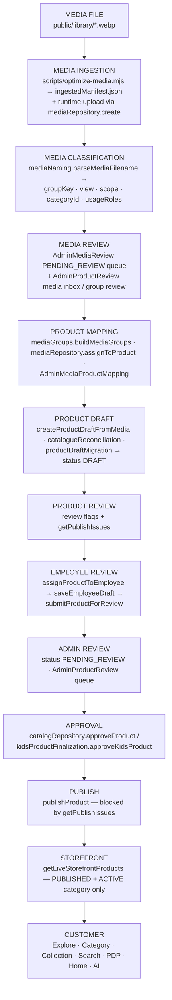
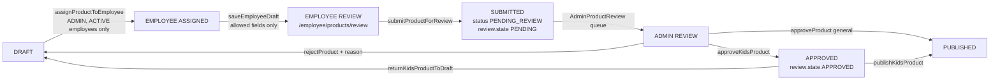
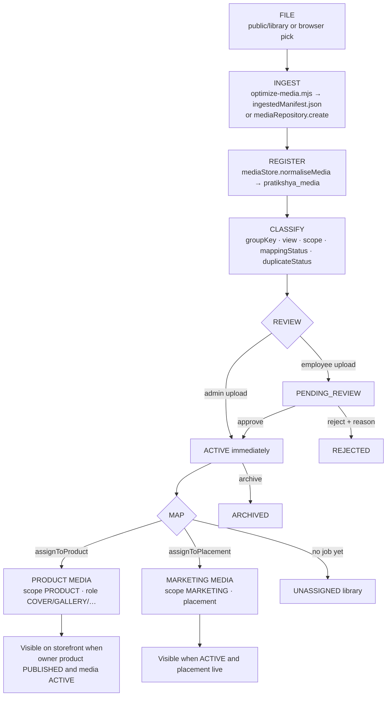
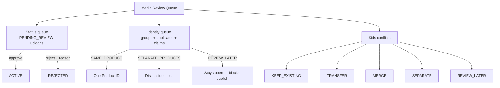
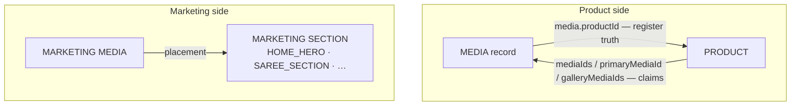
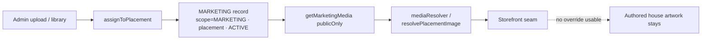
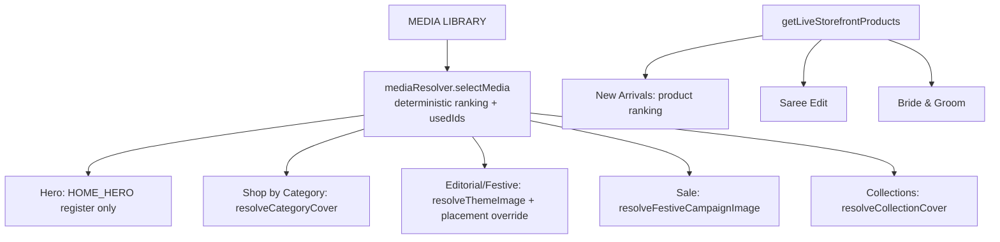
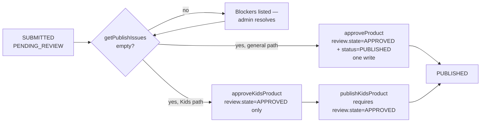
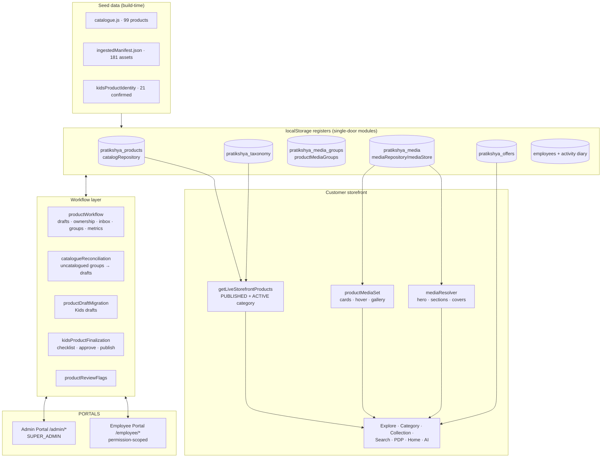

# Pratikshya Fashion
# Product & Media Operational Workflow

> **Audit date:** 2026-08-14 · **Branch:** `arena/019ffff0-pratikshya-fashon` (from `main` @ `5bcea75`)
> **Scope:** Documentation and audit only. No UI, route, data, ID, taxonomy, permission,
> workflow, authentication, catalogue, publishing or employee-management code was changed.
> **Verification:** every claim below was traced to a named file / function / constant in
> `src/`, and the full existing test suite (`npm test`, 342 tests) passes against the code
> described here.

**Status markers used throughout (per the audit brief):**

| Marker | Meaning |
| --- | --- |
| `IMPLEMENTED` | Exists in the repository and is verified against source (and usually tests). |
| `PARTIALLY IMPLEMENTED` | Exists but is incomplete, demo-bound, or only wired for a subset of cases. |
| `NOT IMPLEMENTED` | Does not exist in the frontend today. Do not assume it. |
| `NEEDS BACKEND` | The frontend simulates it (localStorage / seeded JSON); a real backend must own it. |

---

## Table of contents

1. [System Overview](#1-system-overview)
2. [Master Workflow](#2-master-workflow)
3. [Product Lifecycle](#3-product-lifecycle)
4. [Product States](#4-product-states)
5. [Product Review](#5-product-review)
6. [Review Flags](#6-review-flags)
7. [Media Management](#7-media-management)
8. [Media Review Queue](#8-media-review-queue)
9. [Product-Media Mapping](#9-product-media-mapping)
10. [Media Ownership](#10-media-ownership)
11. [Marketing Media](#11-marketing-media)
12. [Homepage Media](#12-homepage-media)
13. [Catalogue Reconciliation](#13-catalogue-reconciliation)
14. [Admin Responsibilities](#14-admin-responsibilities)
15. [Employee Responsibilities](#15-employee-responsibilities)
16. [Publishing](#16-publishing)
17. [Storefront Visibility](#17-storefront-visibility)
18. [Exception Handling](#18-exception-handling)
19. [End-to-End Examples](#19-end-to-end-examples)
20. [Backend Entities](#20-backend-entities)
21. [API Contract](#21-api-contract)
22. [Current Implementation Status](#22-current-implementation-status)
23. [Known Gaps](#23-known-gaps)
24. [Backend Handoff Notes](#24-backend-handoff-notes)
25. [Final Architecture](#25-final-architecture)

---

## 1. System Overview

Pratikshya Fashion is a **browser-only** React 19 + Vite 7 application. There is **no
backend**: all operational state lives in `localStorage` registers seeded from authored
JS/JSON data. This is the single most important fact for anyone reading this document —
every "repository" below is a frontend module wrapping a storage key. `NEEDS BACKEND`
applies to *all* persistence.

### 1.1 The single-register principle

The codebase is built around **one register per concern**, each with exactly one module
allowed to read/write it:

| Concern | Module (single door) | Storage key / source | Change event |
| --- | --- | --- | --- |
| Products | `src/services/catalogRepository.js` | `pratikshya_products` (seeded from `src/data/products/catalogue.js`, 99 authored rows) | `pratikshya-products-changed` |
| Media | `src/services/media/mediaRepository.js` (storage in `mediaStore.js`) | `pratikshya_media` (seeded from `src/data/media/seedMedia.js` + `src/data/media/ingestedManifest.json`, 181 ingested assets) | `pratikshya-media-changed` |
| Group decisions | `src/services/media/productMediaGroups.js` | `pratikshya_media_groups` | `pratikshya-media-groups-changed` |
| Taxonomy & collections | `src/services/taxonomyRepository.js` | `pratikshya_taxonomy` | `pratikshya-taxonomy-changed` |
| Offers | `src/services/offers/offerRepository.js` | `pratikshya_offers` | `pratikshya-offers-changed` |
| Employees | `src/services/employees/employeeService.js` | employee storage via `src/services/employees/storage.js` | `pratikshya-employees-changed` |
| Activity diary | `src/services/employees/activityService.js` | shared activity log (`ACTIVITY_ACTIONS`) — **the one audit log for everything** | `ACTIVITY_CHANGED_EVENT` |

### 1.2 The workflow layer

On top of the registers sits **`src/services/productWorkflow.js`** — the deterministic
`MEDIA → PRODUCT DRAFT → REVIEW → PUBLISH` pipeline (Phase 22). Its own header states the
rules it enforces, all verified in code:

- a media asset belongs to **ONE** product; a conflicting assignment is reported as
  `MEDIA_ALREADY_ASSIGNED` and never silently reassigned;
- Product IDs are permanent, deterministic, never derived from names;
- drafts stay invisible to customers until `PUBLISHED`;
- employees edit only their assigned products, only the allowed fields;
- **visual similarity is a review signal, never automatic identity**.

### 1.3 Three authentication boundaries

| Portal | Context | Guard | Identity |
| --- | --- | --- | --- |
| Customer storefront | `AuthContext` | `ProtectedRoute` (account pages only) | customer account (mock) |
| Employee Operations Portal (`/employee/*`) | `EmployeeAuthContext` | `EmployeeProtectedRoute` + per-path permission (`canAccessPath`) | employee record + permission grants |
| Admin Portal (`/admin/*`) | `AdminAuthContext` | `AdminProtectedRoute` (+ `AdminEmployeeManagementRoute` for `/admin/employees`) | `SUPER_ADMIN` admin account |

An employee session is **never** accepted as admin authentication
(`AdminProtectedRoute.jsx` explicitly documents and enforces this).

### 1.4 Key service modules (all inspected)

`catalogRepository` · `productWorkflow` · `catalogueReconciliation` ·
`productDraftMigration` · `productReviewFlags` · `kidsProductIdentity` ·
`kidsProductFinalization` · `taxonomyRepository` · `media/mediaRepository` ·
`media/mediaStore` · `media/mediaResolver` · `media/productMediaSet` ·
`media/mediaNaming` · `media/mediaGroups` · `media/productMediaGroups` ·
`media/mediaProductDiscovery` · `media/ingestedMedia` · `media/mediaAccess` ·
`media/marketingMediaSource` · `media/productMediaSource` · `media/mediaPaths` ·
`media/mediaMigration` · `media/mediaValidation` · `media/mediaExposure` ·
`media/mediaAudit` · `employees/employeeService` · `employees/authorization` ·
`employees/activityService` · `data/products/index` (storefront access layer) ·
`data/products/explore` · `data/products/query`.

---

## 2. Master Workflow

### 2.1 Master lifecycle diagram



### 2.2 Stage-by-stage transitions

| # | Stage | Who performs | Input | Processing | Output | Data affected | Validation | Blockers | Next state |
| --- | --- | --- | --- | --- | --- | --- | --- | --- | --- |
| 1 | **Media file** | Photographer / build pipeline | image/video file | file placed in `public/library` (build-time) or picked in browser (runtime, demo) | file address | filesystem (build) / browser blob (runtime) | filename convention `[dept]-[cat]-[style]-[number]-[view].webp` | wrong naming → group misdetection | Ingestion |
| 2 | **Ingestion** | Build script (`npm run media:optimize`) or Admin/Employee upload | file | script optimises + writes `ingestedManifest.json` (181 assets, checksums, dimensions, duplicates); runtime `mediaRepository.create()` normalises via `mediaStore.normaliseMedia` | media record with `id` (`med-...`), `scope`, `status` | media register | `UPLOAD_RULES` (type, extension, max 10 MB image / 100 MB video); ephemeral blob URLs are refused as production addresses (`isEphemeralUrl`) → record flagged `demoPlaceholder` | runtime uploads never persist real files (`NEEDS BACKEND`) | Classification |
| 3 | **Classification** | Deterministic code, no human | media record | `parseMediaFilename` derives `groupKey`, `view`, `isStandalone`; manifest carries `categoryId`, `subcategoryId`, `collectionId`, `usageRoles`, `mappingStatus`, `duplicateStatus` | classified record | media register | filename convention only — **no visual guessing** | ambiguous names → `NEEDS_REVIEW` / `UNMAPPED` | Review |
| 4 | **Media review** | Admin (Employee uploads always enter review) | records with `status=PENDING_REVIEW` or mapping/duplicate flags | `mediaRepository.approve/reject` (status queue) · `decideProductGroup` (identity queue) · Kids conflict actions | `ACTIVE` / `REJECTED` media; group decisions | media register + group register + diary | reviewer identity recorded (`reviewedBy`, `reviewedAt`) | undecided groups block publication (`unresolvedGroupConflictsFor`) | Mapping |
| 5 | **Product mapping** | Admin (workflow desk / mapping workspace); Phase 23.2 canonical mapping is automatic | ACTIVE media + groups | `assignToProduct(mediaId, productId, role, {confirmReassign})` — refused without confirmation if owned elsewhere | media with `productId`, `scope=PRODUCT`, `role` | media register | ownership check `validateMediaAssignment`; Kids identity table; one COVER per product | `MEDIA_ALREADY_ASSIGNED` | Draft |
| 6 | **Product draft** | Admin action (`createProductDraftFromMedia`) or automatic migrations (`syncProductDraftRecords`, `syncCatalogueReconciliation`) | media group | stable Product ID minted (`nextStableProductId` / `assignReconciliationIds`), record created with `status=DRAFT`, safe placeholder name, price 0, review flags | draft product | product register | never auto-publishes; never guesses name/price/classification | ownership conflicts recorded as `MEDIA_OWNERSHIP_REVIEW` | Employee review |
| 7 | **Employee review** | Admin assigns; assigned employee edits | draft + assignment | `assignProductToEmployee` (ACTIVE employees only) → `saveEmployeeDraft` (allowed fields only) | edited draft | product register + history + diary | `employeeCanEditProduct` = active status + `products.manage` + assignment | employee lacks permission or assignment | Submit |
| 8 | **Submit** | Assigned employee (or admin) | draft | `submitProductForReview` → `catalogRepository.submitForReview` sets `status=PENDING_REVIEW`, `review.state=PENDING`, `submittedBy/At` | submitted product | product register | refuses PUBLISHED and ARCHIVED products | — | Admin review |
| 9 | **Admin review** | Super Admin | `PENDING_REVIEW` products | review in `AdminProductReview` queue; resolve flags (`clearReviewFlags`), fix media (`setPrimaryMedia`), resolve conflicts (`reconcileKidsConflict`, `transferMediaOwnership`) | decision | product register + media register + diary | `getPublishIssues` must be empty for approval | any publish blocker | Approve / Return |
| 10 | **Approval** | Super Admin | reviewed product | **General path:** `catalogRepository.approveProduct` — sets `review.state=APPROVED` **and status=PUBLISHED in one step**. **Kids path:** `approveKidsProduct` — sets `review.state=APPROVED` while status stays `PENDING_REVIEW`; publish is a separate act | approved product | product register + diary | full `getPublishIssues` (+ `getKidsPublishBlockers` for Kids) | blockers → refuse with reasons array | Publish (Kids) / Storefront (general) |
| 11 | **Publish** | Super Admin | approved product | `publishProduct` → `catalogRepository.publishProduct`; sets `status=PUBLISHED`, `publishedBy/At`, `published=true` | live product | product register + diary | `getPublishIssues` re-checked at publish; Kids also require `review.state===APPROVED` | any blocker | Storefront |
| 12 | **Storefront** | Code, no human | `PUBLISHED` products | `getLiveStorefrontProducts()` filters `status==="PUBLISHED"` **and** category `ACTIVE` in taxonomy; hydrates media via `productMediaSet` | storefront product list | none (read-only) | slug dedupe; media set assembly | archived category hides its products | Customer |
| 13 | **Customer** | Shopper | live list | Explore / category / collection / search / PDP / recommendations / AI | rendered pages | none | Explore dedupes by Product ID | — | — |

---

## 3. Product Lifecycle

### 3.1 MEDIA → PRODUCT: how a product is created from media

There are **four** creation paths, all landing in the one product register:

1. **`createProductDraftFromMedia({ mediaIds, categoryId, subcategory, employeeId, actor })`**
   (`productWorkflow.js`) — the controlled admin action, called from the Media Inbox
   (`MediaInboxCard.jsx`) and Group Review (`decideProductGroup` with `SAME_PRODUCT` and
   no existing product). Steps, exactly as coded:
   1. If `employeeId` supplied → employee must exist and be `ACTIVE`.
   2. Refuses to merge two confirmed Kids plates (`wouldMergeConfirmedKids` →
      `KIDS_MERGE_REFUSED_ERROR`).
   3. Product ID resolved via `preferredProductIdForMedia` → `nextStableProductId`
      (prefix from category, number preferred from the media `groupKey` when unambiguous,
      else next free number).
   4. Every media asset is checked with `validateMediaAssignment`; conflicts are
      **reported**, never resolved silently.
   5. `catalogRepository.createDraftProduct` writes the record: `status=DRAFT`,
      `name=""`, `price=0`, `stock=0`, `mediaIds` = the group, `primaryMediaId` = first
      asset, `galleryMediaIds` = the group, `reviewFlags=["MEDIA_OWNERSHIP_REVIEW"]` if
      conflicted.
2. **Kids draft migration** — `productDraftMigration.syncProductDraftRecords` (runs
   idempotently inside every `catalogRepository` read): mints the 21 `KID-001…KID-021`
   drafts, one per confirmed plate, hydrating metadata from the published kidswear owner
   when safe and adding `NAME/PRICE/TAXONOMY_REVIEW_REQUIRED` flags otherwise.
3. **Catalogue reconciliation** — `catalogueReconciliation.syncCatalogueReconciliation`
   (also inside every read): every *uncatalogued* library media group becomes one DRAFT
   (`SAR-…`, `LEH-…`, `BRD-…`, `MEN-…`, `JEW-…`, `BAN-…`, `INN-…`) — see §13.
4. **Manual editor** — `ProductEditor.jsx` (`/admin/products/new`,
   `/employee/products/new`) via `catalogRepository.createProduct` /
   `catalogRepository.upsert` (id `pf-<timestamp36>`). This is the legacy Phase 11/13
   path; it does not start from media.

### 3.2 Product ID generation `IMPLEMENTED`

- Prefixes: `src/config/productIdPrefixes.js` —
  `KID, MEN, SAR, LEH, BRD, KUR, INN, DUP, BAN, JEW`, default `PRD`.
- `nextStableProductId(categoryId, preferredNumber)` — scans the register, never random,
  never regenerated, **never derived from the product name**.
- Reconciliation IDs (`assignReconciliationIds`) are numbered over the **static**
  manifest-derived group set so a refresh never renumbers a product
  ("bangle-009 stays BAN-009 forever" — verbatim from source comments).
- Authored legacy products keep ids `pf-001 … pf-099` (index-derived, stable).
- `productId` mirrors `id` on every record (`normaliseProductRecord`).
- Admin-only ID change: `changeProductId` (validates `^[A-Z0-9][A-Z0-9-]{1,14}$`,
  uniqueness; re-points media register ownership; logs `PRODUCT_RENAMED_ID`).

### 3.3 Field inventory — provenance and publish requirement

| Field | Provenance | Required for publishing |
| --- | --- | --- |
| `id` / `productId` | **AUTO-GENERATED** (stable ID mint) — admin may change via `changeProductId` | ✔ (`Product ID is required.`) |
| `name` | **MANUALLY ENTERED** (draft starts empty or with safe placeholder) | ✔ real, non-placeholder (`isPlaceholderProductName`) |
| `slug` | **DERIVED** (`slugify(name)`; falls back to Product ID; uniqueness enforced by `ensureUniqueSlug`) | implicit (always exists) |
| `sku` | **DERIVED** default (`PF-00001…` / `<ID>-SKU`), editable; unique across products **and** variants | ✔ |
| `price` (selling) | **MANUALLY ENTERED**; final price recomputed by `computePricing` in `writeProduct` | ✔ > 0 |
| `compareAtPrice` / `originalPrice` | **MANUALLY ENTERED**; mirrored fields (Phase 22: "one field, one meaning") | ✖ (if set must be ≥ price for Kids checklist) |
| `pricing` (mrp, discount, tax) | **DERIVED** through the shared pricing engine (`utils/pricing.computePricing`) — never computed in the UI | engine errors block publish |
| `category` | **MANUALLY ENTERED** / **DERIVED** at reconciliation (explicit media metadata first, filename rule second) | ✔ |
| `subcategory` | **MANUALLY ENTERED** / **DERIVED** from media metadata | ✖ generally; ✔ for Kids (`SUBCATEGORY REVIEW REQUIRED`) — absence sets `TAXONOMY_REVIEW_REQUIRED` at reconciliation |
| `collection` / `collections` | **MANUALLY ENTERED** (multi-select) / hydrated from media `collectionId` | ✖ |
| `description` / `shortDescription` | **MANUALLY ENTERED** | ✔ at least one non-empty |
| Attributes (`fabric, material, colors, patterns, work, occasion, sizes, season, fit, length, highlights, careInstructions, tags`) | **MANUALLY ENTERED** | ✖ |
| `gender` | **DERIVED** (`genderForCategory`: kidswear→Kids, menswear→Men, else Women), editable | ✖ |
| `stock` / `availability` | **MANUALLY ENTERED** (inventory) | ✖ generally; ✔ for Kids (`kidsInventoryValid`: stock > 0 or `made-to-order`) |
| `status` | **DERIVED** by workflow actions only | ✔ must reach `PUBLISHED` via the workflow |
| `mediaIds` / `primaryMediaId` / `galleryMediaIds` | **DERIVED** from the media group at draft creation; edited via `setPrimaryMedia` | ✔ a primary/cover image with undisputed ownership |
| `image` / `hoverImage` / `additionalImages` | legacy authored plates (manifest ids); superseded by the media register; used only as fallback in `productMediaSet` | one of `image` / register cover / mediaSet primary must exist |
| `assignedEmployeeId` | **MANUALLY ENTERED** by admin (`assignToEmployee`) | ✖ |
| `reviewFlags` | **AUTO-GENERATED** by migrations/workflow; cleared by admin or auto-satisfied | ✔ no blocking flag may remain |
| `review` (state, submittedBy/At, reviewedBy/At, rejectionReason) | **AUTO-GENERATED** by workflow actions | Kids publish requires `state=APPROVED` |
| `history` / `priceHistory` | **AUTO-GENERATED** field-level audit trail (`writeProduct`, capped 60 / 24 entries) | ✖ |
| `createdBy/At`, `updatedBy/At`, `publishedBy/At` | **AUTO-GENERATED**, actor-signed | ✖ |
| Views **front / side / back / detail** | **DERIVED** — never stored on the product; resolved per render by `getProductMediaSet` from media `view` labels (filename-parsed, admin-correctable via `updateMediaViewLabel`) | ✖ |

---

## 4. Product States

### 4.1 Persisted states `IMPLEMENTED`

`PRODUCT_STATUS` (`catalogRepository.js`): **`DRAFT`**, **`PENDING_REVIEW`** (canonical
storage of "REVIEW"; `normaliseProductStatus` also accepts `REVIEW`, `IN_REVIEW`,
`UNDER_REVIEW` on read), **`PUBLISHED`**, **`ARCHIVED`**.

`REVIEW_STATE` (parallel review sub-state, stored on `product.review.state`):
`NONE`, `PENDING`, `APPROVED`, `REJECTED`.

> ⚠️ **There is no persisted `SUBMITTED`, `APPROVED`, `RETURNED` or `REJECTED` product
> status.** Those words exist only as the **derived** stage vocabulary below, or as
> `review.state` values. "Returned"/"Rejected" products are `DRAFT` with
> `review.state=REJECTED` + `rejectionReason`.

### 4.2 Derived 6-stage view `IMPLEMENTED` (Kids desks; general desks use raw status)

`kidsStageOf(product)` (`kidsProductFinalization.js`):

```
status PUBLISHED            → PUBLISHED
status ARCHIVED             → ARCHIVED
review.state APPROVED       → APPROVED
status PENDING_REVIEW       → SUBMITTED
assignedEmployeeId set      → EMPLOYEE_REVIEW
otherwise                   → DRAFT
```

### 4.3 State meaning table

| State | Meaning | Who moves **into** it | Who moves **out** of it | Required conditions | Storefront sees it | Employee can edit | Admin can edit |
| --- | --- | --- | --- | --- | --- | --- | --- |
| `DRAFT` | Work in progress; also the landing state after reject/unpublish/restore | system migrations; admin (`createDraftProduct`, `rejectProduct`, `unpublishProduct`, `restoreProduct`); editor create | employee/admin submit; admin publish/archive | none | **NO** | ✔ if assigned + `products.manage` (`employeeCanEditProduct`) | ✔ |
| `PENDING_REVIEW` | Submitted, awaiting admin decision (label "Review") | assigned employee or admin via `submitForReview`; Kids `approveKidsProduct` keeps this status while marking `review.state=APPROVED` | admin (`approveProduct`, `rejectProduct`, `publishProduct`, `archiveProduct`) | product not PUBLISHED/ARCHIVED at submit | **NO** | ✔ technically — `employeeCanEditProduct` does **not** check status (see §23 gaps) | ✔ |
| `PUBLISHED` | Live to customers | admin only (`approveProduct` general path, `publishProduct`, bulk publish) — all gated by `getPublishIssues` | admin (`unpublishProduct` → DRAFT, `archiveProduct`) | full publish checklist (§16) | **YES** (if category ACTIVE) | ✖ effectively — employee edits via `ProductEditor` force status back to DRAFT (`canPublish=false` demotion, "never silently republishes") | ✔ |
| `ARCHIVED` | Retired; nothing is hard-deleted | admin (`archiveProduct`); reconciliation auto-archives redundant drafts; `KEEP_EXISTING`/`MERGE` Kids actions | admin (`restoreProduct` → DRAFT) | none | **NO** | ✖ (`employeeAssignedProducts` filters ARCHIVED out) | ✔ (restore) |

### 4.4 State-transition table

| From → To | Function | Actor | Guard |
| --- | --- | --- | --- |
| (none) → DRAFT | `createDraftProduct` / migrations / `createProduct` | admin / system | stable ID free |
| DRAFT → PENDING_REVIEW | `submitProductForReview` → `submitForReview` | assigned employee, admin | not PUBLISHED/ARCHIVED |
| PENDING_REVIEW → PUBLISHED | `approveProduct` (general: approve **and** publish in one write) | admin | `getPublishIssues` empty |
| PENDING_REVIEW → PENDING_REVIEW (`review.state→APPROVED`) | `approveKidsProduct` | admin | `getKidsPublishBlockers` empty |
| PENDING_REVIEW/DRAFT → PUBLISHED | `publishProduct` | admin | `getPublishIssues` empty; Kids additionally `review.state=APPROVED` |
| PENDING_REVIEW → DRAFT | `rejectProduct(reason)` / `returnKidsProductToDraft` | admin | — (sets `review.state=REJECTED`, `rejectionReason`) |
| PUBLISHED → DRAFT | `unpublishProduct` | admin | — |
| any → ARCHIVED | `archiveProduct` | admin (also automatic in reconciliation & Kids conflict resolution) | — |
| ARCHIVED → DRAFT | `restoreProduct` | admin | — |
| bulk → PUBLISHED/other | `bulkUpdate` | admin | publish path still runs `publishProduct` per product |

Every transition is actor-signed and recorded in the shared activity diary
(`ACTIVITY_ACTIONS.PRODUCT_*`).

---

## 5. Product Review

### 5.1 Review pipeline



### 5.2 Employee side — `/employee/products/review` (`EmployeeProductReview.jsx`) `IMPLEMENTED`

- Route requires `products.view`; editing requires `employeeCanEditProduct`
  (active login status + `products.manage` + `product.assignedEmployeeId ===
  employee.employeeId`).
- Product list = the employee's assigned, non-archived products
  (`employeeAssignedProducts`).
- **Mandatory visual preview**: `ProductPreview` + `getProductWorkflowView(product)`
  returns `{ product, mediaSet, conflicts, issues }` — the full media group (primary,
  front/side/back/detail, gallery, hover state), ownership conflicts and publish issues.
- Editable fields: `EMPLOYEE_EDITABLE_FIELDS` (30 fields — name, price, compareAtPrice,
  descriptions, category, subcategory, gender, fabric, material, colors, patterns, work,
  occasion, sizes, season, fit, length, highlights, careInstructions, collections, tags,
  stock, availability). Anything else in a patch is dropped by
  `pickEmployeeEditableFields` — identity (`id`), media ownership, status, assignment and
  review flags are **not** employee-editable.
- Actions: **Save Draft** (`saveEmployeeDraft` → `catalogRepository.updateDraft`, price
  synced into `pricing`) and **Submit for Review** (`submitProductForReview`).
- Kids products additionally surface `getKidsPublishBlockers` and `kidsHoverState`.

### 5.3 Admin side — `/admin/products/review` (`AdminProductReview.jsx`) `IMPLEMENTED`

Four desks on one page, all reading the shared registers:

1. **MEDIA INBOX** (`getMediaInbox`) — see §8.
2. **PRODUCT DRAFTS** (`ProductDraftReviewPanel`) — per-draft workspace with: name /
   price / compare-at / taxonomy / description editing, review-flag chips (clearable via
   `clearReviewFlags`; auto-satisfied flags computed by `flagsSatisfiedByProduct`),
   primary image selection (`setPrimaryMedia`), view-label correction
   (`updateMediaViewLabel`), conflict resolution (TRANSFER via `reconcileKidsConflict`),
   employee assignment, and the actions **Save**, **Submit**, **Approve & Publish**
   (`approveProduct`), **Publish** (`publishProduct`).
3. **REVIEW QUEUE** — products with `status=PENDING_REVIEW`; approve
   (`catalogRepository.approveProduct`) or reject with a required reason
   (`rejectProduct`).
4. **GROUP REVIEW** (`ProductGroupReviewPanel` + `getPotentialProductGroups` +
   `decideProductGroup`) — see §9.
5. **Kids desks** — `AdminKidsReviewPanel` (reconciliation rows,
   `getKidsReconciliationRows`) and `AdminKidsFinalizationPanel`
   (`getKidsFinalizationRows`, 21-row checklist, employee assignment, approve → publish).

Review coverage asked for in the brief, mapped to implementation:

| Review aspect | Where implemented |
| --- | --- |
| Employee assignment | `assignProductToEmployee` (workflow), `MediaInboxCard`, `AdminKidsFinalizationPanel` |
| Employee permissions | `employeeCanEditProduct`, `EMPLOYEE_EDITABLE_FIELDS`, `hasPermission` |
| Product preview | `ProductPreview.jsx`, `getProductWorkflowView` |
| Media preview | `mediaSet` (primary/front/side/back/detail/gallery/hover) in both panels |
| Name review | `NAME_REVIEW_REQUIRED` flag + `isPlaceholderProductName` + Kids `kidsNameLooksForeign` |
| Price review | `PRICE_REVIEW_REQUIRED` flag + `price > 0` publish rule |
| Taxonomy review | `TAXONOMY_REVIEW_REQUIRED` flag + category required + Kids subcategory validation |
| Grouping review | `GROUP_REVIEW_REQUIRED` flag + `unresolvedGroupConflictsFor` publish blocker + Group Review desk |
| Inventory review | `stock` editing; Kids `kidsInventoryValid` publish rule; general products have **no** inventory publish rule |
| Description review | publish rule "A description is required." |
| Primary image | `setPrimaryMedia` (register cover when owned, claim otherwise) |
| Gallery views | `galleryMediaIds` + `mediaSet.gallery`; view labels correctable |
| Save Draft / Submit / Return / Approve / Publish | `saveEmployeeDraft` / `submitProductForReview` / `rejectProduct`·`returnKidsProductToDraft` / `approveProduct`·`approveKidsProduct` / `publishProduct`·`publishKidsProduct` |

---

## 6. Review Flags

Single vocabulary: `src/services/productReviewFlags.js` (leaf module, no imports).
Flags are **review signals, never a second status system**. Twelve flags exist; nine
block publishing (`PUBLISH_BLOCKING_FLAGS`), three are informational history.

> ⚠️ Naming note: the brief asks about `GROUPING_REVIEW_REQUIRED`; the implemented
> constant is **`GROUP_REVIEW_REQUIRED`** (label "Grouping review required").

| Flag | Cause | Resolver | Publish Blocking | Resolution |
| --- | --- | --- | --- | --- |
| `NAME_REVIEW_REQUIRED` | Draft minted with placeholder/foreign name (migration, reconciliation) | Employee or Admin | **YES** | Enter a real name → auto-satisfied by `flagsSatisfiedByProduct` (`!isPlaceholderProductName`); admin clears via `clearReviewFlags` |
| `PRICE_REVIEW_REQUIRED` | Draft minted with price 0 / owner had no price | Employee or Admin | **YES** | Set price > 0 → auto-satisfied; admin clears |
| `TAXONOMY_REVIEW_REQUIRED` | Category inferred from filename, or missing subcategory at reconciliation/migration | Employee or Admin | **YES** | Set category **and** subcategory → auto-satisfied; admin clears |
| `GROUP_REVIEW_REQUIRED` | Reconciliation group carried `NEEDS_REVIEW` / `UNMAPPED` / duplicate signals (`groupNeedsReview`) | Admin (Group Review desk) | **YES** | Decide SAME_PRODUCT / SEPARATE_PRODUCTS; admin clears flag |
| `VARIANT_REVIEW_REQUIRED` | Group flagged `variantReviewRequired` / media `variantId` | Admin | **YES** | Human variant decision; admin clears. `PARTIALLY IMPLEMENTED` — counted in metrics, no dedicated desk sets/clears it automatically |
| `NEEDS_MEDIA` | `SEPARATE` Kids conflict action strips claims; product left without a primary | Admin | **YES** | Assign/claim a primary image → auto-satisfied when `mediaSet.primary` exists |
| `MEDIA_OWNERSHIP_REVIEW` | Draft created over media owned by another product (`createProductDraftFromMedia` conflicts) | Admin | **YES** | Resolve ownership (TRANSFER/KEEP_EXISTING/…); auto-satisfied when primary exists and no conflicts remain |
| `CONFLICT_UNRESOLVED` | Kids migration found the plate owned by a different product | Admin | **YES** | `reconcileKidsConflict` action; auto-satisfied when conflict-free |
| `KIDS_MIGRATION_REVIEW` | Kids migration uncertainty | Admin | **YES** | Real name entered → auto-satisfied; admin clears |
| `CONFLICT_REVIEW_LATER` | Admin chose **Review Later** on a Kids conflict | Admin | no | Informational marker; conflict itself still blocks via `MEDIA_OWNERSHIP_REVIEW`/conflict checks |
| `MEDIA_OWNERSHIP_MOVED` | `transferMediaOwnership` stripped this product's stale references; reconciliation archived a redundant draft | — | no | Informational history |
| `MEDIA_UNASSIGNED` | `unassignProductMedia` detached this product's media | — | no | Informational history |

**Where flags are displayed:** flag chips on `ProductDraftReviewPanel` (admin) and
`EmployeeProductReview` (via `reviewFlagLabel`); blocking flags are also folded into
`getPublishIssues` text ("Review flags must be resolved before publishing: …"), so they
appear anywhere publish issues render (admin product detail, editor, review desks).

**If unresolved:** the product simply cannot publish — `approveProduct` /
`publishProduct` return `{ ok:false, errors:[…] }`. Nothing expires or escalates.

---

## 7. Media Management

### 7.1 Media lifecycle



### 7.2 Media record fields `IMPLEMENTED` (`mediaStore.normaliseMedia`)

| Field | Meaning |
| --- | --- |
| `id` | `med-<timestamp36>-<seq>` (`createMediaId`) or manifest id; permanent |
| `fileName` / `originalFilename` / `currentFilename` | filenames; `currentFilename` is the canonical post-migration name |
| `url` / `filePath` / `optimizedPath` / `originalPath` / `thumbnail` / `poster` | addresses; canonical root `/library` (`mediaPaths.CANONICAL_MEDIA_ROOT`); blob/data URLs are stripped (`isEphemeralUrl`) |
| `type` | `IMAGE` \| `VIDEO` (`MEDIA_TYPES`) |
| `scope` | `PRODUCT` \| `MARKETING` \| `UNASSIGNED` — derived from `productId`/`placement` when absent |
| `status` | `DRAFT` \| `PENDING_REVIEW` \| `ACTIVE` \| `REJECTED` \| `ARCHIVED` — **only ACTIVE media is ever shown to a customer** |
| `productId` | register-level ownership — **the single ownership truth** |
| `role` | product-page role: `COVER` (max one per product, enforced), `GALLERY`, `DETAIL`, `LIFESTYLE`, `MODEL`, `CLOSEUP`, + 4 video roles |
| `usageRoles` | distribution roles (`HERO`, `CATEGORY_COVER`, `PRODUCT_PRIMARY`, `EDITORIAL`, `BANNER`, `NEW_ARRIVAL`, `SALE`, `LOOKBOOK`, `COLLECTION_COVER`, `AI_SHOPPING`, `AI_MIRROR`, …) read by the resolver — orthogonal to `role` |
| `placement` / `campaign` / `section` | marketing placement + campaign window |
| `groupKey` / `view` / `viewScore` / `isStandalone` | Phase 21.6 filename-derived grouping |
| `mappingStatus` | `MAPPED` \| `UNMAPPED` \| `NEEDS_REVIEW` |
| `mappingMethod` / `mappingNote` | provenance of the mapping (e.g. `HOMEPAGE_HERO_REGISTER`) |
| `duplicateStatus` / `duplicateOf` | `UNIQUE` \| `DUPLICATE` \| `POSSIBLE_DUPLICATE` — never auto-deleted |
| `categoryId` / `subcategoryId` / `collectionId` / `variantId` | taxonomy metadata from ingestion |
| `uploadedBy` / `uploadedByEmployeeId` / `uploadedByType` | provenance (`ADMIN` \| `EMPLOYEE`) |
| `reviewStatus` / `reviewedBy` / `reviewedAt` / `rejectionReason` | media review trail |
| `ingested`, `checksum`, `width`, `height`, `large`, `lowResolution`, `broken`, `demoPlaceholder`, `featured` | quality/provenance markers |
| `sortOrder` | dense 0..n-1 per product (resequenced on every write); cover always leads |
| `ai.{tags,caption,analysedAt}` | reserved, nothing writes it — `NOT IMPLEMENTED` (structured placeholder) |

### 7.3 Ordering & cover invariants (enforced in `mediaRepository`, not UI)

- a product has **at most one COVER**; promoting one demotes the incumbent
  (`create`, `update`, `setCover`, `assignToProduct` all enforce this);
- a product's first image auto-becomes COVER if none exists;
- removing a cover promotes the next image (`remove`);
- `reorder` / `moveWithinProduct` keep the cover in slot 0;
- videos can never be covers (`setCover` refuses).

### 7.4 PRODUCT MEDIA vs MARKETING MEDIA

| | PRODUCT media | MARKETING media |
| --- | --- | --- |
| Scope | `MEDIA_SCOPES.PRODUCT` | `MEDIA_SCOPES.MARKETING` |
| Owner | exactly one `productId` | a `placement` (one of 13 `MARKETING_PLACEMENTS`), never a `productId` (`assignToPlacement` nulls it) |
| Role field | `role` (COVER/GALLERY/…) | `role=null`; ordered by `sortOrder` within placement |
| Reaches customer via | `productMediaSet` → ProductCard/PDP, only while the owning product is PUBLISHED | `getMarketingMedia(placement,{publicOnly:true})` → homepage/section seams, only while ACTIVE on a live placement |
| Becomes a product? | is the product's imagery | **never** — reconciliation excludes house artwork (`isHouseMedia`), and discovery pools only `PRODUCT`/`UNASSIGNED` scopes; hero records additionally require `!media.productId` |
| Assignment door | `assignToProduct` / `transferMediaOwnership` | `assignToPlacement` |

### 7.5 Upload paths

- **Admin** (`/admin/media/upload`, `/admin/products/:id/media`, marketing page):
  `useMediaActions().upload` → status **ACTIVE** immediately, `uploadedByType:"ADMIN"`.
- **Employee** (`/employee/media/upload`, requires `media.upload`):
  same door, status **PENDING_REVIEW**, `uploadedByType:"EMPLOYEE"` — always enters the
  review queue (`MediaUploadForm.jsx` line 251/257, `useMediaActions` provenance
  defaults).
- Both are **demo uploads**: files are previewed in-browser only (`UPLOAD_NOTICE`:
  "Files are previewed in this browser session only…"). `NEEDS BACKEND` for real storage.

---

## 8. Media Review Queue

Two distinct queues exist. The brief's "Media Review Queue" maps to both:

### 8.1 Status review queue — `/admin/media/review` (`AdminMediaReview.jsx`) `IMPLEMENTED`

- **What enters / why:** every record with `status=PENDING_REVIEW`
  (`mediaRepository.getPendingReview`) — in practice, employee uploads.
- **Reviewer sees:** preview thumb (`MediaThumb`), title/filename, media id, type,
  product mapping (`productId` + product name via `catalogRepository`) or placement,
  role label, uploader (`uploadedBy`, employee id), upload time; grouped by
  `(productId || placement || "unassigned") + uploadedByEmployeeId`.
- **Actions:** select single/group/bulk → **Approve** (`mediaRepository.approve` →
  ACTIVE, `reviewStatus=APPROVED`, reviewer + timestamp recorded) or **Reject** with a
  reason from `REJECTION_REASONS` or free text (`mediaRepository.reject` → REJECTED,
  `rejectionReason` stored). Both logged in the shared diary (`MEDIA_APPROVED`,
  `MEDIA_REJECTED`).

### 8.2 Workflow media inbox + group review — `/admin/products/review` `IMPLEMENTED`

**Media inbox** (`getMediaInbox` in `productWorkflow.js`): every asset that is
`UNASSIGNED`, `DRAFT`, `PENDING_REVIEW`, `NEEDS_REVIEW`/`UNMAPPED` mapping,
duplicate-flagged, claimed by a draft, or owned by a non-published product.
Each row carries: the media record, `groupKey`, `view`, standalone flag, owner product,
claiming drafts, category, assigned employee (id + name), and a rank tag
(`DRAFT` > `REVIEW` > `UNASSIGNED` > `NEEDS_REVIEW` > `CLAIMED_BY_DRAFT`/`OPEN`).
Row actions (`MediaInboxCard`): **create product draft from media**
(`createProductDraftFromMedia`) and **assign employee** (`assignProductToEmployee`).

**Group review** (`getPotentialProductGroups` → `ProductGroupReviewPanel`): candidates
from three deterministic signals only — filename multi-view groups, duplicate signals
(`duplicateOf` pairs), and stored pending human decisions. Each candidate shows the media
rows (file, src, groupKey, view, current owner + name), the reason text, and whether it is
already confirmed. Decision via `decideProductGroup`:

| Decision (`GROUP_DECISIONS`) | Effect |
| --- | --- |
| `SAME_PRODUCT` | all media → one Product ID: transfers into `existingProductId` (with `confirm:true`) or creates a new draft; decision + product stored in the group register |
| `SEPARATE_PRODUCTS` | each asset keeps its own identity; decision recorded; group stops blocking publish |
| `REVIEW_LATER` | decision recorded as pending; the group **stays open and keeps blocking** publication of claiming products (`unresolvedGroupConflictsFor`) |

Kids-guard: `SAME_PRODUCT` over two confirmed Kids plates is refused
(`KIDS_MERGE_REFUSED_ERROR`).

### 8.3 Kids conflict actions (`KIDS_CONFLICT_ACTIONS`, `reconcileKidsConflict`) `IMPLEMENTED`

The five actions the brief lists, exactly as implemented:

| Action | Exact behavior |
| --- | --- |
| `KEEP_EXISTING` ("Keep Existing Product") | draft's media claims cleared; **draft archived**; media stays with the current owner |
| `TRANSFER` ("Transfer to KID Product") | each conflicting asset moved via `transferMediaOwnership(confirm:true)`; previous published kidswear owner that is left with no media is archived; conflict flags removed |
| `MERGE` ("Merge into Existing Product") | requires exactly one owner; draft's real name/price/subcategory/descriptions copied onto the owner; draft claims cleared; **draft archived** |
| `SEPARATE` ("Create Separate Product") | claims cleared; draft keeps its identity and gains `NEEDS_MEDIA` |
| `REVIEW_LATER` | adds `CONFLICT_REVIEW_LATER`; conflict deferred, still blocking |

All are logged (`PRODUCT_CONFLICT_RESOLVED`).



---

## 9. Product-Media Mapping

### 9.1 The deterministic grouping convention `IMPLEMENTED`

`mediaNaming.parseMediaFilename` + `mediaGroups.buildMediaGroups`:

```
[department]-[category]-[style]-[number]-[view].webp

women-saree-banarasi-001-front.webp  → groupKey women-saree-banarasi-001, view front
women-saree-banarasi-001-side.webp   → same groupKey                     , view side
women-saree-banarasi-001-back.webp   → same groupKey                     , view back
                                     ⇒ ONE group ⇒ ONE product, three views

kids-001.webp                        → groupKey kids-001, view null, standalone
women-innerwear-001.webp / -002 / -003 ⇒ THREE groups ⇒ THREE products
```

```mermaid
flowchart LR
    subgraph One product — multi-view group
      MF[product-001-front] --> P1[ONE PRODUCT<br/>FRONT · SIDE · BACK · DETAIL]
      MS[product-001-side] --> P1
      MB[product-001-back] --> P1
    end
    subgraph Separate products — standalone files
      S1[product-001.webp] --> PA[PRODUCT A]
      S2[product-002.webp] --> PB[PRODUCT B]
    end
```

**`product-front.webp` / `product-back.webp` / `product-side.webp`** → the view suffix is
stripped, all three share groupKey `product` → **one group, one product**.
**`product-001.webp` / `product-002.webp`** → `001`/`002` are not view suffixes →
**different groupKeys → two groups → two products, always.** Nothing in the codebase
merges different groupKeys automatically; a merge requires an explicit human
`SAME_PRODUCT` decision, and confirmed Kids plates cannot be merged even then.

### 9.2 SIMILAR IMAGE ≠ SAME PRODUCT `IMPLEMENTED` (as an enforced invariant)

Stated and enforced in `productWorkflow.js`, `catalogueReconciliation.js`,
`kidsProductIdentity.js`, `mediaProductDiscovery.js`:

- grouping input is the **filename only** — "No visual similarity, no colour, no model,
  no approximate matching" (`mediaGroups.js` header);
- similarity/duplicate signals produce **review candidates**, never identity;
- `wouldMergeConfirmedKids` refuses any group decision or draft creation that would fold
  two confirmed Kids products into one, with error `KIDS_MERGE_REFUSED_ERROR`.

### 9.3 Ownership, claims, and the two-layer model `IMPLEMENTED`

- **Register ownership** (`media.productId` in the media register) — *the* single
  ownership truth (`mediaRepository.getMediaOwner`).
- **Product claims** (`product.mediaIds` / `primaryMediaId` / `galleryMediaIds` on the
  product record) — the product's *own* assertion. A claim contested by register
  ownership is surfaced as a conflict (`resolveProductMediaClaims` →
  `MEDIA_ALREADY_ASSIGNED` / `MEDIA_NOT_FOUND` / `MEDIA_MISSING_FILE`), **never**
  silently resolved.

Transfer flow (`transferMediaOwnership` — "the ONE door for reassignment"):
requires `confirm:true` when contested; refuses moving a confirmed Kids plate to the
wrong KID id; strips the previous owner's stale `image`/`hoverImage`/`additionalImages`
references and flags it `MEDIA_OWNERSHIP_MOVED`; logs `PRODUCT_MEDIA_TRANSFERRED`.

### 9.4 Cross-product / cross-category prevention `IMPLEMENTED`

- `productMediaSet.isProductOwnedMedia` — a record is product-owned **only** when it
  carries this product's id. "Category, folder, filename prefix and usage role are never
  enough."
- `assembleProductMediaSet` drops any item carrying a different `productId` and marks the
  set `CROSS_PRODUCT_REFERENCE`.
- Kids: `kidsMediaOwnershipIssues` detects `CROSS_PRODUCT_MEDIA`,
  `CROSS_PRODUCT_OWNERSHIP`, `CROSS_PRODUCT_GALLERY`, `WRONG_PRIMARY` — all publish
  blockers.
- Duplicate ownership (same file owned by two products) is measured and reported in
  `getWorkflowMetrics().media.duplicateOwnership`; resolution is human, through the
  conflict actions.

### 9.5 Mapping workspaces

- `/admin/media/product-mapping` (`AdminMediaProductMapping.jsx`) — group browser
  (ALL / MATCHED / NEEDS_REVIEW / STANDALONE filters), manual product selection, primary
  image + ordering; writes through `useMediaActions` → `mediaRepository`.
- `/admin/media/:mediaId` (`AdminMediaDetail.jsx`) — per-asset detail incl.
  `transferMediaOwnership` with explicit confirmation.
- `mediaProductDiscovery.getMediaProductDiscovery` — **read-only** coverage report
  (`MEDIA FILE → GROUP → PRODUCT ID → CATALOGUE RECORD`), ownership precedence
  `REGISTER → PRODUCT_CLAIM → SOURCE_GROUP → CANONICAL_ASSIGNMENT`; used by audits, it
  "creates nothing, writes nothing, publishes nothing."

---

## 10. Media Ownership



**Answers to the brief's ownership questions (verified behavior):**

| Question | Current behavior |
| --- | --- |
| Can one media belong to multiple products? | **No.** `media.productId` is scalar. A second product may *claim* it, which is reported as an ownership conflict and blocks that product's publication until resolved. |
| Can one product have multiple media? | **Yes.** Unbounded; one COVER + ordered gallery (`sortOrder` dense per product). |
| What happens during transfer? | `transferMediaOwnership`: validation → optional `confirm` → `assignToProduct(confirmReassign:true)` → previous owner's stale references stripped + `MEDIA_OWNERSHIP_MOVED` flag → diary entry. Kids plates cannot transfer to a wrong KID id. |
| What happens on ownership conflict? | Reported (`MEDIA_ALREADY_ASSIGNED` with owner id/name/status); publish blocked ("Media ownership must be resolved before publishing (n conflicts)"); human resolves via transfer / keep / merge / separate / later. |
| What happens when a product is archived? | Status becomes `ARCHIVED`; **its media keeps `productId` pointing at it** — media is *not* detached automatically. Archived products drop out of inbox claim scans (`getMediaInbox` skips ARCHIVED claims) and out of the storefront. Exception: Kids `KEEP_EXISTING`/`MERGE` explicitly clear the draft's claims before archiving. |
| What happens to its media? | Stays owned (still counted as `scope=PRODUCT`); becomes effectively invisible to customers because visibility requires a PUBLISHED owner. Detaching requires an explicit `unassignProductMedia`. `PARTIALLY IMPLEMENTED` — no automatic release policy exists. |
| Orphaned media (owner id no longer in register)? | Detected and reported (`getWorkflowMetrics().media.orphaned` / `invalidProductIds`); no automatic repair. |

Marketing ownership is separate and simpler: `assignToPlacement` sets
`scope=MARKETING`, `placement`, clears `productId`/`role`; clearing the placement returns
the record to `UNASSIGNED`.

---

## 10a. Hover Image Workflow (brief §10)

**Source of truth:** `getProductCardMedia(product)` →
`getProductMediaSet` → `pickHover` in `src/services/media/productMediaSet.js`.
`ProductCard.jsx` (design system) calls **only** this helper; `MediaFrame` →
`PratikshyaImage` renders a hover swap **only when `hoverImage` is provided**.

Selection, exactly as coded:

1. Owned items only (register-owned, then authored-plate fallback, then verified claims —
   never another product's media, never category/folder/filename-prefix matches).
2. Primary = COVER role → else `front` view → else best `primaryRank`.
3. Hover = first owned item matching `HOVER_VIEW_PRIORITY`, skipping the primary:
   `back → side → left-side → right-side → left → right → detail → close → closeup →
   close-up → front-close → front-detail → left-side-detail → right-side-detail`;
   else any other owned item; else the primary itself.
4. `hasAlternate = hover !== primary`. When false, `getProductCardMedia` returns
   `hoverImage: undefined` → **the card does not swap on hover**.

Resulting rules (all verified, incl. `tests/productMediaSet.test.js` and
`kidsHoverState`):

| Owned views | Hover |
| --- | --- |
| Front + Back | **Back** |
| Front + Side | **Side** |
| Front + Side + Back | **Back** (back outranks side in `HOVER_VIEW_PRIORITY`) |
| Front only / standalone plate | **No hover swap** (`hoverImage` omitted) |

**NEVER** a random image, another product's image, another category's image, or another
group's image — enforced structurally because the candidate pool is the product-owned
set only (`isProductOwnedMedia`), with cross-product items dropped and flagged.

---

## 11. Marketing Media

### 11.1 Identification & registration `IMPLEMENTED`

Marketing media is any record with `scope=MEDIA_SCOPES.MARKETING` + a `placement` from
`MARKETING_PLACEMENTS` (`src/config/mediaTypes.js`):
`HOME_HERO, WOMEN_SECTION, SAREE_SECTION, LEHENGA_SECTION, BRIDAL_SECTION,
GROOM_SECTION, KIDS_SECTION, BANGLES_SECTION, JEWELLERY_SECTION, FESTIVE_SECTION,
NEW_ARRIVALS, EDITORIAL, PROMOTION` — all currently marked `live: true`.

> The brief's example labels map as: `HOME_HERO`→`HOME_HERO`; `HERO`/`BANNER`/`SALE`/
> `EDITORIAL`/`LOOKBOOK`/`COLLECTION` exist as **usage roles** (`USAGE_ROLES`) rather
> than placements — both vocabularies are real and are used together by the resolver.

Registered by admin upload on `/admin/media/marketing` (per-placement "Add media"),
or by `assignToPlacement(mediaId, placement, meta)` from the library. Campaign window
(`campaign`, `campaignStart`, `campaignEnd`) can be attached (stored;
scheduling/enforcement of windows is `NOT IMPLEMENTED`).

### 11.2 Assignment to homepage/marketing sections

- `getMarketingMedia(placement, { publicOnly:true })` returns ACTIVE records with a real
  URL on live placements, ordered by `sortOrder`.
- **One active record per placement reaches customers — the first in order**
  (documented in `AdminMarketingMedia.jsx`; `marketingMediaSource.resolvePlacementImage`
  uses the override only when it resolves to a real address, else the authored house
  artwork stays).
- The `HOME_HERO` carousel is stricter — see §12.

### 11.3 Differences from product media / why it never becomes a product

- `assignToPlacement` **nulls `productId` and `role`** — a marketing record cannot own a
  product mapping simultaneously.
- Product discovery & reconciliation pool **only** `PRODUCT`/`UNASSIGNED` scopes and
  exclude house artwork (`isHouseMedia`) — marketing plates are structurally invisible
  to draft minting.
- Homepage hero resolution additionally filters `!media.productId`
  (`resolveHomepageHeroMedia`), and Explore ads require `isMarketingPlate`
  (`explorePlacements.js`: "They never use a product's primary / gallery / hover plate
  as an advertisement").

### 11.4 How it reaches the frontend

`useMarketingMedia(placement)` hook → `mediaResolver` /
`marketingMediaSource` → storefront seams (`HeroCarousel`, `CelebrationEdit`,
`SaleBanner`, category pages). Metrics on `/admin/media` count marketing separately
(`getMediaMetrics().marketingMedia`, `activeMarketing`).



---

## 12. Homepage Media

### 12.1 Resolver chain

```
MEDIA LIBRARY (pratikshya_media)
  ↓ mediaRepository.getMarketingMedia / getAll
MEDIA RESOLVER (src/services/media/mediaResolver.js — "the single distribution door")
  ↓ selectMedia ranking: house-plate-last → preferred usage role → featured →
    quality score → portrait preference → stable id order  (never random,
    a refresh never reshuffles; usedIds prevents duplicates in one viewport)
HOMEPAGE SECTION (AtelierDesign.jsx seams)
  ↓
HERO / EDITORIAL / CATEGORY / SALE / COLLECTION plates
```

Every resolved cover carries a `reason` (`FALLBACK_REASONS`): `DIRECT`,
`PRODUCT_GALLERY`, `TAXONOMY_PRODUCT`, `RELATED_TAXONOMY`, `HOUSE_FALLBACK`,
`NO_SOURCE_MEDIA` — so audits can prove *what* was selected.

### 12.2 Section-by-section (they do **not** all work the same way)

| Section (component) | Resolution path |
| --- | --- |
| **Hero** (`HeroCarousel`) | strictest chain: `useMarketingMedia(HOME_HERO)` → `resolveHeroSlideImages` → `resolveHomepageHeroMedia` requires placement `HOME_HERO` **and** usage role `HERO` **and** `mappingMethod === "HOMEPAGE_HERO_REGISTER"` **and** no `productId`; ordered by `sortOrder`. Outage fallback: ACTIVE non-product HERO record only — "Product, category and AI imagery can never be substituted into the homepage hero." Hero image ids are reserved (`resolveHeroImageIds`) and passed as `excludeIds` to later sections. |
| **Saree Edit** (`SareeEditCarousel`) | product-driven: `selectSareeEditProducts` ranks live saree products (8, `SAREE_EDIT_PRODUCT_COUNT`); cards use product-owned media. |
| **Bride & Groom** (`BrideGroomEdit`) | product-driven: `selectBrideGroomLooks` over `BRIDE_CATEGORY_IDS`/`GROOM_CATEGORY_IDS` with wedding-name heuristics (`isBrideWeddingProduct`). |
| **Celebration/Festive Edit** (`CelebrationEdit`) | `FESTIVE_SECTION` placement override via `resolvePlacementImage`, else `resolveEditorialFrame(theme)` (→ `resolveThemeImage`, HERO/EDITORIAL/LOOKBOOK roles per theme), else authored `imageRef`. |
| **Shop by Category** (`ShopByCategory`) | categories from `taxonomyRepository.activeCategories()`; each cover via `resolveCategoryCover`: category `bannerMediaId` (ACTIVE) → `CATEGORY_COVER`/`EDITORIAL`/`HERO` role media for that category → best member-product library image (`TAXONOMY_PRODUCT`) → related taxonomy media → authored artwork (`NO_SOURCE_MEDIA`). |
| **New Arrivals** (`NewArrivals`) | product-driven: `selectNewArrivalProducts(getLiveStorefrontProducts(), 5)` — media-tier ranking (`productMediaTier`), no marketing plates. |
| **Sale** (`SaleBanner`) | offer text from `offerRepository` (highest-priority live percentage collection offer — never hardcoded); backdrop via `resolveFestiveCampaignImage` → `resolveSaleBackdrop` (PROMOTION placement override → SALE/BANNER/EDITORIAL role media → house festive plate). |
| **Collections** (category/collection pages, `CatalogueListing`) | `resolveCollectionCover`: collection `heroMediaId`/`thumbnailMediaId` → `COLLECTION_COVER`+ roles → collection-tagged media → member-product image → authored artwork. |



---

## 13. Catalogue Reconciliation

`src/services/catalogueReconciliation.js` (Phase 23) — **MEDIA EXISTS but PRODUCT DOES
NOT EXIST** is resolved here, automatically and idempotently, on every catalogue read
(`catalogRepository.read()` → `syncCatalogueReconciliation`).

**Pipeline:**

1. **Discovery** — `staticReconciliationGroups()`: ingested manifest records, minus house
   artwork (`isHouseMedia`), minus the 21 Kids plates (`isKidsMedia`), scopes
   PRODUCT/UNASSIGNED, grouped by `buildMediaGroups`. The *static* (manifest-derived)
   set is used deliberately so Product IDs never renumber (always 61 uncatalogued
   groups).
2. **Grouping** — one filename group = one physical product (`ONE PHYSICAL PRODUCT = ONE
   PRODUCT ID`, module header).
3. **ID assignment** — `assignReconciliationIds`: fixed category order → groupKey order →
   sequential numbers with the category prefix (SAR-001, LEH-001, BRD-…, MEN-…, JEW-…,
   BAN-…, INN-…).
4. **Phase 23.2 canonical assignment** — `assignedProductMediaMap` pairs some
   uncatalogued groups to EXISTING published products that have no register media
   (bangles by id order; jewellery `Earrings` subcategory; innerwear by id order), and
   `syncCanonicalMediaAssignment` applies register ownership (first view COVER, rest
   GALLERY) — "Existing ownership is never stolen: a file already owned by a different
   product is left alone." Groups so assigned are **not** drafted; a previously minted
   redundant draft is auto-ARCHIVED with `MEDIA_OWNERSHIP_MOVED`.
5. **Draft creation** — `draftRecordForGroup`: `status=DRAFT`, safe name
   `Uncatalogued <Label> · <ID>` (`reconciliationDraftName`), slug = lowercased Product
   ID, SKU `<ID>-SKU`, price 0, media **claims** only (register ownership is *not*
   transferred here — "that is the productWorkflow's job"), provenance fields
   `sourceGroupKey`, `sourceGroupNumber`, `sourceViewCount`.
6. **Metadata hydration** — category from explicit media `categoryId` (else filename
   rule, marked *inferred*), subcategory/collection when unanimous across the group.
7. **Review flags** — always `NAME_REVIEW_REQUIRED` + `PRICE_REVIEW_REQUIRED`;
   `TAXONOMY_REVIEW_REQUIRED` when category missing/inferred or subcategory absent;
   `GROUP_REVIEW_REQUIRED` when the group carries ingestion/duplicate flags
   (`groupNeedsReview`).
8. **Ownership conflicts** — expressed via claims; surfaced later by
   `resolveProductMediaClaims` in review.
9. **Employee assignment** — `assignedEmployeeId: null` at mint; assignment is a manual
   admin step afterwards.
10. **Publication** — never here. "Nothing auto-publishes." Drafts flow into §5.
11. **Idempotency** — `ensureCatalogueReconciliation` upgrades only placeholder-state
    fields of existing drafts ("Anything a human has already set … is left exactly as it
    is"); versioned by `pratikshya_catalogue_reconciliation_version` (v2). Kids records
    are never touched here.

Summary reporting: `getCatalogueReconciliationSummary` (total/catalogued/uncatalogued
groups, assigned-to-published, new candidates, needs-review, per-category rollup).

---

## 14. Admin Responsibilities

**Authorization model** (`src/config/adminAccess.js`, verified — nothing invented):

- One admin role exists: **`SUPER_ADMIN`** (seed account `PF-ADM-00001`, Kavya Menon).
- The only **enumerated** admin permission key is
  `ADMIN_PERMISSIONS.EMPLOYEES_MANAGE` (`employees.manage`), granted to SUPER_ADMIN and
  checked by `hasAdminPermission` / `canManageEmployeeAccounts` — route-guarded by
  `AdminEmployeeManagementRoute` and re-checked in service writes.
- **All other admin authority is session-scoped, not permission-keyed:** any
  authenticated, ACTIVE Super Admin session behind `AdminProtectedRoute` may use every
  admin page; media access resolves to a full grant
  (`resolveMediaAccess`: "a Super Admin session carries every media permission").
- Employee-account permission keys are **reserved to the Admin domain** —
  `employees/authorization.hasPermission` hard-denies them for any employee
  (`isEmployeeAccountPermission` → `false`), and
  `sanitizeEmployeePermissions` strips them from any employee grant list.

What the Super Admin can actually do (routes verified in `App.jsx`):

| Capability | Where / function | Status |
| --- | --- | --- |
| Manage employees (create/edit/role/permissions/suspend/activate/deactivate/reset password) | `/admin/employees*` → `EmployeeManagementContext` → `employeeService` (`createEmployee`, `updateEmployee`, `setEmployeeStatus`, `resetEmployeePassword`, …) | `IMPLEMENTED` (ADMIN ONLY, `employees.manage`) |
| Manage products (CRUD, duplicate, bulk, ID change) | `/admin/products*`, `ProductEditor`, `catalogRepository` | `IMPLEMENTED` |
| Review products | `/admin/products/review` (four desks + Kids panels) | `IMPLEMENTED` |
| Review media | `/admin/media/review` + workflow inbox/group review | `IMPLEMENTED` |
| Resolve ownership | `transferMediaOwnership`, `unassignProductMedia`, `reconcileKidsConflict`, `AdminMediaDetail` | `IMPLEMENTED` |
| Approve products | `approveProduct` / `approveKidsProduct` | `IMPLEMENTED` |
| Publish products | `publishProduct` / `publishKidsProduct` / bulk | `IMPLEMENTED` |
| Manage taxonomy (categories/subcategories) | `/admin/categories*` → `taxonomyRepository` (create/update/archive/restore) | `IMPLEMENTED` |
| Manage collections | `/admin/collections*` → `taxonomyRepository` (+ activate/deactivate, product assignment via `collections` field) | `IMPLEMENTED` |
| Manage marketing media | `/admin/media/marketing` → `assignToPlacement`, activate/archive | `IMPLEMENTED` |
| Manage offers | `/admin/offers*` → `offerRepository` (DRAFT/SCHEDULED/ACTIVE/PAUSED/EXPIRED/ARCHIVED) | `IMPLEMENTED` |
| Orders, returns, customers, inventory, analytics, AI business assistant | respective `/admin/*` routes | `IMPLEMENTED` (mock data domains) |

> ⚠️ Documented inconsistency: because admin authority beyond `employees.manage` is
> session-implied rather than permission-keyed, a backend cannot copy a per-permission
> admin matrix from the frontend — it must define one (`NEEDS ADMIN DECISION` /
> `NEEDS BACKEND`).

---

## 15. Employee Responsibilities

**Model:** role → default permissions → authorization
(`employeeRoles.js` → `employeePermissions.js` → `employees/authorization.js`).
Pages ask `hasPermission("inventory.view")`; they never test roles. Missing role or
empty grant list = deny.

Roles (`ROLE_DEFINITIONS`): Store Manager (`MGR`), Sales Executive (`SLS`), Inventory
Manager, Inventory Staff, Warehouse Staff, Customer Support, Fashion Stylist (`STY`).
Only **Store Manager** carries `products.manage` and the full media grant
(`media.view/upload/edit/assign/manage`) by default; Fashion Stylist has
`media.view/upload`; grants are customizable per employee (except the reserved
employee-account keys).

Employee product/operational work (all `IMPLEMENTED`):

- **Assigned products** — `/employee/products/review`; only
  `assignedEmployeeId === self`, non-archived (`employeeAssignedProducts`).
- **Product review & metadata editing** — the 30 `EMPLOYEE_EDITABLE_FIELDS`; never
  identity, media ownership, status, flags or assignment.
- **Submitting products** — `submitProductForReview`.
- **Product create/edit form** — `/employee/products/new|:id/edit`
  (`ProductEditor` with `canPublish=false`; needs `products.manage`); an employee edit of
  a published product demotes it to DRAFT rather than silently republishing.
- **Media where permitted** — `/employee/media` dashboard (own uploads,
  `getByEmployee`), `/employee/media/upload` (needs `media.upload`; uploads always land
  `PENDING_REVIEW`). Employees with `media.assign`/`media.manage` can use those specific
  actions through `useMediaActions`. Employees do **not** get the admin review queue.
- **Inventory** — `/employee/inventory*` per `inventory.*` permissions.
- **Assigned operational tasks** — orders, offers, support/styling/warehouse desks per
  permission; attendance/leave/performance via the workforce module.

**EMPLOYEE ACCOUNT MANAGEMENT is not employee work.** Verified three ways:
(1) `EMPLOYEE_ACCOUNT_PERMISSION_KEYS` are never valid employee grants;
(2) `hasPermission` denies them categorically;
(3) the legacy `/employee/management/*` URL is a redirect to the employee's own profile
("Employee account management exists exclusively at `/admin/employees`" — `App.jsx`).

```mermaid
flowchart TD
    subgraph ADMIN — Super Admin
      A1[Employee accounts CRUD<br/>employees.manage] 
      A2[Assign products to employees]
      A3[Media review queue · group decisions · ownership transfers]
      A4[Approve · Publish · Archive · Reject]
      A5[Taxonomy · Collections · Marketing · Offers]
    end
    subgraph EMPLOYEE — permission-scoped
      E1[Edit assigned drafts<br/>products.manage + assignment]
      E2[Save Draft · Submit for Review]
      E3[Upload media → PENDING_REVIEW<br/>media.upload]
      E4[Inventory / orders / support per grants]
    end
    A2 --> E1 --> E2 --> A4
    E3 --> A3
```

---

## 16. Publishing

### 16.1 The publish checklist (general products) — `getPublishIssues(product)` `IMPLEMENTED`

A product **must not publish** while any line fails; `approveProduct` and
`publishProduct` both call this and return the reasons array on failure:

```
✔ Product ID          — id/productId present
✔ Name                — non-empty AND not a placeholder (isPlaceholderProductName)
✔ SKU                 — non-empty
✔ Category            — non-empty (taxonomy id)
✔ Price               — selling price > 0 (record or pricing engine)
✔ Description         — description OR shortDescription non-empty
✔ Primary media       — product.image OR register cover OR mediaSet.primary
✔ Ownership           — mediaSet.ownershipConflicts empty
✔ Review flags        — no blocking flag (blockingReviewFlags)
✔ Grouping            — no unresolved group decision touching claimed/gallery media
                        (unresolvedGroupConflictsFor)
✔ Pricing engine      — computePricing(product.pricing).errors empty
```

Notes: **video is never required** ("One quality cover is enough"). **Inventory is NOT a
general publish blocker** — stock may be 0 on a published non-Kids product
(`NEEDS ADMIN DECISION` whether the backend should change this).

### 16.2 Kids additions — `getKidsPublishBlockers(product)` `IMPLEMENTED`

All of §16.1 **plus**: category must be `kidswear`; name must not read as another
department (`kidsNameLooksForeign`); subcategory must be a valid kidswear subcategory;
the confirmed `SEPARATE_PRODUCT` identity must be recorded
(`ensureKidsIdentitiesConfirmed`, self-healing); the product must own its confirmed plate
(`KID-00n` ↔ `kids-00n.webp`); no cross-product media issues
(`kidsMediaOwnershipIssues`); inventory must be deliberate (`kidsInventoryValid`:
stock > 0 or `made-to-order`).

### 16.3 APPROVED → PUBLISHED



**What changes at publication** (`writeProduct` on the publish transition):
`status="PUBLISHED"`, `published=true`, `publishedBy`/`publishedAt` stamped,
`review.state=APPROVED` (approve path), history entry appended, diary entry
(`PRODUCT_APPROVED`/`PRODUCT_PUBLISHED`), `PRODUCTS_CHANGED_EVENT` dispatched — the
storefront cache (`getLiveStorefrontProducts` fingerprint) invalidates and the product
appears on every customer surface on next read. No data is copied anywhere; visibility
is purely the status filter.

---

## 17. Storefront Visibility

**The single gate:** `src/data/products/index.js` → `isCustomerVisible(record)`:

```js
if (taxonomyRepository.findCategory(record.category)?.status !== "ACTIVE") return false;
if (record.status) return record.status === "PUBLISHED";
return record.published !== false;   // legacy rows without status
```

| Product state | Customer visible? |
| --- | --- |
| `DRAFT` | **NO** |
| `EMPLOYEE_REVIEW` (derived; status DRAFT + assignment) | **NO** |
| `SUBMITTED` / `PENDING_REVIEW` | **NO** |
| `APPROVED` (Kids: review.state APPROVED, status still PENDING_REVIEW) | **NO** — approval alone never reaches the storefront |
| `APPROVED` (general path) | moot — general approval *is* publication in the same write |
| `PUBLISHED` | **YES**, *if* its category is ACTIVE in taxonomy |
| `PUBLISHED` in an archived category | **NO** |
| `ARCHIVED` | **NO** |

Verified by `tests/storefrontVisibility.test.js` (Phase 23.1: media → publish →
storefront flow) and `tests/explore.test.js`.

**How each surface obtains products** (all read the one live list — no surface keeps its
own catalogue):

| Surface | Path |
| --- | --- |
| Explore (`/explore`) | `ExploreBrowser` → `getExploreProducts()` (live list deduped by Product ID) → `queryExplore`/`queryCatalogue` → `buildExploreStream` (promo/editorial inserts from `explorePlacements`, marketing plates only) |
| Category (`/category/:slug`) | `CatalogueListing` → `taxonomyRepository.findCategory` → `queryCatalogue` with category filter over the live list |
| Collection (`/collection/:slug`) | same via `findCollection` + `isProductInCollection` |
| Search (`/search`) | `queryCatalogue` with `matchesSearch` over normalised `searchText` (name, SKU, tags, collections, product type) |
| Homepage | §12 — product seams read `getLiveStorefrontProducts()`; artwork seams read the resolver |
| Product Detail (`/product/:slug`) | `getProductBySlug` (live list) → `ProductGallery` → `productMediaSource.getProductSlides` → `getProductMediaSet` |
| Recommendations | `data/products/recommendations.js` over the live list (`products` export) |
| AI Shopping (`/account/ai-shopping`) | `aiShoppingService.rankShoppingCandidates` etc. over live products; images via `resolveAiShoppingImage` → `decorateProductWithMedia` |
| AI Mirror | `resolveAiMirrorImage` + `isAiMirrorSafeMedia`; `AI_MIRROR_ELIGIBLE_CATEGORIES` only — jewellery/bangles/dupattas/innerwear are excluded by constant |

Customer-facing media is additionally gated: `publicOnly` reads require media
`status=ACTIVE` with a real URL; `productMediaSet` drops broken/duplicate/videos from
card sets.

---

## 18. Exception Handling

Exact current behavior for every scenario in the brief:

| Scenario | Current behavior | Status |
| --- | --- | --- |
| Media belongs to another product | Assignment refused (`assignToProduct` returns `null` without `confirmReassign`); `validateMediaAssignment` returns `MEDIA_ALREADY_ASSIGNED` + owner details; draft creation records the conflict + `MEDIA_OWNERSHIP_REVIEW`; publish blocked | `IMPLEMENTED` |
| Duplicate ownership detected (same file, two owners) | Counted in `getWorkflowMetrics().media.duplicateOwnership`; excluded from "valid ownership" Kids metrics; surfaced in audits. No automatic resolution | `PARTIALLY IMPLEMENTED` (detection yes, guided resolution flow no) |
| Similar images detected | `duplicateStatus=POSSIBLE_DUPLICATE/DUPLICATE` → group-review candidate ("a human decides"); exact duplicates excluded from usable card images | `IMPLEMENTED` |
| Grouping uncertain | `GROUP_REVIEW_REQUIRED` flag + group review queue; `REVIEW_LATER` keeps it open and publishing stays blocked | `IMPLEMENTED` |
| Product has no price | `PRICE_REVIEW_REQUIRED` (when minted) + publish blocker "Selling price must be greater than zero." | `IMPLEMENTED` |
| Product has no name | placeholder names blocked (`isPlaceholderProductName`); publish blocker | `IMPLEMENTED` |
| Product has no taxonomy | publish blocker "Category is required."; missing subcategory blocks Kids only | `IMPLEMENTED` |
| Product has no primary image | publish blocker "At least one cover image is required…" / `NEEDS_MEDIA` | `IMPLEMENTED` |
| Product is rejected | `rejectProduct(reason)` → status DRAFT, `review.state=REJECTED`, `rejectionReason` stored, diary entry; employee sees it back in their drafts | `IMPLEMENTED` |
| Product is returned | same mechanism (`returnKidsProductToDraft` wraps `rejectProduct` with default reason "Returned for further review.") — return and reject are one code path | `IMPLEMENTED` (single mechanism) |
| Product is archived | status ARCHIVED; invisible everywhere customer-facing; media stays owned (§10); restorable | `IMPLEMENTED` |
| Employee is deactivated | `setEmployeeStatus → INACTIVE`; login blocked (`canEmployeeLogin=false`); `employeeCanEditProduct` fails so they can no longer edit; **new** assignments to them are refused ("Only active employees can receive new product assignments") — but **existing** `assignedEmployeeId` values are not cleared and no re-assignment prompt exists | `PARTIALLY IMPLEMENTED` |
| Media is transferred | §9.3/§10 — one door, confirmation, previous owner stripped + flagged, diary entry | `IMPLEMENTED` |
| Product loses its media | `unassignProductMedia` flags owner `MEDIA_UNASSIGNED`; cover removal promotes an heir; if nothing remains, next publish/approve is blocked (no cover); published Kids owner left with no media after a TRANSFER is auto-archived | `IMPLEMENTED` |
| Media record's owner id no longer exists | reported as orphaned in metrics; no auto-repair | `PARTIALLY IMPLEMENTED` |

---

## 19. End-to-End Examples

### 19.1 Realistic scenario — `KID-021` (data unchanged; this narrates existing code paths)

```
1  kids-021.webp exists in the ingested library (181-asset manifest).
2  On first catalogue read, productDraftMigration.syncProductDraftRecords mints
   KID-021: status DRAFT, category kidswear, claims { mediaIds:[kids-021],
   primaryMediaId: kids-021 }, metadata hydrated from the published kidswear
   owner when safe, flags (e.g. PRICE_REVIEW_REQUIRED) otherwise. If the plate
   is owned by a different published product → CONFLICT_UNRESOLVED.
3  The plate appears in the Admin MEDIA INBOX (claimed by a draft), and KID-021
   appears in the Kids reconciliation and finalization desks
   (getKidsReconciliationRows / getKidsFinalizationRows — always 21 rows).
4  Admin resolves any ownership conflict (KEEP_EXISTING / TRANSFER / MERGE /
   SEPARATE / REVIEW_LATER via reconcileKidsConflict).
5  Admin assigns an employee: assignProductToEmployee("KID-021","PF-MGR-…") —
   only ACTIVE employees accepted. Stage → EMPLOYEE_REVIEW.
6  Employee opens /employee/products/review?product=KID-021: sees the mandatory
   preview (primary plate, hover state, blockers), edits name ("Boys' Festive
   Kurta Set"), price, subcategory, stock — Save Draft (saveEmployeeDraft).
7  Employee presses Submit for Review → status PENDING_REVIEW,
   review.state PENDING, submittedBy/At recorded. Stage → SUBMITTED.
8  Admin reviews in the finalization desk: the 9-item checklist (media, name,
   category, subcategory, price, employee reviewed, admin reviewed, ready,
   published) and getKidsPublishBlockers must be clean.
9  Admin approves: approveKidsProduct → review.state APPROVED (status still
   PENDING_REVIEW). Stage → APPROVED. Storefront still cannot see it.
10 Admin publishes: publishKidsProduct → publishProduct → status PUBLISHED,
   publishedBy/At. Diary: KIDS_PRODUCT_APPROVED, KIDS_PRODUCT_PUBLISHED.
11 getLiveStorefrontProducts() now includes KID-021 (kidswear is ACTIVE):
   Explore card (deduped by Product ID), /category/kidswear grid,
   /product/kid-021 detail page (slug = lowercased Product ID). The card shows
   kids-021.webp with NO hover swap (standalone plate → no alternate).
```

### 19.2 Reconciliation scenario — `SAR-005`

```
1  women-saree-cotton-005-front/-side/-back.webp exist with no product record.
2  syncCatalogueReconciliation groups them (one groupKey), mints SAR-005:
   name "Uncatalogued Saree · SAR-005", slug sar-005, DRAFT, price 0,
   claims = 3 media ids (primary = front), flags NAME_REVIEW_REQUIRED +
   PRICE_REVIEW_REQUIRED (+ TAXONOMY/GROUP flags if metadata was thin).
3  Admin assigns an employee; employee names, prices and classifies it; submits.
4  Admin clears remaining flags (clearReviewFlags after flagsSatisfiedByProduct),
   approves (approveProduct → published in the same write, general path).
5  The card renders front as primary and BACK as hover (Front+Side+Back ⇒
   hover = back per HOVER_VIEW_PRIORITY).
```

---

## 20. Backend Entities

Derived strictly from the frontend record shapes. (A richer field-by-field dump already
exists in `docs/backend/DATABASE_SCHEMA.md`; this section is the operational summary.)

| Entity | ID | Required fields | Relationships | Status field | Ownership rules |
| --- | --- | --- | --- | --- | --- |
| **Product** | permanent Product ID (`KID-001`, `SAR-005`, `pf-001`, `pf-<ts36>`); admin-changeable via audited rename | id, name*, slug (unique), sku (unique incl. variants), category, price*, description*, status (*at publish) | → Media (claims `mediaIds`/`primaryMediaId`/`galleryMediaIds`); → Employee (`assignedEmployeeId`); → Taxonomy (category/subcategory); → Collections (`collections[]`); has Variants, Review, history[] | `DRAFT · PENDING_REVIEW · PUBLISHED · ARCHIVED` | claims must be reconciled against Media.productId before publish |
| **Media** | `med-…` / manifest id | id, type, scope, status; url for customer use | → Product (`productId`, scalar) XOR → Placement (`placement`); groupKey/view; uploadedByEmployeeId | `DRAFT · PENDING_REVIEW · ACTIVE · REJECTED · ARCHIVED` | ONE owner; reassignment requires explicit confirmation; one COVER per product |
| **MediaGroup** (decision register) | group id / `groupKey` | id, mediaIds[], source (`FILENAME·MANUAL·REVIEW_FLAG`) | → Media (ids), → Product (optional) | `PENDING · CONFIRMED · SPLIT · ARCHIVED`; decision `SAME_PRODUCT · SEPARATE_PRODUCTS · REVIEW_LATER` | undecided groups block publication of claiming products |
| **ProductMedia** (join, implicit today) | — (currently `media.productId` + role + sortOrder on the media row) | productId, mediaId, role, sortOrder | Product ↔ Media | via media status | backend may normalise into a join table; frontend semantics must hold |
| **Employee** | `employeeId` (`PF-MGR-00001` style, role prefix) | employeeId, name, role, status, permissions[] | → Products (assignment), → Media (uploads), → workforce records | `ACTIVE · PENDING · ON_LEAVE · SUSPENDED · INACTIVE` (login only for first three) | account admin is Admin-domain only |
| **Review** (embedded `product.review`) | — | state, submittedBy/At, reviewedBy/At, rejectionReason | on Product | `NONE · PENDING · APPROVED · REJECTED` | approval recorded before/at publication |
| **Workflow** (activity diary + reviewFlags + history) | activity ids | action (ACTIVITY_ACTIONS), actor, summary, target ids, timestamp | references Product/Media/Employee | — | single log; every mutation signed |
| **MarketingMedia** | same Media entity, `scope=MARKETING` | placement | → Placement (13 values), campaign window | media status; live placement flag | never carries productId |
| **Taxonomy** (Category, Subcategory) | slug ids | id, name, slug, order | Subcategory → Category | `ACTIVE · ARCHIVED` | archiving a category hides its published products |
| **Collection** | slug id | id, name, slug, type | ← Products via `collections[]`; heroMediaId/thumbnailMediaId → Media | `DRAFT · SCHEDULED · ACTIVE · ARCHIVED` (derived by date window) | — |

---

## 21. API Contract

Legend: **ADMIN ONLY** = Super Admin session · **EMPLOYEE** = employee with the noted
permission · **PUBLIC** = unauthenticated customer. Every write must be actor-signed and
produce an activity entry (the frontend already does; the backend must preserve it).

### 21.1 Products

| Operation | Actor | Input | Output | Validation (from frontend behavior) |
| --- | --- | --- | --- | --- |
| `GET /products` (admin view) | ADMIN ONLY / EMPLOYEE `products.view` | filters (status, category, assignee) | full records incl. flags, claims, history | — |
| `GET /products?status=PUBLISHED` (storefront) | PUBLIC | category/collection/search/sort/pagination | customer-shaped records | PUBLISHED + category ACTIVE only; slug-deduped |
| `POST /products` | ADMIN ONLY (draft mint also system-side) | draft fields, optional stable id | created DRAFT | stable-ID uniqueness; never auto-publish |
| `POST /products/from-media` | ADMIN ONLY | mediaIds[], categoryId?, employeeId? | DRAFT + conflicts[] | active employee; Kids no-merge; ownership conflicts reported not resolved |
| `PATCH /products/:id` | ADMIN ONLY; EMPLOYEE `products.manage` + assigned (field-whitelisted) | patch | updated record | employee patch filtered to `EMPLOYEE_EDITABLE_FIELDS`; slug/SKU uniqueness; pricing recomputed server-side |
| `POST /products/:id/publish` | ADMIN ONLY | — | published record or `errors[]` | full publish checklist §16 (+ Kids rules; Kids require prior approval) |
| `POST /products/:id/archive` / `restore` / `unpublish` | ADMIN ONLY | — | updated record | — |
| `POST /products/:id/change-id` | ADMIN ONLY | newId | renamed record | `^[A-Z0-9][A-Z0-9-]{1,14}$`, unique; media ownership re-pointed atomically |

### 21.2 Media

| Operation | Actor | Input | Output | Validation |
| --- | --- | --- | --- | --- |
| `GET /media` | ADMIN ONLY; EMPLOYEE `media.view` | scope/status/product/placement filters | records | — |
| `GET /media?public=1` | PUBLIC (via product/marketing endpoints) | — | ACTIVE + real URL only | never expose non-ACTIVE |
| `POST /media` | ADMIN ONLY (→ ACTIVE); EMPLOYEE `media.upload` (→ PENDING_REVIEW) | file + metadata | record | type/extension/size rules; provenance recorded |
| `PATCH /media/:id` | ADMIN ONLY; EMPLOYEE `media.edit` | editable fields | record | id/scope/createdAt immutable through this door |
| `POST /media/:id/assign` | ADMIN ONLY; EMPLOYEE `media.assign` | productId?, role? / placement? | record | ownership check; `confirmReassign` required for contested moves; one COVER invariant |
| `POST /media/:id/transfer` | ADMIN ONLY | targetProductId, confirm | record + previousOwner | Kids plate lock; previous owner stripped + flagged; logged |
| `POST /media/:id/approve` / `reject` | ADMIN ONLY | reason? (reject) | record | reviewer + timestamp recorded; reject requires reason text |
| `POST /media-groups/:id/decide` | ADMIN ONLY | decision, mediaIds, existingProductId? | decision record (+ product) | SAME/SEPARATE/LATER only; Kids no-merge |

### 21.3 Product Review

| Operation | Actor | Input | Output | Validation |
| --- | --- | --- | --- | --- |
| `POST /products/:id/assign` | ADMIN ONLY | employeeId \| null | record | employee exists + ACTIVE |
| `POST /products/:id/save-draft` | EMPLOYEE (assigned, `products.manage`) | whitelisted patch | record | `employeeCanEditProduct` |
| `POST /products/:id/submit` | EMPLOYEE assigned / ADMIN | — | PENDING_REVIEW record | not PUBLISHED/ARCHIVED |
| `POST /products/:id/return` | ADMIN ONLY | reason | DRAFT record, review REJECTED | reason stored |
| `POST /products/:id/approve` | ADMIN ONLY | — | (general) PUBLISHED; (Kids) review APPROVED | publish checklist |
| `POST /products/:id/clear-flags` | ADMIN ONLY | flags[] | record | logged `PRODUCT_REVIEW_FLAGS_CLEARED` |
| `POST /products/:id/primary-media` | ADMIN ONLY | mediaId | record | cover when owned, claim otherwise |

### 21.4 Employee

| Operation | Actor | Input | Output | Validation |
| --- | --- | --- | --- | --- |
| `GET /employees` | ADMIN ONLY (`employees.manage`) | filters | records (public shape, no credentials) | — |
| `POST /employees` | ADMIN ONLY | draft | record + one-time credentials | `validateEmployeeDraft`; role-prefixed id |
| `PATCH /employees/:id` | ADMIN ONLY | patch / role / permissions | record | employee-account keys never grantable to employees |
| `POST /employees/:id/activate` / `deactivate` / `suspend` | ADMIN ONLY | — | record | status transitions; login gating by status |
| `POST /employees/:id/reset-password` | ADMIN ONLY | — | temp password | logged |
| `PATCH /employees/me` | EMPLOYEE (self) | limited profile fields | record | `updateOwnEmployeeProfile` scope |

### 21.5 Marketing

| Operation | Actor | Input | Output | Validation |
| --- | --- | --- | --- | --- |
| `GET /marketing-media` | ADMIN ONLY (full) / PUBLIC (ACTIVE + live placements) | placement? | records ordered by sortOrder | — |
| `POST /marketing-media` | ADMIN ONLY | file + placement | ACTIVE record | placement from the 13-value enum |
| `PATCH /marketing-media/:id` | ADMIN ONLY | metadata/status/order | record | activate/archive logged |
| `POST /marketing-media/:id/assign` / `remove` | ADMIN ONLY | placement \| null | record | productId cleared on assign; UNASSIGNED on remove |

---

## 22. Current Implementation Status

### CURRENTLY IMPLEMENTED (verified in code + passing tests)

- One product register with 4 persisted statuses + review sub-state + field history.
- Deterministic filename parsing, grouping, view detection (Phase 21.6).
- Media register with scopes, statuses, roles, usage roles, cover/order invariants.
- Media ownership model: single owner, claims vs register, confirmed transfers, conflict
  reporting, Kids identity lock (21 separate products).
- Media inbox, media status review queue, group review with SAME/SEPARATE/LATER,
  Kids conflict actions (KEEP_EXISTING/TRANSFER/MERGE/SEPARATE/REVIEW_LATER).
- Product draft minting from media (manual + Kids migration + catalogue reconciliation),
  stable Product IDs, safe placeholder names, review flags.
- Employee assignment, field-whitelisted employee editing, submit; admin
  return/approve/publish/archive; Kids two-step approve→publish with 9-item checklist.
- Publish gate `getPublishIssues` (+ Kids blockers) covering ID, name, SKU, category,
  price, description, primary media, ownership, flags, grouping, pricing engine.
- Storefront gate (`PUBLISHED` + ACTIVE category), Explore dedupe by Product ID,
  deterministic hover rule, deterministic homepage resolver with reasoned fallbacks,
  strict HOME_HERO register.
- Permission model (employee keys, role defaults, admin domain separation), shared
  activity diary for every mutation.

### PARTIALLY IMPLEMENTED

- **Uploads** — metadata-only demo; ephemeral URLs never persisted as production media.
- **`VARIANT_REVIEW_REQUIRED`** — defined, counted, blocking; no dedicated desk drives it.
- **Duplicate-ownership repair & orphaned media repair** — detected/reported only.
- **Employee deactivation vs existing assignments** — new assignments blocked; stale
  `assignedEmployeeId` not cleared/reassigned.
- **Campaign windows on marketing media** — stored, never evaluated.
- **Archived product media policy** — media stays owned; no release/reclaim flow.
- **`media.ai.*`** — reserved structure, nothing writes it.

### NOT IMPLEMENTED

- Persisted `SUBMITTED`/`APPROVED`/`RETURNED`/`REJECTED` *statuses* (derived/sub-state only).
- A separate approve-then-publish step for **non-Kids** products (general approval
  publishes immediately).
- Per-permission admin authorization beyond `employees.manage`.
- Employee-facing media review queue (review is admin-only).
- Automatic visual-similarity detection (deliberate: similarity is never identity).
- Notifications/escalation for stale reviews; publish scheduling; media CDN.

### NEEDS BACKEND

All persistence (products, media, groups, taxonomy, offers, employees, activity, auth
sessions, credentials), real file storage/optimization, server-enforced authorization
with the same permission keys, server-side publish validation identical to
`getPublishIssues`, concurrency control on the registers (current model is
last-write-wins localStorage).

### NEEDS ADMIN DECISION

- Should general products adopt the Kids two-step approve→publish? (currently
  inconsistent by design phase).
- Should stock be a publish blocker for non-Kids products?
- What happens to media and assignments when a product is archived long-term or an
  employee is deactivated with open work?
- Whether marketing campaign windows should auto-activate/expire records.

### NEEDS EMPLOYEE DECISION

- None structurally — employees act only on assigned work; their open decisions are the
  per-product name/price/taxonomy/inventory entries flagged on their drafts.

---

## 23. Known Gaps

Bugs / architectural inconsistencies found during the audit — **documented, not fixed**:

1. **Approve == Publish (general path).** `catalogRepository.approveProduct` sets
   `status=PUBLISHED` directly; only the Kids flow separates APPROVED from PUBLISHED.
   The UI button honestly says "Approve & Publish", but the master vocabulary
   (`APPROVAL → PUBLISH` as distinct stages) holds only for Kids.
2. **Employee edits during admin review.** `employeeCanEditProduct` checks status
   nowhere, so an assigned employee can still `saveEmployeeDraft` on a
   `PENDING_REVIEW` product. Whether that is intended is undocumented.
3. **Two flag vocabularies for grouping.** Product flags use `GROUP_REVIEW_REQUIRED`
   while the brief/UI language says "Grouping review"; additionally
   `unresolvedGroupConflictsFor` blocks publishing independently of the flag — two
   mechanisms with overlapping meaning.
4. **`transferMediaOwnership` result when unconfirmed** returns the validation object
   spread into `{ ok:false, ... }` — callers must know to re-call with `confirm:true`;
   `assignToProduct` returning bare `null` for the same condition loses the reason.
5. **Admin authority is session-implied.** Beyond `employees.manage` there are no admin
   permission keys — a future multi-admin-role world has nothing to attach to.
6. **Employee deactivation leaves dangling assignments** (§18) — products can sit
   assigned to an account that can never log in again, with no queue surfacing them.
7. **Archived products retain media ownership** with no lifecycle policy; the media is
   locked away from reuse unless someone manually unassigns/transfers it.
8. **`REVIEW_LATER` never escalates** — deferred conflicts/groups persist indefinitely
   with no aging or reminder surface beyond remaining in the queues.
9. **Runtime uploads are placeholders** — a reviewer can APPROVE a `demoPlaceholder`
   record whose file exists in no one else's browser.
10. **Storefront visibility depends on category status silently** — publishing succeeds
    into an archived category; the product is live-but-invisible with no warning at
    publish time.

None of these break the current demo (all 342 tests pass); all are contract-relevant for
the backend intern.

---

## 24. Backend Handoff Notes

- A detailed earlier handoff package already exists under `docs/backend/`
  (`BACKEND_HANDOFF_SPEC.md`, `DATABASE_SCHEMA.md`, `API_CONTRACT.md`,
  `AUTHORIZATION_MATRIX.md`, `WORKFLOW_SPEC.md`, `MEDIA_PRODUCT_MAPPING_SPEC.md`,
  `PRODUCT_CATALOGUE_SPEC.md`, `TAXONOMY_AND_COLLECTIONS.md`,
  `ERROR_AND_VALIDATION_SPEC.md`, plus extracted JSON data). **This document is the
  operational workflow companion to that package** — where they overlap, both were
  generated from the same source modules; the source code remains the arbiter.
- **Preserve determinism.** Product IDs, groupKeys, slugs and resolver ordering are
  contracts. Never renumber, never randomise, never derive IDs from names.
- **Preserve the two-layer ownership model** (register ownership vs product claims) or
  consciously collapse it — but then reimplement conflict *reporting*, because the review
  UX depends on conflicts being visible, not auto-resolved.
- **Enforce the same permission keys server-side.** "UI hiding is never the only
  control" is written into the frontend modules; today it *is* the only control.
- **Keep the single activity diary.** Every workflow function writes exactly one log;
  the admin Activity page and several metrics read it.
- **Replicate publish validation server-side verbatim** (§16) — the frontend re-checks
  at approve *and* publish; the backend must too, atomically.
- Migration seeds available in-repo: 99 authored products, 181 ingested media assets,
  21 Kids identities, 61 static uncatalogued groups, taxonomy/collections/roles JSON in
  `docs/backend/data/`.

---

## 25. Final Architecture



**One sentence:** media enters deterministically named, is classified and reviewed by
humans, becomes exactly one draft product per physical group with a permanent ID, is
completed by an assigned employee, is approved and published only by a Super Admin after
every blocker is provably clear, and only then — and only while its category is active —
does a customer ever see it.

---

*End of document. Generated by repository audit; every function, constant, route, flag,
status and rule named above exists verbatim in `src/` as of the audit commit.*
