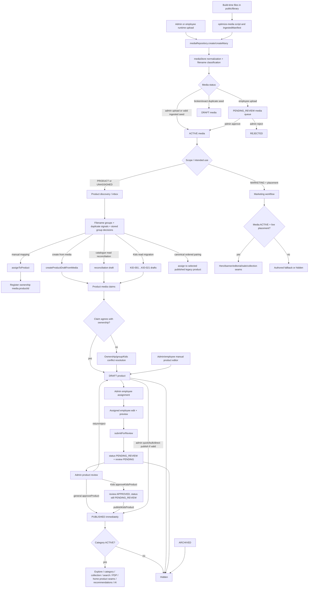
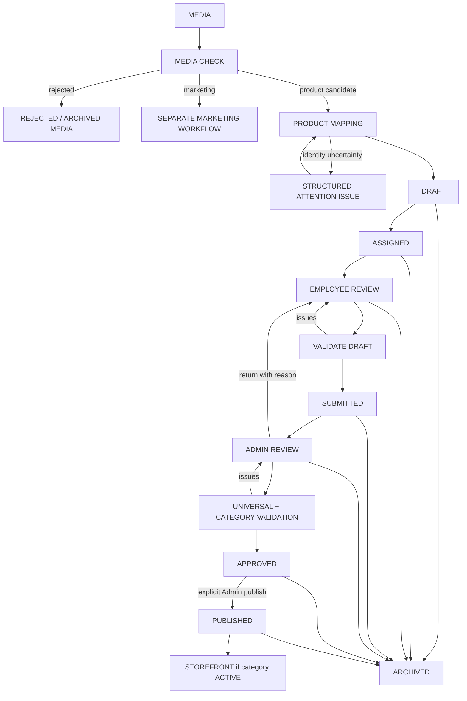

# Product & Media Workflow Audit and Refactor Plan

> **Phase:** 1 — audit and planning only  
> **Audit date:** 2026-08-16  
> **Repository source of truth:** application code on `arena/01a00993-pratikshya-fashon`  
> **Baseline document reviewed:** `docs/product-media-workflow.md`  
> **Change boundary:** no application, route, test, manifest, seed, product, media, taxonomy, permission, or workflow data was changed. This document is the only Phase 1 artifact.

## 1. Executive Summary

The application has a sound security-oriented core: one product register, one media register, deterministic filename grouping, stable product identities, explicit media ownership, blocking publish validation, employee assignment, Super Admin approval, audit history, and a storefront filter that exposes only published products in active categories. Those protections should be retained.

The complexity is primarily orchestration and presentation rather than separate databases. One business journey is currently expressed through several partially overlapping mechanisms:

- four product-creation paths;
- product `status`, embedded `review.state`, derived Kids stages, review flags, group decision state, media lifecycle state, and mapping/duplicate classifications;
- a media status review queue, a broad workflow media inbox, a mapping workspace, a group review desk, a product draft desk, a submitted review queue, Kids reconciliation, and Kids finalization;
- general approval that publishes immediately versus Kids approval followed by a separate publish action;
- both register ownership (`media.productId`) and product-side media claims (`mediaIds`, `primaryMediaId`, `galleryMediaIds`);
- general validation in `getPublishIssues` plus a Kids wrapper and Kids-only lifecycle functions.

The recommended target is **one product lifecycle, one review workspace, one publish validator, and one ownership security layer**. Kids must retain immutable `KID-001…KID-021` identity-to-plate rules and Kids-specific name, taxonomy, inventory, and no-merge checks, but those checks should be validator plug-ins rather than a second approval/publishing workflow. Marketing media must remain an independent workflow and must not enter product discovery.

The refactor should be compatibility-first. Existing persisted statuses and records should initially be adapted to a canonical derived workflow model; destructive field removal should occur only after telemetry/audits and migration tests prove parity. Phase 2 must not renumber IDs, rewrite ownership silently, erase history, or broaden storefront visibility.

### Principal findings

1. **The general and Kids publish models differ.** `catalogRepository.approveProduct` approves and publishes in one write. `approveKidsProduct` records approval while keeping `PENDING_REVIEW`, and `publishKidsProduct` publishes later.
2. **Kids is both a necessary integrity policy and duplicate workflow machinery.** Identity locks and category checks are necessary; separate stages, checklist rows, approve/publish wrappers, reconciliation/finalization panels, and activity aliases duplicate the common workflow.
3. **Media review questions are mixed.** File acceptance, product identity grouping, product mapping, ownership conflict resolution, and product completeness appear as several queues even though they feed one product.
4. **Publish readiness is duplicated.** Product flags, computed validation issues, open group decisions, ownership conflicts, and the Kids checklist can describe the same unresolved condition.
5. **Authorization is not consistently service-enforced.** Route/page checks are meaningful, and assigned employee editing has a service guard, but most catalogue/workflow/media repository mutations trust the caller. `useMediaActions` computes `access` but does not enforce it in its action methods. In this browser-only application, localStorage and imported service calls remain mutable by the client.
6. **Automatic reconciliation has side effects during reads.** Catalogue reads run Kids draft synchronization and catalogue reconciliation; canonical media assignment may mutate media ownership. This hides workflow creation/mapping inside repository reads.
7. **The prior workflow document is broadly accurate but not fully current/precise.** Notable discrepancies are recorded in §11.

---

## 2. Current Workflow

### 2.1 Actual end-to-end map



### 2.2 Entry and creation branches

| Branch | Entry | Decision owner | Result | Important behavior |
| --- | --- | --- | --- | --- |
| Build ingestion | `scripts/optimize-media.mjs` → `ingestedManifest.json` → `ingestedMedia.assetToRecord` | build metadata + parser | seeded media row | Broken/exact duplicate rows become media `DRAFT`; most usable rows become `ACTIVE`. |
| Runtime admin upload | `MediaUploadForm` → `useMediaActions.upload` | authenticated Admin UI | media `ACTIVE` | Browser preview only; ephemeral file URL is stripped on persistence. |
| Runtime employee upload | same hook | employee with UI permission | media `PENDING_REVIEW` | Enters `/admin/media/review`. |
| Controlled media draft | `createProductDraftFromMedia` | Admin product-review desk | permanent ID + product `DRAFT` | Checks ownership; records conflicts rather than stealing media. |
| General reconciliation | `catalogRepository.read` → `syncCatalogueReconciliation` | system/read side effect | deterministic uncatalogued group drafts | Claims media but does not generally assign register ownership. Never publishes. |
| Canonical assignment | catalogue read → `syncCanonicalMediaAssignment` | deterministic ordered pairing | media assigned to an existing published product | Only for bangles, Earrings, innerwear; existing ownership is not stolen. |
| Kids migration | catalogue read → `syncProductDraftRecords` | system/read side effect | 21 fixed Kids drafts | Hydrates safe data from a published Kids owner and records conflicts. |
| Manual editor | `ProductEditor` → `createProduct`/`upsert` | Admin or employee UI | timestamp-based `pf-*` draft | Does not begin with media; employee workspace can see all products with `products.view`. |

### 2.3 Human interaction points

- **Employee:** uploads media; sees own upload dashboard; edits product catalogue through the broad product workspace when granted `products.manage`; works assigned products in `/employee/products/review`; saves and submits.
- **Super Admin:** reviews employee uploads; maps/group media; creates drafts; resolves ownership; assigns employees; edits/clears flags; reviews submissions; approves, publishes, archives, restores, transfers media, and manages employees.
- **Customer:** never mutates workflow data. Customer product surfaces read the live list; account authentication protects account-only pages, not product browsing.

### 2.4 Storefront visibility starts

Visibility begins only when `src/data/products/index.js` considers the product customer-visible: persisted `status === "PUBLISHED"` and the taxonomy category is `ACTIVE`. Legacy rows without status fall back to `published !== false`. Product media is additionally filtered/assembled by ownership and usability. Marketing media follows its own `ACTIVE` + live-placement path.

---

## 3. Current State Machines

### 3.1 State-machine inventory

| State machine | States / values | Storage | Who changes it | Trigger / blockers | UI consumers | Overlap |
| --- | --- | --- | --- | --- | --- | --- |
| Product lifecycle | `DRAFT`, `PENDING_REVIEW`, `PUBLISHED`, `ARCHIVED` (`REVIEW`, `IN_REVIEW`, `UNDER_REVIEW` normalize to pending) | product `status` in `pratikshya_products` | repository/workflow; Admin UI; employee submit/editor | submit, reject, approve, publish, unpublish, archive, restore; publish issues block publish | Admin Products, Product Review, employee products/review, detail/editor | Primary lifecycle; lacks persisted assigned/submitted/approved stages. |
| Product review | `NONE`, `PENDING`, `APPROVED`, `REJECTED` | `product.review.state` plus actors/timestamps/reason | submit, approve, reject | no independent transition guard beyond called action | Review desks, Kids stage/checklist | Duplicates portions of lifecycle. General `APPROVED` is coupled to `PUBLISHED`; Kids is not. |
| Derived Kids stage | `DRAFT`, `EMPLOYEE_REVIEW`, `SUBMITTED`, `APPROVED`, `PUBLISHED`, `ARCHIVED` | not stored; derived from status, review, assignment | indirectly all product actors | precedence in `kidsStageOf` | Kids finalization | A category-specific projection of a lifecycle all categories need. |
| Review flags | 12 values; 9 blocking, 3 informational | `product.reviewFlags[]` | migrations/reconciliation/workflow; Admin clears | field uncertainty, ownership/group/migration events | Admin draft review, employee review, publish issues | Some flags duplicate live validator results and conflict records. |
| Assignment | unassigned or one `assignedEmployeeId` | product field | Admin workflow; generic repository also writable by caller | wrapper rejects non-active employee; no separate assignment history entity | Admin draft/Kids panels, employee queue | `EMPLOYEE_REVIEW` is inferred merely from presence. No assignment status. |
| Media lifecycle | `DRAFT`, `PENDING_REVIEW`, `ACTIVE`, `REJECTED`, `ARCHIVED` | media `status`; parallel `reviewStatus` metadata | ingestion, upload provenance, admin review/actions | uploader/type metadata; public reads require ACTIVE | Media library/review/detail, employee media | `status` and `reviewStatus` both express acceptance. |
| Media scope/ownership | `PRODUCT`, `MARKETING`, `UNASSIGNED`; scalar `productId` or `placement` | media row | assign/detach/placement/transfer | explicit confirmation for contested product reassignment | media pages, mapping, product media | Scope is partly derived from productId/placement; product claims duplicate relationship. |
| Mapping | `MAPPED`, `UNMAPPED`, `NEEDS_REVIEW` | media `mappingStatus` | ingestion metadata; not a full runtime transition workflow | filename/manifest mapping quality | media library/inbox/mapping | Overlaps unassigned scope, group review and product-claim conflicts. |
| Duplicate classification | `UNIQUE`, `DUPLICATE`, `POSSIBLE_DUPLICATE` | media `duplicateStatus`, `duplicateOf` | ingestion | checksum/manifest analysis | inbox/group/media library | A signal, not lifecycle; exact duplicates also affect usable media. |
| Group decision | decisions `SAME_PRODUCT`, `SEPARATE_PRODUCTS`, `REVIEW_LATER`; statuses `PENDING`, `CONFIRMED`, `SPLIT`, `ARCHIVED` | `pratikshya_media_groups` | Admin/group workflow; Kids identity bootstrap | unresolved decision blocks claiming products | Product Group Review, Kids identity | Decision and status partly encode the same closure; group flag separately repeats it. |
| Kids identity | fixed `SEPARATE_PRODUCT` policy represented as `SEPARATE_PRODUCTS` group decision | code constant + group register | lazy system bootstrap | all 21 group decisions are self-healed | Kids desks/audits | Necessary policy is duplicated into mutable group records. |
| Employee account | `ACTIVE`, `PENDING`, `ON_LEAVE`, `SUSPENDED`, `INACTIVE` | employee register | Super Admin employee service | login/assignment checks | Admin employee pages, auth | Relevant because inactive assignees remain attached. |
| Taxonomy status | category `ACTIVE`/`ARCHIVED`; collection has its own schedule/status model | taxonomy register | Admin | category state silently gates storefront | taxonomy/admin/storefront | Published product can be invisible due to separate category state. |
| Marketing media | media lifecycle + placement live bit; campaign dates stored | media row + placement config | Admin | ACTIVE and live placement; campaign dates not enforced | marketing desk/homepage | Correctly separate from product lifecycle. |

### 3.2 Product transitions as implemented

| From | Action | To | Guard |
| --- | --- | --- | --- |
| none | create/manual/reconciliation/migration | `DRAFT`, review usually `NONE` | ID behavior depends on path. |
| `DRAFT` | assign | `DRAFT` + assignee | workflow wrapper requires active employee. |
| `DRAFT` (or pending) | submit | `PENDING_REVIEW` + review `PENDING` | workflow blocks published/archived; repository method itself does not. |
| pending | general approve | `PUBLISHED` + review `APPROVED` | `getPublishIssues` empty; no requirement that current status be pending. |
| pending | Kids approve | remains `PENDING_REVIEW` + review `APPROVED` | Kids blockers empty; Kids wrapper. |
| approved Kids | Kids publish | `PUBLISHED` | Kids blockers empty and review approved. |
| draft/pending/other | direct publish/quick/bulk | `PUBLISHED` | `getPublishIssues` empty; general publish does not require submission or approval. |
| pending | reject/return | `DRAFT` + review `REJECTED` | reason is accepted; UI may require it. |
| published | unpublish | `DRAFT` | no additional guard. |
| any existing | archive | `ARCHIVED` | media ownership remains. |
| archived | restore | `DRAFT` | no media release/revalidation in transition. |

### 3.3 Target interpretation

The lifecycle, review sub-state, and assignment should be exposed as one canonical workflow projection. During compatibility migration they need not immediately become one physical field. A canonical adapter can map existing records to:

`DRAFT → ASSIGNED → IN_EMPLOYEE_REVIEW → SUBMITTED → IN_ADMIN_REVIEW → APPROVED → PUBLISHED → ARCHIVED`

`RETURNED` should remain a transition/result back to `DRAFT`, with reason and history, rather than another long-lived status. Validation/attention is orthogonal and should not become a lifecycle state.

---

## 4. Current Media Workflow

### 4.1 Responsibilities of audited media modules

| Module | Actual responsibility |
| --- | --- |
| `mediaStore` | localStorage read/write, seed reconciliation, record normalization, scope derivation, ephemeral URL stripping, media ID creation (`pm-*`). |
| `mediaRepository` | query/write API; status review; cover/order invariants; product/placement assignment; one scalar product owner; metrics. |
| `ingestedMedia` | turns the 181-row manifest into media records and parses filename group/view. |
| `mediaNaming` | filename-only `groupKey`, view, and standalone parsing. |
| `mediaGroups` | deterministic computed filename groups and view ordering; no storage. |
| `productMediaGroups` | persisted human group decisions, group editing, and unresolved-group publish lookup. |
| `mediaProductDiscovery` | read-only report from files/groups/claims/assignment to catalogue coverage; does not write. |
| `productMediaSet` | assembles owned media, authored fallback, and valid claims; rejects cross-product references; selects primary/hover/gallery deterministically. |
| `mediaResolver` | deterministic distribution for homepage/category/editorial/sale/AI roles with reason codes and fallback behavior. |
| `marketingMediaSource` | converts marketing record to placement image/fallback. |
| `mediaAccess` | computes Admin/employee media capability booleans; not itself an enforcement boundary. |

### 4.2 Ownership and relationship model

The media row's scalar `productId` is declared as ownership truth. A product also stores claims in three fields. Claims are useful for migration and conflict discovery, but they create two representations:

- `media.productId` = current owner;
- `product.mediaIds`, `primaryMediaId`, `galleryMediaIds` = intended/claimed relation;
- authored `image`, `hoverImage`, `additionalImages` = legacy fallback relation.

`resolveProductMediaClaims` converts missing files, missing URLs, and different owners into explicit conflicts. `transferMediaOwnership` is the safer high-level transfer path: it requires confirmation, respects confirmed Kids plate locks, strips stale authored references from the previous owner, adds an informational flag, and logs. Lower-level `mediaRepository.assignToProduct(..., {confirmReassign:true})` can bypass those higher-level cleanup semantics if called directly.

### 4.3 Existing media work queues

1. **Status review queue (`/admin/media/review`)** — only `PENDING_REVIEW`, usually employee uploads; approve/reject file acceptance.
2. **Workflow media inbox (`/admin/products/review`)** — broad union of unassigned, draft/pending, unmapped/review, duplicate-signaled, draft-claimed, and non-published-owned media. It mixes routing, mapping, quality, and product-work status.
3. **Product mapping (`/admin/media/product-mapping`)** — deterministic groups, product selector, cover/order operations.
4. **Group review (inside Product Review)** — same/separate/later identity decisions and manual group edits.
5. **Per-media detail** — metadata, assignment, transfer confirmation.
6. **Per-product media page** — upload, cover, ordering, roles.

These are not all duplicate business actions. File acceptance and product identity are genuinely different. The duplication is that mapping, grouping, ownership, draft creation, and product issue resolution are spread across several contexts without one case-oriented product record.

### 4.4 Media risks found

- Runtime uploads persist metadata but not actual bytes; an approved demo placeholder may have no portable file.
- `media.status` and `reviewStatus` can disagree; public visibility trusts status.
- `useMediaActions` returns an `access` object but action functions do not refuse unauthorized calls.
- Archive/delete/assignment are repository operations without actor authorization in the service.
- Product ownership transfer has a safe wrapper and a lower-level reassignment option; responsibility is duplicated.
- Archived products retain media indefinitely; no reclaim policy exists.
- The broad media inbox can include already owned non-published product media, making it an attention feed rather than a pure “unmapped media” queue.

---

## 5. Current Product Workflow

### 5.1 Product identity

- Authored products use stable `pf-001…` IDs.
- Controlled media drafts use category prefixes and `nextStableProductId`, preferring an unambiguous group number.
- Reconciliation assigns IDs deterministically over the static group universe so exclusions do not renumber later groups.
- Kids identities are fixed in code as `KID-001…KID-021` paired to `kids-001.webp…kids-021.webp`.
- Manual product creation uses time-based `pf-*` IDs.
- `normaliseProductRecord` mirrors `productId` from `id`.
- Admin ID change is possible, validates syntax/uniqueness, and the workflow wrapper repoints register-owned media.

### 5.2 Draft creation paths and overlap

| Path | ID strategy | Ownership effect | Review setup | Assessment |
| --- | --- | --- | --- | --- |
| `createProductDraftFromMedia` | category prefix + preferred group number | validates, then assigns non-conflicting media to the new product | conflict flag when needed | Desired general command, though it needs a canonical transaction boundary. |
| `catalogueReconciliation` | static group ordering | claims media; canonical subset separately assigns existing products | name/price/taxonomy/group flags | Migration/bootstrap function; should not remain a perpetual read-time workflow. |
| `productDraftMigration` | fixed KID identity table | claims confirmed plate; owner may remain legacy product | migration/conflict flags | Historical compatibility plus necessary identity seed. |
| Manual `ProductEditor` | timestamp ID | none | ordinary draft | Legitimate manual creation, but should enter same lifecycle and assignment/review rules. |

### 5.3 Archival

Archiving changes only product status. Storefront visibility stops, but register media remains owned and assignment remains attached. Kids conflict actions may clear claims or archive a previous owner left without media, creating category-specific archive semantics.

### 5.4 Product workflow defects/ambiguities

- Direct `publishProduct`, quick publish, and bulk publish can bypass the intended employee submission and Admin approval sequence because the gate validates content/media, not lifecycle review completion.
- `getPublishIssues` does not require `review.state === APPROVED`; Kids adds this in its publishing wrapper.
- `catalogRepository.submitForReview` does not itself reject published/archived products; only `productWorkflow.submitProductForReview` adds those checks, while `EmployeeProducts` calls the repository directly.
- Employees with `products.manage` have a broad catalogue workspace and can submit any visible product there; the stricter assigned-only rule exists only in `saveEmployeeDraft`/`EmployeeProductReview`.
- `employeeCanEditProduct` does not block edits while pending review. An assigned employee can change a submitted record.
- Product updates and status writes rely on UI intent rather than service-layer actor authorization.

---

## 6. Current Review Workflow

### 6.1 Review presentations

| Presentation | Purpose | Service(s) | UI | Overlap | Recommendation |
| --- | --- | --- | --- | --- | --- |
| Media Review Queue | accept/reject employee-uploaded file | `mediaRepository.getPendingReview/approve/reject` | `AdminMediaReview` | Distinct quality/acceptance decision | Keep as a media intake tab in unified workspace; do not merge its states into product status. |
| Media Inbox | surface any media/product mapping attention | `productWorkflow.getMediaInbox` | `MediaInboxCard` within `AdminProductReview` | Overlaps library filters, mapping, draft review and group review | Replace broad queue with explicit `Unmapped media` and product-linked attention filters. |
| Product Mapping | map groups/assets to products and order media | `mediaGroups`, `mediaRepository` | `AdminMediaProductMapping` | Overlaps Inbox and Group Review | Keep capability, present as mapping stage/tool launched from one workspace. |
| Product Group Review | decide same/separate/later and edit groups | `productMediaGroups`, `decideProductGroup` | `ProductGroupReviewPanel` | Group flag and publish validator repeat unresolved state | Keep as an issue type; embed case resolution in product/media mapping stage. |
| Product Draft Review | edit product, media, flags, assignee, submit/publish | `productWorkflow`, `catalogRepository` | `ProductDraftReviewPanel` | Duplicates Admin Products/editor and submitted queue | Make the core Admin review record. |
| Submitted Product Queue | approve/reject pending products | `catalogRepository` | section in `AdminProductReview` | Same product record as draft desk but reduced controls | Merge into the core workspace with stage filters. |
| Employee Product Review | assigned preview, edit, validate, submit | `productWorkflow` + Kids validator | `EmployeeProductReview` | Broad employee product editor is a parallel edit/submit path | Retain as canonical employee workflow; limit broad workspace mutations or route them through same commands. |
| Kids Reconciliation | ownership conflicts and migration readiness | `getKidsReconciliationRows`, `reconcileKidsConflict` | `AdminKidsReviewPanel` | Group/ownership/draft review specialized by migration | Convert to temporary migration issue filters/actions in common review. |
| Kids Finalization | 21-row lifecycle/checklist/assign/approve/publish | `kidsProductFinalization` | `AdminKidsFinalizationPanel` | Duplicates common lifecycle and Admin review | Retire as workflow after migration; keep Kids validator and optional saved filter/report. |
| Admin Products | CRUD, quick/bulk publish/archive | repository | `AdminProducts` | Parallel publication path outside review desk | Keep catalogue index; route approval/publication into unified review command and gate. |

### 6.2 Review flag audit

| Flag | Why it exists / trigger | Resolver | Blocks publish | Recommended disposition |
| --- | --- | --- | --- | --- |
| `NAME_REVIEW_REQUIRED` | migration/reconciliation cannot supply a real name | employee/admin enters name; Admin clears | Yes | Convert to computed validation issue for current data; preserve historical occurrence in activity/migration metadata. |
| `PRICE_REVIEW_REQUIRED` | draft starts with zero/unknown price | employee/admin enters price; Admin clears | Yes | Computed validation issue; avoid requiring both a valid value and manual flag clearing. |
| `TAXONOMY_REVIEW_REQUIRED` | inferred/missing category or subcategory | employee/admin classifies; Admin clears | Yes | Split provenance (“inferred”) from computed validity. Category-specific requirements belong to validators. |
| `GROUP_REVIEW_REQUIRED` | uncertain/unmapped/duplicate group at reconciliation | Admin group decision + flag clear | Yes | Derive from open group issue; one source of blocking truth. Keep issue record/history, not duplicate product flag. |
| `VARIANT_REVIEW_REQUIRED` | variant metadata detected | Admin manual resolution | Yes | Keep as explicit unresolved issue until variant workflow exists; currently no complete resolver UI. |
| `NEEDS_MEDIA` | separation/transfer leaves product without primary | Admin maps media | Yes | Computed universal validator result. |
| `MEDIA_OWNERSHIP_REVIEW` | claim conflicts with register owner | Admin transfer/keep/separate | Yes | Keep ownership conflict as structured issue; derive publish failure from it. |
| `CONFLICT_UNRESOLVED` | Kids migration finds different owner | Admin Kids conflict action | Yes | Historical migration alias of ownership conflict; migrate to common ownership issue. |
| `KIDS_MIGRATION_REVIEW` | uncertain Kids migration content | Admin corrects/clears | Yes | Historical-only after migration; do not generate for future Kids products. |
| `CONFLICT_REVIEW_LATER` | Admin deferred Kids conflict | Admin later resolves | No | Represent as issue disposition/snooze with due date/history, not product flag. |
| `MEDIA_OWNERSHIP_MOVED` | media transferred away / reconciliation retired draft | informational | No | Preserve in immutable activity history; remove from active attention flags. |
| `MEDIA_UNASSIGNED` | media detached | informational | No | Preserve in activity history; computed missing-media validation is sufficient. |

**UI simplification:** show a common **Needs Attention** count with typed issues (`CONTENT`, `TAXONOMY`, `MEDIA`, `OWNERSHIP`, `GROUPING`, `VARIANT`, `MIGRATION`). Do not collapse structured causes in storage or logs; grouping them visually must not erase their resolver, severity, or blocking status.

---

## 7. Current Kids Workflow

### 7.1 Why it exists

The Kids workflow was introduced to repair and protect a known dataset: 21 standalone Kids plates must remain 21 separate products with permanent identities. Existing published Kids products may own those plates, so migration creates KID drafts, hydrates safe fields, reports conflicts, and offers explicit resolution. The finalization module then provides Kids-specific validation and a two-step approval/publish process.

### 7.2 Classification

| Kids concept | Classification | Rationale / target treatment |
| --- | --- | --- |
| `CONFIRMED_KIDS_IDENTITIES`, fixed IDs and filenames | **E — necessary data-integrity protection** | Keep immutable compatibility policy. Never renumber or infer these identities. |
| `wouldMergeConfirmedKids` no-merge rule | **A/E — necessary category/data validation** | Keep in shared grouping/ownership policy as an identity lock, not a workflow fork. |
| Expected plate ownership and cross-product checks | **A/E** | Keep as Kids validator and ownership policy. |
| Foreign department name/subcategory checks | **A — Kids validation** | Keep as category validator; review token quality over time. |
| Valid Kids taxonomy and deliberate inventory | **A — Kids validation** | Keep as category-specific publish rules, subject to explicit product policy. |
| `productDraftMigration` and stale Kids register repair | **C — historical migration compatibility** | Freeze/version; run explicitly/idempotently, then retire from every read after migration completion. |
| Kids reconciliation rows and five conflict labels | **B/C/D** | Underlying transfer/keep/separate decisions are general ownership operations; Kids panel is migration UI. |
| Lazy creation of group decisions for each identity | **B/E** | Preserve invariant, but source it from immutable identity policy; avoid mutable duplicate group state where possible. |
| `KIDS_STAGES` / `kidsStageOf` | **B/D — duplicate general lifecycle** | Generalize to one workflow projection for all categories. |
| 9-item Kids checklist | **A + B** | Keep Kids-only checks; universal fields and review milestones belong to common validator/workflow. |
| `approveKidsProduct` / `publishKidsProduct` | **B/D — duplicate workflow** | Replace with universal approve and publish commands that invoke category validators. |
| Kids activity action aliases | **B** | Shared activity actions already carry product ID/category; aliases are not a separate log and can be removed after callers migrate. |
| Kids hover helper | **A but presentation-only** | General media set already ensures no random alternate; Kids standalone assertion may remain as a test/policy, not workflow. |
| `AdminKidsReviewPanel` | **B/C** | Temporary migration filter/actions in unified workspace. |
| `AdminKidsFinalizationPanel` | **B** | Replace with common product review plus “Kids” saved filter and Kids validation section. |

### 7.3 Target Kids strategy

```text
COMMON PRODUCT COMMANDS
  create / assign / edit / submit / return / approve / publish / archive
       +
UNIVERSAL PUBLISH VALIDATOR
       +
KIDS POLICY PLUGIN (when category/identity is Kids)
  - KID-001…KID-021 identity lock
  - confirmed plate ownership
  - no confirmed-plate merge
  - kidswear category and valid subcategory
  - no foreign department metadata
  - deliberate stock or made-to-order state
       =
ONE LIFECYCLE, CATEGORY-SPECIFIC VALIDATION
```

Kids migration conflict records must be converted to common structured ownership/grouping issues without automatically changing any existing ownership or archival outcome.

---

## 8. Current Marketing Workflow

Marketing media shares the media register but has a distinct scope and assignment model:

- `scope=MARKETING`, one `placement`, no product owner or product role;
- assignment to placement clears `productId` and `role`;
- public retrieval requires media `ACTIVE` and a configured live placement;
- hero resolution imposes additional mapping/usage-role restrictions;
- editorial/banner/sale/lookbook/collection are usage roles and/or placement concepts used by `mediaResolver`;
- product discovery excludes marketing scope, placement rows, house artwork, and canonical hero files;
- Explore promotion inserts use marketing plates rather than product cover images;
- campaign start/end are stored but not evaluated.

### Boundary assessment

The conceptual boundary is correct and must remain:

```text
PRODUCT / UNASSIGNED PRODUCT-CANDIDATE MEDIA → product mapping → product workflow
MARKETING MEDIA → placement/campaign workflow → marketing storefront seams
```

The shared physical register is acceptable if scope invariants are enforced transactionally. Marketing actions must never call product draft discovery. A future backend could use separate tables/buckets while preserving the same API boundary.

### Marketing-specific risks

- The same low-level repository can switch a record between product and marketing by assignment, so service authorization and explicit confirmation are essential.
- Campaign windows are metadata only and must not be represented as active scheduling.
- Some homepage seams intentionally fall back to authored assets; “no active override” does not imply no image.

---

## 9. Current Permission Model

### 9.1 Roles and effective actions

| Action | Super Admin | Employee | Customer | Actual enforcement observation |
| --- | --- | --- | --- | --- |
| Create product | Yes | Yes with `products.manage` UI | No | Catalogue service itself does not authorize actor. |
| Edit product | Yes | Broad editor with `products.manage`; assigned review uses whitelist + assignment | No | Assigned save has service guard; generic update/editor relies on UI. |
| Assign employee | Yes | No intended | No | Workflow wrapper validates active target but does not verify assigning actor is Admin. |
| Review media acceptance | Yes | No intended | No | Admin route protects page; hook/repository functions do not enforce reviewer role. |
| Resolve ownership/grouping | Yes | employees may have media assign permissions in general media model | No | High-risk workflow functions do not authenticate actor. |
| Submit | Yes | intended for assigned employee; broad workspace can submit any product | No | Multiple call paths have different guards. |
| Approve | Yes | No intended | No | Route/UI only; repository method trusts caller. |
| Publish | Yes | No intended | No | Route/UI only; repository method validates data, not actor/review lifecycle. |
| Archive | Yes | No intended for products; media capabilities vary | No | Repository trusts caller. |
| Manage employees | Yes, `employees.manage` | Categorically denied | No | Strongest service-level authorization: `authorizeEmployeeManagement`. |
| View storefront | Yes | Yes | Yes | Product visibility is data-filtered. |

### 9.2 Authentication boundaries

- Admin and employee sessions are separate; `AdminProtectedRoute` requires authenticated Super Admin.
- Employee route authentication is in `EmployeeProtectedRoute`; per-path permission checks occur in `EmployeeLayout`, and some pages re-check.
- Customer `ProtectedRoute` guards account pages. Public catalogue pages remain intentionally open.

### 9.3 Permission findings

1. **Frontend-only security:** all authoritative state is localStorage. Any browser user with script/devtools access can alter it. This cannot be made a real trust boundary without a backend.
2. **Inconsistent service authorization:** employee account management verifies Admin authority in the service; product/media workflow generally does not.
3. **Computed-but-not-enforced media access:** `useMediaActions` exposes `access` but calls repository writes regardless of `access` values.
4. **Actor signing is not authorization:** accepting an actor object for history does not prove an authenticated session.
5. **Admin permission granularity:** only employee management has an enumerated Admin permission. Every other Admin action is implied by the Super Admin route/session.
6. **Employee assignment scope bypass:** the assigned-only workflow is secure in `saveEmployeeDraft`, but the broad `EmployeeProducts`/`ProductEditor` path is a separate mutation model.
7. **Stale assignments:** employee deactivation blocks login/new assignment but leaves products assigned to the inactive employee.

**Phase 2 requirement:** command services must accept an authenticated principal and enforce action-level policy before repository writes. The frontend can mirror checks, but backend enforcement is required for actual security.

---

## 10. Duplicate/Overlapping Systems

### 10.1 Data model overlap

| Current concept | Target | Migration risk |
| --- | --- | --- |
| `product.status` + `product.review.state` + derived Kids stage | one canonical workflow projection; retain compatibility fields until migrated | Incorrect mapping could expose approved-but-unpublished Kids or alter general published products. |
| `media.status` + `media.reviewStatus` | lifecycle status as authority; review decision/history as event metadata | Existing rows may disagree; never infer ACTIVE from reviewStatus alone. |
| `media.productId` + product claims + authored image fields | ownership relation as authority; explicit pending mapping/conflict issue; legacy fields read-only fallback | Silent collapse could steal media or remove storefront fallback. |
| mapping status + scope + productId + group productId | structured media intake/mapping state derived from authoritative relation and open issues | Existing manifest metadata is useful provenance and must not be discarded. |
| `GROUP_REVIEW_REQUIRED` + unresolved group record | group record/issue is blocking truth | Clearing a flag currently does not close a group; migration must preserve blockers. |
| `MEDIA_OWNERSHIP_REVIEW` + `CONFLICT_UNRESOLVED` + computed ownership conflicts | one structured ownership conflict type | Kids migration intent/history must remain identifiable. |
| fixed Kids identity table + self-healed mutable group decisions | immutable identity policy plus migration evidence | Removing group rows too soon can fail existing audits/tests. |
| `assignedEmployeeId` + inferred employee-review stage | assignment entity/field with assignment events and canonical stage | Existing assignee and history must remain unchanged. |
| product `history`, `priceHistory`, review timestamps, shared activity diary | shared append-only activity/audit model; retain field history if needed | Consolidation can lose forensic detail or duplicate events. |
| `id` and mirrored `productId` | immutable canonical `id`, compatibility alias at API edge | Existing scripts and records may read either field. |
| `collection` and `collections[]`; `originalPrice` and `compareAtPrice` | one canonical write shape with compatibility projections | Storefront/editor compatibility and persisted records. |

### 10.2 Service ownership overlap

- `catalogRepository` both persists products and implements review/publish commands/validation.
- `productWorkflow` wraps some repository commands, owns transfer/draft/group/conflict/assignment, and presents inbox metrics.
- `catalogueReconciliation` both discovers and mutates drafts/media during reads.
- `productDraftMigration` owns Kids draft creation while `kidsProductFinalization` owns category validation and lifecycle wrappers.
- `mediaRepository` owns low-level reassignment while `productWorkflow.transferMediaOwnership` owns safer business transfer semantics.
- Admin/employee pages occasionally call repositories directly, bypassing workflow wrappers.

### 10.3 Queue overlap summary

The audit found multiple presentations, but they should not be reduced blindly to one list. The target Admin workspace should have one navigation destination with filters/tabs for distinct work types:

- **Media intake** (file acceptance);
- **Needs mapping** (no product relationship);
- **Identity/grouping issues**;
- **Product drafts/assigned work**;
- **Submitted for Admin review**;
- **Ownership/validation issues**;
- **Approved/ready to publish**.

Each item should link to one product case where a product exists. Media without a product remains a media-intake case until mapping/draft creation.

---

## 11. Problems Found

### 11.1 Functional and architecture findings

| Finding | Impact | Severity |
| --- | --- | --- |
| General approval publishes immediately; Kids approval does not | two publishing models and confusing Admin semantics | High |
| Direct/quick/bulk publish does not require submitted/approved review state | intended employee/Admin review can be bypassed | High |
| Most write services do not authorize the actor | frontend route checks are not a true security boundary | Critical for production; expected demo limitation |
| Read operations trigger draft creation/reconciliation and media assignment | hidden side effects, difficult rollback/concurrency, hard-to-explain workflow | High |
| Canonical bangles/Earrings/innerwear mapping pairs sorted media groups to sorted published products | deterministic but not proof of physical identity; stronger than “no guessing” language implies | High |
| Assigned employee can edit pending-review products | Admin can review moving data | Medium/High |
| Broad employee product workspace bypasses assigned-only workflow semantics | employees with manage grant can act beyond assigned queue | High unless explicitly intended |
| Group blockers exist both as flag and live group query | duplicate resolution steps and stale flags | Medium |
| Kids migration/finalization remains permanently in operational UI | migration concepts become everyday workflow | Medium |
| Archived products retain media and assignments | assets can remain locked; inactive work remains attached | Medium |
| Category can be archived while product remains published | publish succeeds but product is invisible; no warning in gate | Medium |
| Demo media can be approved despite no durable file | apparent acceptance without portable asset | High for production |
| `VARIANT_REVIEW_REQUIRED` blocks but lacks complete dedicated resolution flow | dead-end blocker risk | Medium |
| `REVIEW_LATER` has no due date/escalation | work can remain blocked forever | Medium |
| Marketing campaign dates are not enforced | scheduling expectation mismatch | Low/Medium |
| Lower-level reassignment can bypass safe transfer cleanup | stale previous-owner references/history risk | High |

### 11.2 Discrepancies in `docs/product-media-workflow.md`

The baseline document is detailed and mostly consistent with source, but these claims require correction in the new plan rather than editing the original:

1. It states media IDs as `med-<timestamp36>-<seq>` in one table; `mediaStore.createMediaId` currently creates `pm-<timestamp36>-<random>`. Manifest IDs may use other stable forms.
2. It characterizes `productWorkflow` as the place that publishes, but UI paths call `catalogRepository.publishProduct` directly (Admin Products quick/bulk, and repository workflow methods).
3. It says pages do not import repository write methods directly in the media action architecture; product pages/components do call catalogue repository workflow methods directly, and media authorization is computed but not enforced by the hook.
4. “UI hiding is never the only control” is an aspiration, not uniformly true for product/media actions in this frontend-only implementation.
5. “Existing ownership is never stolen” is true for canonical reconciliation assignment, but explicit group decisions and confirmed transfer operations do reassign ownership by design. The distinction should be stated.
6. The document's strong “never guesses physical identity” language is not fully compatible with canonical ordered pairing of media groups to published bangles/Earrings/innerwear records. The pairing is deterministic, but order/category matching is still an identity assumption and deserves human confirmation or migration evidence.
7. The prior audit's exact test count is baseline-specific and should not be treated as a permanent repository fact.

---

## 12. What Must Be Preserved

### 12.1 Media protections

- One media record has at most one product owner.
- Cross-product references are rejected from rendered product media sets and surfaced as conflicts.
- Contested reassignment requires explicit confirmation and complete previous-owner cleanup.
- A product has at most one image cover; videos cannot become covers.
- Primary/hover/gallery resolution remains deterministic; no random selection.
- Similarity, duplicate hints, color, model, or background never automatically merge products.
- Missing files, orphan owners, duplicate ownership, and disputed claims remain visible as errors.
- Media status must be ACTIVE before customer use.
- Media IDs and file identity/checksum provenance remain stable.

### 12.2 Product protections

- Existing IDs, slugs where relied upon, SKUs, and product/media relationships are preserved.
- IDs are not regenerated from names or changed by migration ordering.
- Draft, assigned, submitted, approved-but-unpublished, returned, and archived records are customer-invisible.
- Publication remains an explicit Admin-authorized operation with an atomic validation check.
- Archive is non-destructive and reversible; media policy changes require explicit decisions.
- Pricing remains computed by the shared pricing engine.
- Taxonomy/category state remains part of storefront eligibility, with clearer publish feedback.

### 12.3 Review protections

- Employee assignment, active-account check, field whitelist, and assigned-product restriction.
- Admin approval and return reason.
- Blocking issues remain typed and actionable even if visually grouped as Needs Attention.
- Product history, review actors/timestamps, price history, and shared activity diary are retained.
- Every mutation is attributable to an authenticated principal.
- Permission checks move into command/service boundaries, not only UI.

### 12.4 Kids protections

- `KID-001…KID-021` and `kids-001.webp…kids-021.webp` pairings remain permanent.
- Each confirmed Kids asset remains a separate physical product identity.
- Confirmed Kids assets cannot be merged, cross-owned, or selected as another KID product's primary.
- Kids category/subcategory/name/inventory checks remain category validators.
- Kids uses the same approval and publishing gate as every other category.

### 12.5 Marketing protections

- Marketing scope/placement remains mutually exclusive with product ownership.
- House, hero, banner, editorial, sale, lookbook, collection, and promotion assets do not create products.
- Product discovery continues to exclude marketing/house/hero media.
- Hero-specific safety and deterministic fallback logic remain.

---

## 13. Proposed Unified Workflow

### 13.1 Target lifecycle



### 13.2 Canonical rules

1. Media acceptance is not product approval.
2. Mapping produces or selects exactly one product identity; unresolved mapping cannot publish.
3. Product lifecycle is category-neutral.
4. Assignment is explicit. Employees edit only assigned, editable-stage products and whitelisted fields.
5. Submission freezes employee editing until return/reassignment, unless a deliberate collaboration policy is added.
6. Admin approval and publication are distinct commands for every category.
7. Approval requires lifecycle review completion plus current validation. Publication revalidates atomically.
8. Category validators add rules but never add stages or alternate commands.
9. Structured issues are computed from authoritative data where possible; manual decisions are stored as issue/group records with history.
10. Storefront reads only published products in active categories, never workflow labels or flags directly.

### 13.3 Compatibility mapping

| Existing record | Canonical stage |
| --- | --- |
| `ARCHIVED` | `ARCHIVED` |
| `PUBLISHED` | `PUBLISHED` (grandfather existing review metadata; do not unpublish) |
| pending + review approved | `APPROVED` |
| pending + review pending/none | `IN_ADMIN_REVIEW` / `SUBMITTED` based on submission timestamp |
| draft + rejected review | `RETURNED` presentation, operational stage `DRAFT`/employee review |
| draft + assignee | `ASSIGNED` or `IN_EMPLOYEE_REVIEW` |
| draft without assignee | `DRAFT` |

No compatibility adapter may promote an existing record to a more public state.

---

## 14. Kids Integration Strategy

1. Extract a category validator interface such as `validateCategoryForPublish(product, context)`.
2. Register `kidswear` validation that calls retained pure rules: identity, expected plate, no-merge, ownership, taxonomy, foreign-name, inventory.
3. Move confirmed Kids identity lock into a shared immutable identity policy consumed by mapping, transfer, and validation.
4. Convert Kids migration conflicts into common structured ownership/grouping issues with `source: KIDS_MIGRATION`.
5. Map existing Kids stages through the common lifecycle adapter.
6. Replace `approveKidsProduct` and `publishKidsProduct` callers with universal commands. Keep compatibility wrappers temporarily delegating to those commands.
7. Replace Kids panels with a Kids saved filter and Kids Validation section in the common Admin workspace.
8. Keep a migration/audit report proving all 21 IDs, plates, owners, statuses, and storefront behavior before removing compatibility code.
9. Do not apply the 21-plate lock to arbitrary future Kids products; future Kids products use common mapping plus Kids category validation.

---

## 15. Media Strategy

### 15.1 Target conceptual model

```text
MEDIA INTAKE
  ├─ file rejected / archived
  ├─ marketing classification → Marketing workflow
  └─ product candidate
       ├─ already mapped with valid owner → READY FOR PRODUCT
       └─ needs mapping/group decision → MAPPING ISSUE
                                      → product identity
                                      → product draft/relation
```

### 15.2 Queue placement

- **Media Review Queue** becomes the **Intake** tab: approve/reject employee uploads and quality/availability.
- **Media Inbox** is narrowed to **Needs Mapping** and no longer includes every asset owned by a non-published product.
- **Group Review** becomes a typed mapping issue (`SAME`, `SEPARATE`, `DEFERRED`) attached to the affected media/product case.
- **Product media completeness/ownership** appears inside the product review record, not as a separate generic inbox row.
- **Per-product media and per-media detail** remain focused tools launched from the common case.

### 15.3 Ownership target

The authoritative write should be one ownership command/service. Repositories should not expose confirmed cross-owner reassignment as a routine option. The command must atomically:

1. authenticate/authorize actor;
2. validate source and target;
3. apply identity locks (including Kids);
4. require explicit conflict decision;
5. update ownership and role/order;
6. remove stale previous-owner claims/fallbacks or create explicit follow-up issues;
7. append audit event;
8. revalidate both products.

Product claims should become either a compatibility projection of ownership or a clearly named **pending mapping request**, not a second apparent owner.

---

## 16. Review Strategy

### 16.1 One Admin product review workspace

Each product case should show:

- identity, status, category and immutable ID;
- product information and pricing;
- full media set with ownership truth and claims;
- employee assignment and submission metadata;
- typed attention issues with resolver and blocking status;
- universal validation and category-specific validation sections;
- activity/history;
- actions appropriate to stage: assign, return, approve, publish, archive.

Top-level filters replace separate conceptual desks: `Needs mapping`, `Draft`, `Assigned`, `Submitted`, `Needs attention`, `Approved`, `Published`, `Archived`, plus category filters such as Kids.

### 16.2 Employee workflow

```text
MY ASSIGNED PRODUCT
  → EDIT whitelisted fields
  → PREVIEW complete owned media
  → VALIDATE
  → SAVE DRAFT
  → SUBMIT
  → read-only while Admin reviews
  → returned with reason OR approved
```

Employees should see human-readable content/media issues, not migration version, ownership register internals, reconciliation IDs, or group storage mechanics. Employees with dedicated media assignment permission may use a separate media tool, but product-review assignment alone must not imply ownership-transfer authority.

### 16.3 Attention model

A common issue shape is recommended:

```text
{id, productId/mediaId, type, code, severity, blocksPublish,
 source, message, resolverRole, status, createdAt, resolvedAt, resolution}
```

Computed issues need not be persisted; manual decisions and migration provenance should be. The UI can group all unresolved items under Needs Attention while retaining exact codes.

---

## 17. Publishing Strategy

### 17.1 Universal gate

Design one pure orchestration function:

```js
validateProductForPublish(product, context) => {
  ok,
  issues: [{ code, section, message, blocksPublish, source }]
}
```

Universal checks should include:

- stable product identity and unique SKU/slug constraints;
- real name;
- positive valid pricing;
- active/valid taxonomy and required description;
- inventory policy where universally required;
- active primary image owned by this product;
- no cross-product, missing-file, orphan, or duplicate-cover conflict;
- no unresolved identity/group/mapping issue;
- assignment/submission/Admin-review completion according to lifecycle;
- no unresolved blocking manual issue;
- pricing engine errors;
- category validator results.

Category dispatch:

```text
universal issues
+ validatorRegistry[product.category]?.validate(product, context)
= final issue list
```

For Kids, add the retained checks described in §14. This does not create Kids commands or statuses.

### 17.2 Commands

- `submitProduct`: employee/admin authorization, editable stage, validation suitable for submission, transition to Admin review.
- `returnProduct`: Admin authorization, required reason, transition back to editable stage.
- `approveProduct`: Admin authorization, must be submitted/in Admin review, full validation, transition to approved but not public.
- `publishProduct`: Admin authorization, must be approved, full validation repeated atomically, transition to published.
- `archiveProduct`: Admin authorization and explicit media-retention/release policy.

Existing published products should be grandfathered without forced unpublish. Editing a published product requires a deliberate revision model or explicit demotion behavior; it must never silently republish changes.

---

## 18. Target Service Ownership

| Responsibility | Current owner(s) | Target owner | Reason |
| --- | --- | --- | --- |
| Media persistence/query | `mediaStore`, `mediaRepository` | Media Repository | Keep low-level storage free of product workflow decisions. |
| Media registration/intake | repository + upload hook | Media Intake Service | Centralize provenance, file validation, initial status, authorization. |
| Media ownership/transfer | repository + `productWorkflow` | Media Ownership Service | One atomic security door; no lower-level contested transfer bypass. |
| Filename classification | `mediaNaming`, `mediaGroups` | Media Classification Service (pure) | Deterministic, reusable, no writes. |
| Product mapping/group decisions | `productWorkflow`, `productMediaGroups`, mapping UI | Product Mapping Service | One owner for identity decision, draft selection/creation, structured issues. |
| Discovery/audit | `mediaProductDiscovery` | Read-only Audit/Projection Service | Preserve no-write guarantee. |
| Product persistence | `catalogRepository` | Product Repository | Repository should not own authorization/lifecycle orchestration. |
| Product ID generation | workflow + reconciliation/manual paths | Product Identity Service | Stable category strategy and reservation/uniqueness in one place. |
| Draft creation | workflow, reconciliation, Kids migration, editor | Product Command Service | All paths enter same lifecycle; migrations call explicit command in migration mode. |
| Assignment/review/approval/publish/archive | repository + workflow + Kids finalization | Product Workflow Service | One lifecycle and authorization boundary. |
| Publish validation | `getPublishIssues` + Kids blockers + flags/groups | Product Validation Service + category registry | One issue result, category extension only. |
| Kids rules | identity, migration, finalization, workflow | Kids Policy Validator + migration adapter | Keep rules, remove alternate lifecycle. |
| Taxonomy | `taxonomyRepository` | Taxonomy Service/Repository | Publish validation queries active taxonomy explicitly. |
| Marketing media | repository + resolver + marketing UI | Marketing Media Service | Separate commands and permissions; may share storage infrastructure. |
| Storefront eligibility | `data/products/index` | Storefront Product Query | One public projection: published + active category. |
| Audit/activity | product history + activity service | Audit Service | Append-only actor-signed events across commands. |
| Authorization | routes/pages, employee auth, limited services | Policy/Authorization Service + backend | Enforce at command boundary for every mutation. |

---

## 19. Data Model Changes Proposed

No data change is implemented in Phase 1. Proposed Phase 2 direction:

1. Add a canonical workflow projection/version without deleting existing `status` or `review` fields initially.
2. Represent manual unresolved work as structured issues/decisions; derive simple field-validity issues at read time.
3. Make media ownership relation authoritative and define claims as migration/pending-mapping compatibility fields.
4. Preserve group decision records, but simplify status/decision closure and link issues to products/media.
5. Preserve immutable audit events and existing embedded history during transition.
6. Add assignment/review events rather than inferring all work from one assignee field.
7. Add category validator metadata/version only if needed for reproducible approval.
8. Add explicit migration-complete markers for Kids and catalogue reconciliation so ordinary reads become side-effect free.
9. Keep compatibility aliases for `productId`, legacy image fields, collection fields, and price aliases until all consumers migrate.

### Migration principle

Use **expand → backfill/verify → switch reads → switch writes → deprecate → remove**. Never combine field removal with lifecycle behavior changes in the same release.

---

## 20. Security Considerations

- A production backend is mandatory for durable media, authorization, concurrency, and tamper-resistant audit.
- Every command must verify an authenticated principal and action permission; actor labels are derived server-side, not accepted as authority.
- Employee product edit must check active account, `products.manage`, assignment, editable stage, and field whitelist.
- Admin approval/publish/ownership transfer/archive must be Admin-only commands.
- Ownership and publish transitions require atomic transactions/optimistic version checks to prevent concurrent reassignment or stale approval.
- IDs and ownership changes need immutable audit events.
- File scanning, MIME verification, size/dimension checks, durable object storage, and checksum uniqueness belong server-side.
- Public APIs must return only published product projections and ACTIVE eligible media; drafts and internal issues must not leak.
- Marketing/product scope switches require explicit authorization and should invalidate incompatible fields atomically.
- LocalStorage migration code must treat browser data as untrusted, validate shapes, and never promote status based on malformed values.
- Do not weaken cross-product media filtering during UI consolidation.

---

## 21. Migration Risks

| Area | Risk | Severity | How to preserve |
| --- | --- | --- | --- |
| Product IDs | renumbering/collision across authored, reconciliation, Kids, manual IDs | Critical | Snapshot all IDs; immutable mapping; reservation tests; never derive from new stage/name. |
| Media IDs | mistaken normalization or recreated runtime IDs | Critical | Preserve exact IDs; document `pm-*` plus manifest formats; migrate by ID/checksum without regeneration. |
| Ownership | silent transfer, stale previous-owner fields, orphan owner | Critical | Pre/post ownership ledger; atomic transfer command; conflict report; no automatic repair. |
| Product claims | dropping claims may remove migration evidence/fallback | High | Classify each claim as owned, pending, missing, conflict before conversion. |
| Existing published products | new approval rule could hide/unpublish them | Critical | Grandfather status; validate/report without automatic demotion. |
| Existing Kids records | merge, wrong plate, altered KID ID, duplicated published owner | Critical | 21-row invariant audit before/after every migration; block on any difference. |
| Review history | approval/return actor or timestamps lost | High | Copy fields and activity events; reconciliation report; append-only migration event. |
| Review flags | clearing duplicate flags may erase unresolved real issues | High | Recompute structured issue first; resolve/remove flag only when equivalent issue truth is preserved. |
| Group decisions | deleting mutable Kids/group rows can reopen blockers | High | Compatibility adapter and decision snapshot; retain until all consumers/tests migrate. |
| localStorage | old browser versions and corrupted/partial writes | High | Versioned idempotent migration, backup key/export, rollback reader, never status-promote. |
| Seed/manifest reconciliation | reads recreate removed fields/drafts or overwrite changes | High | Make migration explicit; version seed policy; test old and current registers. |
| Routes/bookmarks | removing desks breaks operational links | Medium | Keep redirects/compatibility routes until usage migration; preserve query targets. |
| Employee assignments | inactive assignee or altered scope | High | Snapshot assignee IDs; unresolved-assignment queue; no automatic reassignment. |
| Taxonomy | category validator mismatch or archived category visibility | High | Snapshot category IDs/status; validate existence/active state; no taxonomy rewrite. |
| Media fallbacks | legacy authored image removal changes cards/PDP | High | Golden media-set tests; compare primary/hover/gallery per product. |
| Activity log | duplicate events from wrappers and new commands | Medium | Event idempotency key and one command event policy. |
| Tests/audit scripts | assumptions about Kids panels/flags/routes fail | High | Compatibility phase; update only after behavior parity fixtures are added. |
| Runtime upload records | no durable file to migrate | High | Mark demo placeholders; do not promote; require re-upload or backend ingest decision. |
| Concurrency | local last-write-wins becomes backend race | High | entity version/ETag and transactions for ownership/publish. |

---

## 22. Before vs After

| Concern | Before (measured concepts, not claimed as independent systems) | After |
| --- | --- | --- |
| Lifecycle | product status + review state + Kids derived stages; general and Kids transition paths | one category-neutral lifecycle projection and commands |
| Publish | general approve-and-publish, direct publish, Kids approve then publish | explicit universal approve, then explicit universal publish |
| Validation | `getPublishIssues`, blocking flags, unresolved groups, ownership conflicts, Kids blockers/checklist | one structured validator result + category plug-ins |
| Admin queues | media status queue, broad media inbox, mapping, group review, draft review, submitted queue, Kids reconciliation, Kids finalization, plus catalogue quick publish | one Admin workspace with distinct intake/mapping/product stage filters and one case view |
| Employee workflow | broad catalogue editor plus assigned review desk | assigned product → edit → preview → validate → submit |
| Kids | fixed identity + migration + reconciliation + finalization + lifecycle wrappers | common lifecycle + retained Kids identity/validation policy + temporary migration adapter |
| Ownership | media owner + product claims + legacy authored plates; safe and low-level transfer paths | one authoritative ownership command; compatibility claims explicitly classified |
| Reconciliation | recurring read-time draft creation and media assignment | explicit, versioned migration/bootstrap job; ordinary reads are side-effect free |
| Authorization | route/page checks, selected service checks, caller-trusting repositories | command-level policy checks and backend enforcement |
| Marketing | shared register but separate scope/resolver | remains separate workflow with stricter service boundary |
| Storefront | published + active category, deterministic media | same safety gate, with regression tests and clearer validation warning |

The target does not necessarily reduce the number of necessary technical checks. It reduces the number of human-facing workflow models and the number of services independently deciding transitions.

---

## 23. Phase 2 Implementation Plan

### Step 0 — Freeze invariants and capture migration fixtures

- **Files likely affected:** new test fixtures/audit scripts; existing product/media/Kids/storefront tests; no runtime behavior yet.
- **Services:** read-only snapshots from catalogue, media, groups, taxonomy, activity.
- **Data:** snapshot IDs, status/review, ownership, claims, 21 Kids pairs, assignments, published storefront set.
- **Risk:** low; fixture accidentally encodes unstable timestamps/order.
- **Dependencies:** none.
- **Tests:** baseline full suite; ownership ledger; published product list; per-product media-set golden data; Kids 21 invariant.
- **Rollback:** remove fixture additions; no data mutation.

### Step 1 — Introduce canonical workflow projection and transition specification

- **Files likely affected:** new `productWorkflowState` module; `catalogRepository`, `productWorkflow`, Kids finalization adapters; workflow tests.
- **Services:** Product Workflow Service.
- **Data:** initially none; derive canonical stage from current fields.
- **Risk:** stage misclassification, especially approved Kids and rejected drafts.
- **Dependencies:** Step 0 fixtures.
- **Tests:** table-driven mapping for every status/review/assignment combination; no visibility changes.
- **Rollback:** keep existing callers on raw status; remove adapter usage.

### Step 2 — Create structured universal validation service

- **Files likely affected:** extract from `catalogRepository.getPublishIssues`; `productReviewFlags`, `productMediaGroups`, `productMediaSet`; new validator registry.
- **Services:** Product Validation, Media Ownership read model, Taxonomy.
- **Data:** none initially; issue projection only.
- **Risk:** missed blocker or duplicate/conflicting messages.
- **Dependencies:** stable fixtures.
- **Tests:** parity against every existing general publish test; issue code and severity tests; active-category warning/check; no random media.
- **Rollback:** have old `getPublishIssues` delegate only after parity; feature flag back to old function.

### Step 3 — Integrate Kids as a validator/policy plug-in

- **Files likely affected:** `kidsProductIdentity`, `kidsProductFinalization`, new Kids validator, `productWorkflow`, Kids tests/audits.
- **Services:** Product Validation, Mapping/Ownership policy.
- **Data:** no ID/owner/status changes; retain group decisions.
- **Risk:** weakening KID plate lock or applying confirmed-21 assumptions to future Kids.
- **Dependencies:** Step 2 registry.
- **Tests:** all 21 exact pairings; wrong primary/cross-owner/no-merge; category/subcategory/name/inventory; future non-confirmed Kids; parity with current blockers.
- **Rollback:** compatibility wrappers call current `getKidsPublishBlockers`.

### Step 4 — Implement universal authorized lifecycle commands

- **Files likely affected:** `productWorkflow`, `catalogRepository`, admin/employee auth policy modules, activity service; new command service.
- **Services:** Product Workflow, Authorization, Audit.
- **Data:** existing fields written compatibly; optional workflow version/event.
- **Risk:** blocking current UI paths or inadvertently permitting direct publish.
- **Dependencies:** Steps 1–3.
- **Tests:** actor/permission matrix; valid/invalid transitions; approval does not publish; publication requires approved; employee assignment/stage/whitelist; concurrency/version contract.
- **Rollback:** command adapter can invoke legacy repository methods behind feature flag; preserve old field shape.

### Step 5 — Consolidate ownership and mapping commands

- **Files likely affected:** `mediaRepository`, `productWorkflow`, `productMediaGroups`, mapping pages, media action hook, product/media tests.
- **Services:** Media Ownership, Product Mapping, Audit, Authorization.
- **Data:** no bulk ownership change; compatibility claims retained.
- **Risk:** stale references, accidental reassignment, cover/order regression.
- **Dependencies:** authorized command foundation.
- **Tests:** transfer confirmation; previous-owner cleanup; one cover; video restriction; no Kids wrong transfer; group same/separate/later; marketing XOR product.
- **Rollback:** retain legacy methods as internal adapters; restore snapshot ledger for any migration rehearsal.

### Step 6 — Make migrations/reconciliation explicit and side-effect free on reads

- **Files likely affected:** `catalogRepository.read`, `catalogueReconciliation`, `productDraftMigration`, migration scripts/version keys, tests.
- **Services:** Migration Runner, Product Identity, Mapping.
- **Data:** existing localStorage version markers and seeded records.
- **Risk:** missing drafts in old browsers or rerunning a migration; canonical mapping changes.
- **Dependencies:** commands support migration mode and idempotency.
- **Tests:** empty/current/old/corrupt registers; repeated run idempotency; no writes on ordinary reads; canonical assignment ledger unchanged; rollback export/import.
- **Rollback:** retain compatibility read migrator for one release; restore old register backup and markers.

### Step 7 — Unify employee product workflow

- **Files likely affected:** `EmployeeProductReview`, `EmployeeProducts`, `EmployeeProductForm`, `ProductEditor`, navigation/badges.
- **Services:** Product Workflow commands and validation projection.
- **Data:** assignments unchanged.
- **Risk:** removing legitimate manager catalogue capability or blocking returned work.
- **Dependencies:** canonical commands/stages.
- **Tests:** assigned-only list/edit; pending read-only; returned reason; preview/media; save/submit; unauthorized direct URL; role/permission combinations.
- **Rollback:** keep broad workspace read-only or feature-flag old editor path.

### Step 8 — Build one Admin review workspace presentation

- **Files likely affected:** `AdminProductReview`, draft/group/media/Kids panels, `AdminProducts`, Admin navigation, media review/mapping pages.
- **Services:** projections only; universal commands.
- **Data:** none.
- **Risk:** hiding distinct media intake tasks or removing migration tools too early.
- **Dependencies:** Steps 1–7.
- **Tests:** filters/counts; deep links; all resolver actions; keyboard/accessibility; Admin-only actions; route compatibility.
- **Rollback:** keep old panels/routes behind compatibility links/feature flag.

### Step 9 — Replace flags with structured/computed attention safely

- **Files likely affected:** `productReviewFlags`, reconciliation/migration writers, validator, Admin/employee issue components, activity.
- **Services:** Validation/Issue Projection.
- **Data:** preserve old flags through read adapter; backfill manual/migration issue provenance only after dry-run.
- **Risk:** erasing real blockers or making informational history active.
- **Dependencies:** new workspace and validator parity.
- **Tests:** flag-to-issue matrix; every blocker remains blocking; informational flags preserved in history; old persisted records render correctly.
- **Rollback:** continue reading/writing legacy flags in dual-write period.

### Step 10 — Switch all publish/approve callers and retire alternate Kids paths

- **Files likely affected:** Admin Products, Product Detail/Editor, Product Review, Kids panels/wrappers, catalogue repository exports.
- **Services:** universal Product Workflow.
- **Data:** approved state representation may need compatibility write; no existing published demotion.
- **Risk:** accidental storefront count change and broken bulk actions.
- **Dependencies:** complete parity and dual-read/dual-write period.
- **Tests:** general and Kids identical lifecycle; bulk uses command per product; revalidation at publish; storefront snapshots.
- **Rollback:** feature flag old commands; keep wrappers until post-release verification.

### Step 11 — Enforce media and product permissions at every command boundary

- **Files likely affected:** `useMediaActions`, media/product workflow services, authorization modules, pages/tests; backend contract/docs when backend work starts.
- **Services:** Authorization.
- **Data:** none.
- **Risk:** current implicit Super Admin/manager paths fail if principal propagation is incomplete.
- **Dependencies:** all UI callers use commands.
- **Tests:** full action matrix for Super Admin, each employee grant, inactive/suspended employee, customer/anonymous; direct service invocation denial.
- **Rollback:** log-only policy mode in development, never in production; retain principal adapters.

### Step 12 — Storefront and marketing regression hardening

- **Files likely affected:** storefront visibility/media tests, Explore/homepage/category/PDP/recommendations/AI tests, resolver tests; runtime code only if a discrepancy is found.
- **Services:** Storefront query, Media Resolver, Marketing Media.
- **Data:** none.
- **Risk:** UI consolidation accidentally broadens live query or mixes marketing/product media.
- **Dependencies:** final command and data projections.
- **Tests:** every surface listed in §24; hero isolation; marketing exclusion from discovery; active category gate; archived/draft/approved invisibility.
- **Rollback:** revert query adapter while retaining new workflow behind feature flag.

### Step 13 — Compatibility cleanup only after measured stability

- **Files likely affected:** legacy Kids finalization/reconciliation UI and wrappers, legacy flags/claims adapters, old route redirects, migration code.
- **Services:** all migrated owners.
- **Data:** remove no field until backup, usage scan, and migration report pass.
- **Risk:** late browser/localStorage records still depend on old shape.
- **Dependencies:** at least one compatibility release and telemetry/audit evidence.
- **Tests:** old-version fixtures, route redirects, no dead imports, full suite/build/audits.
- **Rollback:** restore adapters/routes; data remains backward-compatible through expansion period.

---

## 24. Test Strategy

### 24.1 Required layers

1. **Pure state tests:** compatibility mapping and legal transition table.
2. **Validation contract tests:** universal issue codes and category plug-ins.
3. **Authorization tests:** direct command invocation, not just hidden buttons/routes.
4. **Ownership property tests:** one media/one owner, one cover, no silent transfer, no Kids cross-plate.
5. **Migration fixtures:** fresh, prior-version, malformed, partially migrated localStorage; repeated runs.
6. **Workflow integration:** media → mapping → draft → assigned employee → submit → Admin approve → publish → storefront.
7. **Negative integration:** unresolved owner/group/flag, missing media, inactive employee, archived category, unapproved direct publish.
8. **Storefront surface tests:** Explore, category, collection, search, homepage product seams, PDP, recommendations, AI Shopping, AI Mirror.
9. **Marketing boundary tests:** hero/placement assets never become discovery candidates; product assets never substitute into strict hero.
10. **Golden-data audits:** exact product/media IDs, ownership ledger, 21 Kids identities, published product set, primary/hover/gallery.

### 24.2 Release gates

- No product or media ID differences unless explicitly approved and audited (the proposed plan expects none).
- No ownership differences during workflow-only refactor.
- No existing published product becomes hidden or new product becomes visible unintentionally.
- All current tests pass before and after each step.
- `npm run build` passes.
- Audit scripts for media, products, Kids, storefront, Explore, homepage, and discovery pass.
- A migration dry run reports counts and exact differences before any write.

---

## 25. Rollback Strategy

### 25.1 Global strategy

- Feature-flag new workflow projections/commands and preserve legacy adapters through the compatibility period.
- Export/snapshot `pratikshya_products`, `pratikshya_media`, `pratikshya_media_groups`, taxonomy, employee assignments, activity, and migration version keys before any migration.
- Use idempotent, versioned migrations with a preflight and dry-run difference report.
- Dual-read old/new shapes first; dual-write only where deterministic; switch reads before deleting old fields.
- Never roll back by regenerating IDs or reconstructing ownership from filenames.
- Existing published status is restored from snapshot, not inferred from review history.
- Restore data and version marker together to prevent an immediate rerun.

### 25.2 Failure-specific rollback

| Failure | Rollback |
| --- | --- |
| Stage mapping wrong | switch UI/query back to raw status/review; no stored transition needed. |
| Validator parity failure | route commands back to legacy validator; keep issue projection read-only. |
| Ownership discrepancy | stop writes; restore exact media/product registers from ledger snapshot; retain audit of failed attempt. |
| Kids invariant failure | block deployment/publish; restore all 21 product/media/group rows exactly; run Kids audit. |
| Storefront visibility change | switch storefront query adapter back; restore statuses/category snapshot if data changed. |
| Permission rollout blocks valid actors | restore legacy caller adapter in non-production or targeted feature flag; do not globally bypass production authorization. |
| Old localStorage cannot migrate | retain old reader/migrator and provide export/import recovery; do not reset to seed automatically. |
| Unified UI omits a task | restore compatibility route/panel while keeping underlying commands. |

---

## 26. Final Recommendation

Proceed to Phase 2 only as an incremental compatibility refactor, not a rewrite. Begin by freezing invariants and introducing read-only canonical state/validation projections. Then centralize authorized commands, ownership, and publishing before changing UI. Integrate Kids as a validator and identity policy while retaining the 21-record migration evidence. Make reconciliation explicit and side-effect free. Finally, consolidate the Admin and employee experiences and retire old paths only after measured parity.

The desired architecture is:

```text
ONE PRODUCT REGISTER / REPOSITORY
          +
ONE AUTHORIZED PRODUCT WORKFLOW SERVICE
          +
ONE UNIVERSAL PUBLISH VALIDATOR
          +
CATEGORY VALIDATORS (including Kids)
          +
ONE MEDIA OWNERSHIP SECURITY SERVICE
          +
ONE ADMIN REVIEW WORKSPACE

KIDS = COMMON WORKFLOW + IMMUTABLE IDENTITY POLICY + KIDS VALIDATION
MARKETING = SEPARATE MARKETING WORKFLOW
STOREFRONT = PUBLISHED + ACTIVE CATEGORY + SAFE ACTIVE MEDIA
```

Do not remove safeguards in the name of simplification. Simplify who owns each decision and how humans encounter work; retain the underlying evidence, deterministic behavior, and security gates.

---

## Appendix A — Audit Coverage

### Core services inspected

- `src/services/catalogRepository.js`
- `src/services/catalogueReconciliation.js`
- `src/services/productWorkflow.js`
- `src/services/productDraftMigration.js`
- `src/services/productReviewFlags.js`
- `src/services/kidsProductIdentity.js`
- `src/services/kidsProductFinalization.js`
- `src/services/taxonomyRepository.js`
- `src/services/media/mediaRepository.js`
- `src/services/media/mediaStore.js`
- `src/services/media/mediaResolver.js`
- `src/services/media/ingestedMedia.js`
- `src/services/media/mediaNaming.js`
- `src/services/media/mediaGroups.js`
- `src/services/media/productMediaGroups.js`
- `src/services/media/mediaProductDiscovery.js`
- `src/services/media/productMediaSet.js`
- `src/services/media/productMediaSource.js`
- `src/services/media/marketingMediaSource.js`
- `src/services/media/mediaAccess.js`
- `src/services/employees/authorization.js`
- `src/services/employees/employeeService.js`
- `src/services/employees/activityService.js`
- `src/services/admin/adminAuthorization.js`
- `src/services/ai/shopping/aiShoppingService.js`
- `src/services/aiMirror/aiMirrorService.js`

### UI/routes inspected

- `src/App.jsx`; Admin/Employee protected routes and layouts; navigation/permission config
- Admin Products, Product Detail/Editor, Product Review
- Product Draft Review, Group Review, Media Inbox, Kids Review, Kids Finalization panels
- Admin Media Library, Review, Mapping, Detail, Product Media, Marketing Media, Upload
- Employee Products, Product Form, Product Review, Media Dashboard/Detail/Upload, dashboard/navigation
- Product preview/gallery/card and public product access/query layers
- Explore, category/collection listing, search, homepage seams, PDP, recommendations, AI Shopping, AI Mirror

### Data/config/tests/scripts inspected

- `src/config/mediaTypes.js`, product ID/category config, Admin access, employee permissions/roles/status/navigation
- product catalogue and media ingestion manifest/seed shapes
- `docs/product-media-workflow.md` and backend workflow/schema/authorization indexes for comparison
- workflow, media, Kids, reconciliation, storefront, Explore, homepage, AI, employee test inventory
- media/product/Kids/storefront audit script inventory

## Appendix B — Audit Validation Record

Phase 1 acceptance criteria:

- application code changed: **No**
- routes changed: **No**
- tests changed: **No**
- manifests/seeds/data changed: **No**
- workflow/product/media state changed by this audit: **No intentional runtime execution or migration**
- only expected repository artifact: `docs/workflow-refactor-plan.md`
- test/build validation: recorded after document creation in the final response; these commands do not alter application behavior
